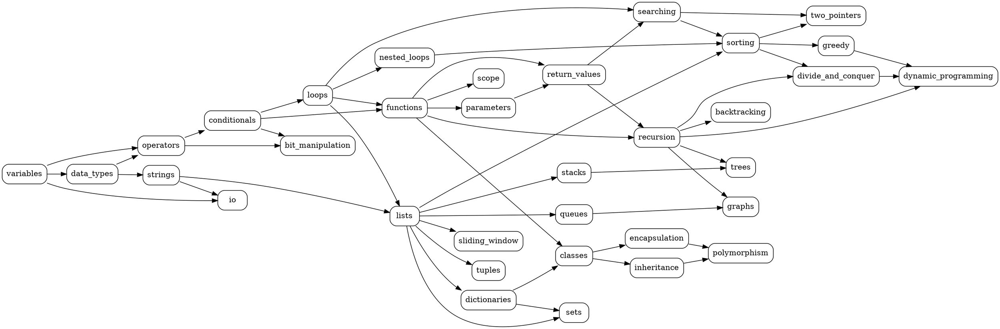

# Appendix B (Companion): Full Knowledge Graph

This companion file contains the complete 34-concept inventory and all 52 prerequisite edges of the platform's knowledge graph. It is referenced from the condensed [Appendix B](16-appendix-b.md) and lives outside the main paper page count. The data is the canonical source seeded by `server/prisma/seed-adaptive.ts` into the `concepts` and `knowledge_graph_edges` tables.

## C.1 Full Concept Inventory

All 34 concepts grouped by tier. Columns match the database fields: `name`, `displayName`, `topicGroup`, `difficultyTier`, and `description`.

*Table C.1. Complete concept inventory (34 concepts).*

| # | Name | Display Name | Topic Group | Tier | Description |
| --- | --- | --- | --- | --- | --- |
| 1 | variables | Variables and Assignment | basics | 1 | Variable declaration, assignment, naming conventions, and basic memory concepts. |
| 2 | data_types | Data Types | basics | 1 | Integers, floats, booleans, strings, type conversion, and type checking. |
| 3 | operators | Operators and Expressions | basics | 1 | Arithmetic, comparison, logical, and bitwise operators. Operator precedence. |
| 4 | io | Input and Output | basics | 1 | Reading user input, printing output, string formatting, and f-strings. |
| 5 | strings | String Operations | basics | 1 | String methods, slicing, concatenation, formatting, and common string algorithms. |
| 6 | conditionals | Conditional Statements | control_flow | 1 | if/elif/else statements, boolean logic, nested conditionals, ternary expressions. |
| 7 | loops | Loops | control_flow | 1 | for loops, while loops, break, continue, range(), enumerate(), loop patterns. |
| 8 | nested_loops | Nested Loops | control_flow | 2 | Nested loop patterns, matrix traversal, pattern printing, time complexity implications. |
| 9 | functions | Functions | functions | 2 | Function definition, calling functions, docstrings, and function design principles. |
| 10 | parameters | Parameters and Arguments | functions | 2 | Positional args, keyword args, default values, *args, **kwargs. |
| 11 | return_values | Return Values | functions | 2 | Returning values, multiple return values, None, and function composition. |
| 12 | lists | Lists | data_structures | 2 | List creation, indexing, slicing, methods (append, insert, remove), list comprehensions. |
| 13 | tuples | Tuples | data_structures | 2 | Tuple creation, immutability, packing/unpacking, named tuples, tuple as dictionary keys. |
| 14 | dictionaries | Dictionaries | data_structures | 2 | Dict creation, access, methods, iteration, defaultdict, dict comprehensions. |
| 15 | searching | Searching Algorithms | algorithms | 2 | Linear search, binary search, search in sorted/unsorted arrays, search complexity. |
| 16 | scope | Variable Scope | functions | 3 | Local vs global scope, LEGB rule, closures, and the global/nonlocal keywords. |
| 17 | recursion | Recursion | functions | 3 | Recursive functions, base cases, recursive thinking, stack overflow, tail recursion. |
| 18 | sets | Sets | data_structures | 3 | Set creation, operations (union, intersection, difference), frozen sets, set comprehensions. |
| 19 | stacks | Stacks | data_structures | 3 | Stack data structure, LIFO principle, implementation using lists, applications. |
| 20 | queues | Queues | data_structures | 3 | Queue data structure, FIFO principle, deque, priority queues, BFS applications. |
| 21 | classes | Classes and Objects | oop | 3 | Class definition, __init__, instance variables, methods, self parameter. |
| 22 | sorting | Sorting Algorithms | algorithms | 3 | Bubble sort, selection sort, insertion sort, merge sort, quicksort, sort stability. |
| 23 | sliding_window | Sliding Window | algorithms | 3 | Fixed and variable size sliding window, window sum/max/min, substring problems. |
| 24 | inheritance | Inheritance | oop | 4 | Single inheritance, super(), method overriding, MRO, multiple inheritance basics. |
| 25 | encapsulation | Encapsulation | oop | 4 | Public/private/protected attributes, properties, getters/setters, data hiding. |
| 26 | polymorphism | Polymorphism | oop | 4 | Duck typing, method overriding, abstract classes, interfaces via ABC. |
| 27 | two_pointers | Two Pointers Technique | algorithms | 4 | Two pointer approach for sorted arrays, opposite direction, same direction patterns. |
| 28 | greedy | Greedy Algorithms | algorithms | 4 | Greedy choice property, activity selection, fractional knapsack, interval scheduling. |
| 29 | divide_and_conquer | Divide and Conquer | algorithms | 4 | Problem decomposition, merge sort, quicksort, binary search as D&C, recurrence relations. |
| 30 | dynamic_programming | Dynamic Programming | advanced | 5 | Memoization, tabulation, optimal substructure, overlapping subproblems, classic DP problems. |
| 31 | graphs | Graphs | advanced | 5 | Graph representation (adjacency list/matrix), BFS, DFS, shortest paths, connected components. |
| 32 | trees | Trees | advanced | 5 | Binary trees, BST, tree traversals (inorder, preorder, postorder), tree properties. |
| 33 | backtracking | Backtracking | advanced | 5 | Constraint satisfaction, permutations, combinations, N-Queens, sudoku solver concepts. |
| 34 | bit_manipulation | Bit Manipulation | advanced | 5 | Bitwise operators, bit masks, common bit tricks, XOR properties, power of two checks. |

**Tier counts.** T1 = 7, T2 = 8, T3 = 8, T4 = 6, T5 = 5. Total = 34.

**Topic group counts.** basics = 5, control_flow = 3, functions = 5, data_structures = 6, oop = 4, algorithms = 6, advanced = 5. Total = 34.

## C.2 Full Prerequisite Edge List

All 52 directed edges. Each edge `u → v` means concept `u` is a prerequisite of concept `v`. Every edge has `relationType = PREREQUISITE` and `weight = 1.0`.

*Table C.2. Complete prerequisite edge list (52 edges).*

| # | From | To |
| --- | --- | --- |
| 1 | variables | data_types |
| 2 | variables | operators |
| 3 | data_types | operators |
| 4 | operators | conditionals |
| 5 | conditionals | loops |
| 6 | data_types | strings |
| 7 | variables | io |
| 8 | strings | io |
| 9 | loops | nested_loops |
| 10 | loops | functions |
| 11 | loops | lists |
| 12 | loops | searching |
| 13 | strings | lists |
| 14 | functions | parameters |
| 15 | functions | return_values |
| 16 | conditionals | functions |
| 17 | lists | tuples |
| 18 | lists | dictionaries |
| 19 | return_values | searching |
| 20 | parameters | return_values |
| 21 | functions | scope |
| 22 | return_values | recursion |
| 23 | functions | recursion |
| 24 | functions | classes |
| 25 | dictionaries | classes |
| 26 | lists | sets |
| 27 | dictionaries | sets |
| 28 | lists | stacks |
| 29 | lists | queues |
| 30 | lists | sorting |
| 31 | searching | sorting |
| 32 | lists | sliding_window |
| 33 | nested_loops | sorting |
| 34 | classes | inheritance |
| 35 | classes | encapsulation |
| 36 | sorting | two_pointers |
| 37 | searching | two_pointers |
| 38 | recursion | divide_and_conquer |
| 39 | sorting | divide_and_conquer |
| 40 | sorting | greedy |
| 41 | inheritance | polymorphism |
| 42 | encapsulation | polymorphism |
| 43 | recursion | dynamic_programming |
| 44 | recursion | backtracking |
| 45 | recursion | trees |
| 46 | stacks | trees |
| 47 | recursion | graphs |
| 48 | queues | graphs |
| 49 | divide_and_conquer | dynamic_programming |
| 50 | greedy | dynamic_programming |
| 51 | operators | bit_manipulation |
| 52 | conditionals | bit_manipulation |

## C.3 Edge Statistics

- Total edges: 52
- Single root (in-degree 0): `variables`
- Leaves (out-degree 0): `io`, `sliding_window`, `polymorphism`, `two_pointers`, `dynamic_programming`, `graphs`, `backtracking`, `bit_manipulation`
- Maximum in-degree: 4 (`dynamic_programming` from `recursion`, `divide_and_conquer`, `greedy`)
- Maximum out-degree: 7 (`lists` to `tuples`, `dictionaries`, `sets`, `stacks`, `queues`, `sorting`, `sliding_window`)
- Longest path (length 9): `variables → operators → conditionals → loops → functions → return_values → recursion → divide_and_conquer → dynamic_programming`

## C.4 Graphviz DOT Specification

The block below regenerates the full graph with any Graphviz tool (`dot -Tpng kg.dot -o kg.png`).

