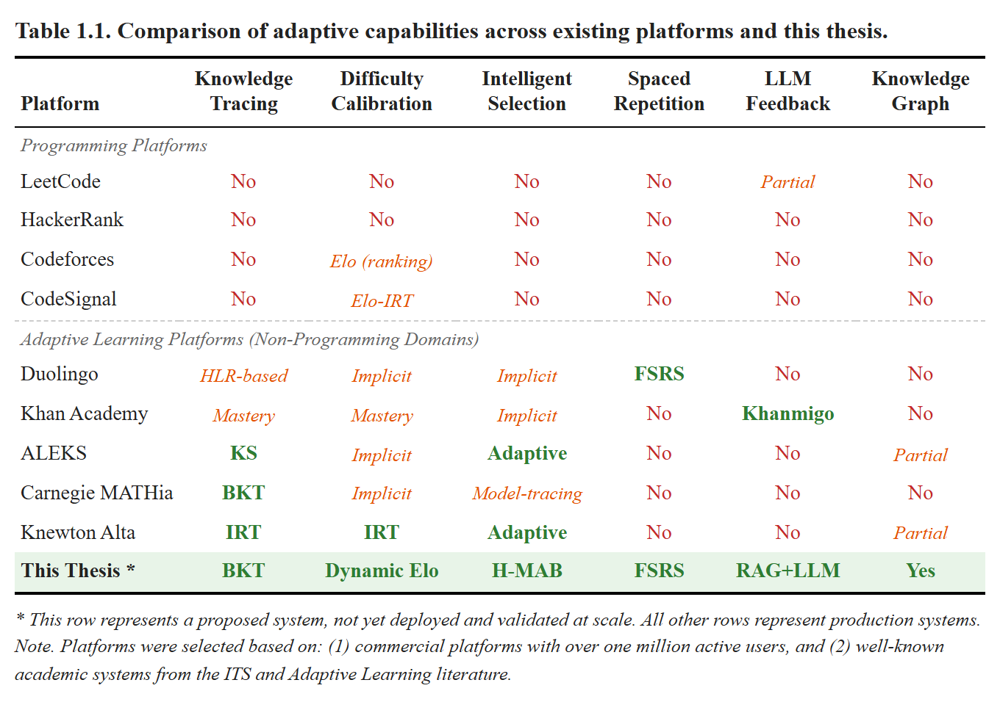
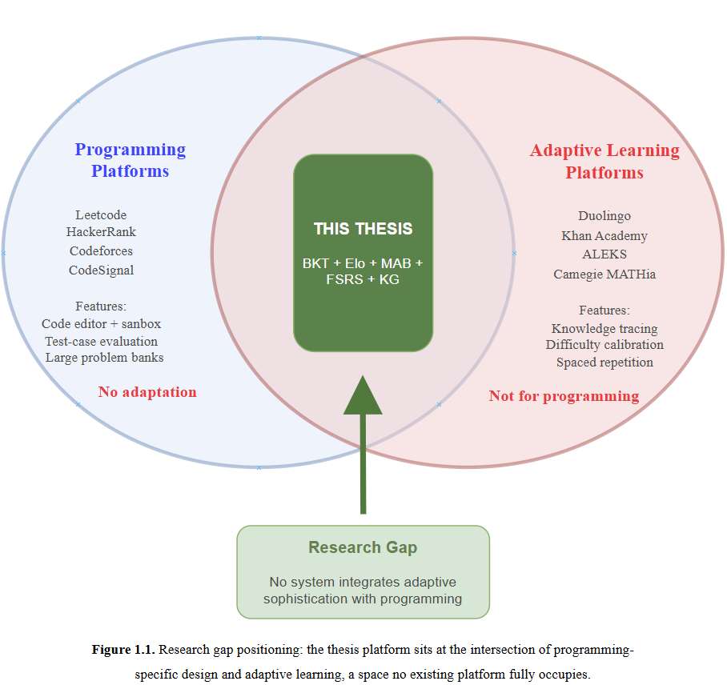
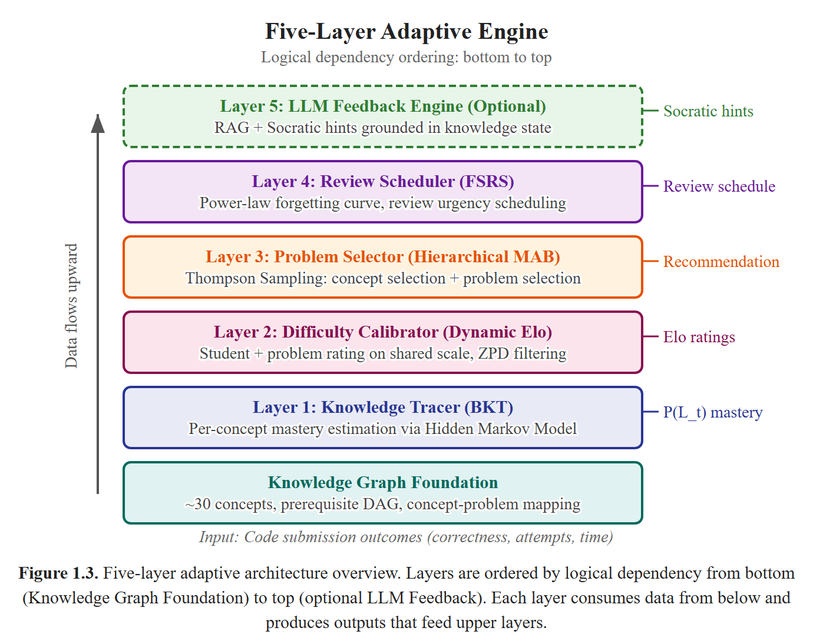
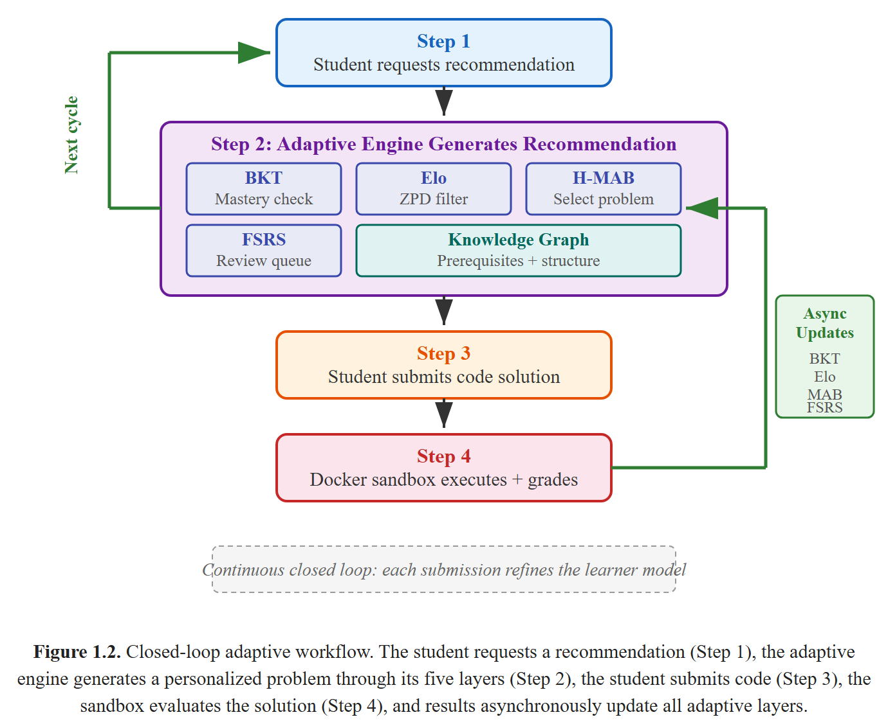
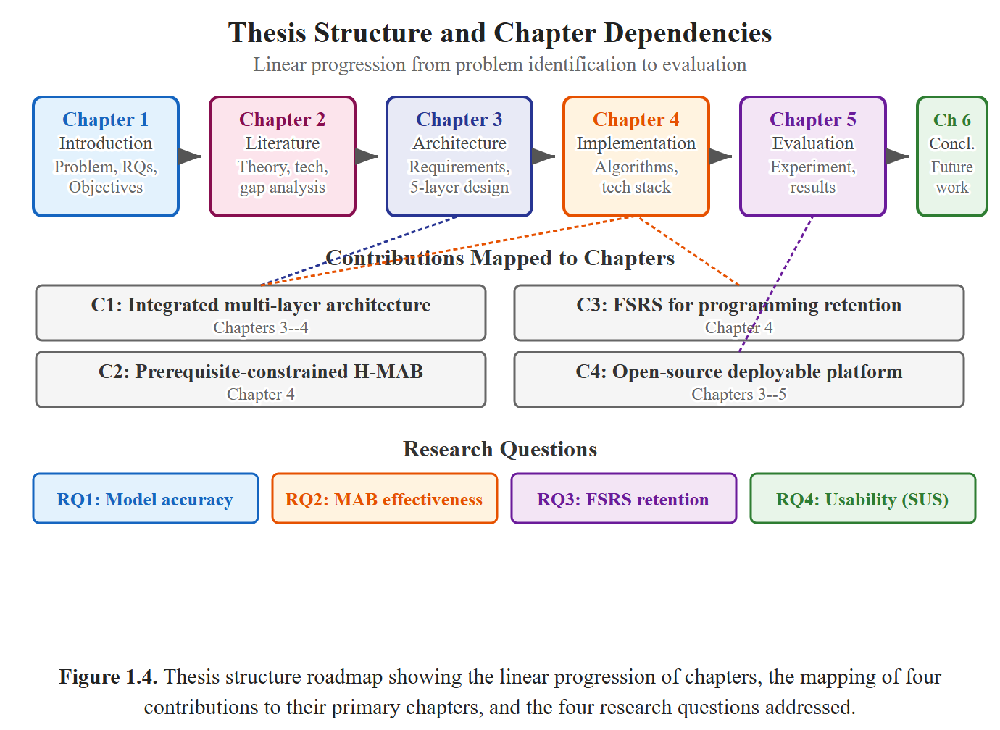

# CHAPTER 1. INTRODUCTION

## 1.1. Problem Statement

Programming has emerged as an essential skill set that is now considered an essential part of higher education around the world. In fact, enrollment figures for introductory computer science courses have been steadily increasing over the past two decades or so. However, despite the increasing demand for programming courses, the field has been struggling with a long-standing crisis that has been well documented over the past several decades: high failure and dropout rates that far exceed those of any other undergraduate course. In their extensive systematic literature review, Luxton-Reilly et al. [1] reported that the failure rates of students enrolled in introductory computer science courses average between 30% and 40% around the world and that these figures have been remarkably stable over several decades of pedagogical experimentation. In their seminal review of learning and teaching programming, Robins et al. [2] highlighted that another major challenge that teachers face is that students entering computer science courses may have vastly different backgrounds, some may have spent several years coding on their own, while others may see their first line of code on the first day of class.

This heterogeneity presents a fundamental challenge in a more traditional approach to instruction in a lecture format. In a typical programming class of 50 to 100 students in a university, a lecturer is required to teach at a single pace and a single level of difficulty. Students who are more advanced in their foundational programming knowledge, such as variables, control flow, and data structures, become bored because they are waiting for their peers to catch up. Meanwhile, those students who are not as advanced in their programming background become more and more behind, not being able to close the gap from simply knowing how to write code to actually having the requisite "computational thinking" to solve a problem on their own. Programming, unlike many other subjects, is a skill that must be practiced individually and deliberately [3]. Lectures, no matter how good, are simply not a replacement for this cycle of writing code, getting errors, debugging, and refining.

This problem is exacerbated by the resource limitations that the instructor faces. Individualized feedback on the students' code, pinpointing misconceptions, recommending practice problems for improvement, and monitoring the progress of each student on a variety of programming concepts takes a linear amount of time proportional to the size of the class. With large classes, it becomes impossible to do so. Grading the assignments on the students' code also takes a considerable amount of time, and the effectiveness of the grading diminishes as the students progress to the next topic before the instructor gets back to them with the graded assignments.

## 1.2. Motivation

#### 1.2.1 The Promise of Adaptive Learning

Adaptive learning, the ability to tailor the content, pace, and methodology of the instruction to the unique characteristics of the learner or the performance of the learner, has shown considerable promise with respect to effectiveness across a variety of different educational domains [6], [7]. The idea behind adaptive learning is the fundamental premise that the effectiveness of the learning can be significantly enhanced by matching the content of the instruction to the state of knowledge of the learner or the ability of the learner.

Several decades of research have gone into validating the effectiveness of the premise behind adaptive learning. Early Intelligent Tutoring Systems such as the Cognitive Tutor series showed a 50-100% improvement in the ability to solve problems [3], [8]. Contemporary systems such as ALEKS [9] and Duolingo [10] have shown the effectiveness of machine learning algorithms with respect to the effectiveness of adaptive learning. A comprehensive review of the effectiveness of the system and its evolution is presented in Chapter 2.

These success stories highlight the need for the application of adaptive learning to the education of programming skills, a subject that lends itself to the application of machine learning algorithms.

#### 1.2.2 Why Programming is Uniquely Suited to Adaptive Learning

Programming education possesses several characteristics that distinguish it from other domains and make it an ideal candidate for adaptive learning systems:

Objectively measurable outcomes. Unlike essay-based subjects or open-ended creative tasks, programming exercises produce artifacts --- code --- that can be automatically evaluated against test cases, providing at minimum a binary correctness signal and often more granular feedback such as the proportion of tests passed. This measurability provides a clean foundation for knowledge modeling.

Rich behavioral signals. Beyond binary correctness, each code submission contains a wealth of information: the number of attempts before success, the time elapsed between attempts, the types of errors encountered (syntax, runtime, logic), the structural complexity of the submitted code, and its similarity to known optimal solutions. These signals are far richer than those available in multiple-choice assessments.

Hierarchical skill structure. Programming concepts form a natural prerequisite hierarchy: understanding variables is prerequisite to understanding arrays, which is prerequisite to understanding sorting algorithms, which in turn supports dynamic programming. This structure can be explicitly modeled as a knowledge graph and used to sequence learning.

Multiple solution paths. Most programming problems admit multiple correct solutions of varying sophistication (brute force versus optimized approaches), providing opportunities for differentiated assessment based on the approach a student takes.

These properties mean that an adaptive system for programming can leverage unusually rich data to model student knowledge with high fidelity, recommend problems at precisely calibrated difficulty levels, and provide targeted feedback --- capabilities that are difficult or impossible to achieve through manual instruction alone.

#### 1.2.3 The Gap in Existing Platforms

Despite the strong case for adaptive learning in programming, existing online coding platforms fail to deliver comprehensive adaptation. Platforms such as LeetCode, HackerRank, and Codeforces have achieved remarkable scale with millions of users, but their pedagogical architecture remains fundamentally static:

LeetCode and HackerRank classify problems into fixed difficulty tiers that do not adapt to individual users, with no probabilistic knowledge model or prerequisite awareness.

Codeforces and CodeSignal employ Elo-based rating systems, but primarily for competitive ranking or assessment rather than pedagogical recommendation integrated with knowledge tracing or retention scheduling.

A systematic comparison reveals that no existing platform --- academic or commercial --- integrates all the components that learning science indicates are necessary for effective personalized instruction: modeling what the student knows (knowledge tracing), calibrating how hard each problem is for each individual (difficulty calibration), selecting which problem to recommend next to maximize learning (intelligent selection), scheduling when to review previously learned concepts to prevent forgetting (spaced repetition), and providing contextual help when the student is stuck (feedback generation) [see Table 1.1]. The table includes both programming-focused platforms (LeetCode through CodeSignal) and adaptive learning platforms from other domains (Duolingo through Knewton Alta); the question this thesis investigates sits at their intersection: how to bring the adaptive mechanisms of the latter category into the programming education domain of the former.

*Table 1.1. Comparison of adaptive capabilities across existing platforms and this thesis.*

The platforms included in Table 1.1 were chosen based on two criteria: (1) commercial platforms with more than one million active users, commonly used for programming practice or adaptive learning, and (2) well-known academic systems from the Intelligent Tutoring Systems and Adaptive Learning literature. However, the comparison here is limited to the inclusion of the six components of the adaptive system, as described above.

Academic research, like the commercial platforms, has also focused on the six components of the adaptive system. In the knowledge tracing papers, the accuracy of the prediction is evaluated, but the actual recommendation system is not built. In the Multi-Armed Bandit papers for education, the difficulty is considered fixed, rather than being an adaptive component. The FSRS algorithm is based on flashcard-based memorization for vocabulary, facts, etc. However, it has not been applied to the retention of programming skills. Thus, each of the research papers has focused on one component of the problem, but the actual integration has been left out.

This row describes the platform proposed in this thesis. At the time of writing it has been implemented but not yet evaluated in a classroom pilot. All other rows describe production systems.

## 1.3. Research Objectives

The aim of this thesis is to design and implement an integrated adaptive learning platform for undergraduate programming courses, and to specify a pilot evaluation protocol for it. The specific objectives are as follows.

**Objective 1: Design a multi-layer adaptive learning architecture.** Propose a modular architecture in which each layer addresses a distinct aspect of adaptive instruction - knowledge tracing (Layer 1), difficulty calibration (Layer 2), problem selection (Layer 3), and review scheduling (Layer 4) - together with an optional LLM hint layer (Layer 5). The architecture defines explicit data flows between layers so that each can operate independently while contributing to a coherent pipeline.

**Objective 2: Implement the learner model (BKT + Dynamic Elo).** Implement Bayesian Knowledge Tracing for per-(student, concept) mastery estimation and a dual Elo rating system with a dynamic K-factor for continuous difficulty calibration, taking submission outcomes as the primary observation signal. Use the Elo / Item Response Theory link [11] to ground difficulty matching in psychometric theory.

**Objective 3: Implement the recommendation and review pipeline (H-MAB + FSRS).** Implement a two-level Hierarchical Multi-Armed Bandit with Thompson Sampling that selects a concept and then a specific problem, subject to knowledge-graph prerequisite gating and Elo-based Zone of Proximal Development filtering. Integrate the Free Spaced Repetition Scheduler [12] so that due reviews interact with the MAB's next recommendation. Define a rating mapping from code submission outcomes to FSRS review ratings.

**Objective 4: Deliver a deployable full-stack platform.** Integrate the adaptive engine with a React frontend, a NestJS API, a FastAPI adaptive service, a PostgreSQL database, and a Docker-based code execution sandbox into a working web application usable by undergraduate students.

**Objective 5: Specify and pre-register a pilot evaluation protocol.** Design a between-subjects, pre-test / post-test pilot study with a control group to assess learning effectiveness, recommendation quality, engagement, and usability, including instruments, metrics, statistical plan, and ethical procedures. Execution of the intervention and reporting of results are explicitly scoped as future work beyond this thesis.

## 1.4. Research Questions

This thesis addresses four research questions. For the comparative questions (RQ2, RQ3) corresponding hypotheses are stated and are tested at the alpha = 0.05 significance level. Because the experimental condition in the pilot enables Layers 1-4 simultaneously (see Chapter 5), RQ2 and RQ3 should be read as questions about the integrated platform as a whole rather than about any single layer in isolation.

**RQ1: How accurately does the learner model embedded in the platform predict student performance?** This question evaluates the foundational capability of the learner model. It is assessed by the AUC-ROC of BKT and Elo predictions on held-out submissions, the recommendation acceptance rate per difficulty band, and the convergence speed of Elo ratings. Following established thresholds in educational data mining [11], an AUC-ROC of at least 0.65-0.70 is taken as the pre-registered target for acceptable predictive performance.

**RQ2: Does the integrated adaptive pipeline (BKT + Elo + Hierarchical MAB + FSRS) lead to different learning outcomes than a content-based filtering baseline?** This question compares the experimental group, which receives the full Layers 1-4 pipeline, against the control group, which receives only content-based filtering over sentence-transformer embeddings. The primary metric is Normalized Learning Gain; the Problems-to-Mastery ratio is a supporting indicator of efficiency. Because several adaptive components are active at the same time in the experimental condition, RQ2 does not attempt to isolate the individual contribution of the Hierarchical MAB.

- H2 (alternative): Students in the adaptive group will show higher Normalized Learning Gain than students in the content-based filtering group.

- H2_0 (null): There is no difference in Normalized Learning Gain between the two groups.

**RQ3: Does the platform with FSRS-scheduled reviews yield different short-term retention outcomes than the same platform without scheduled reviews?** This question is assessed through a retention test administered two weeks after the end of the intervention. As with RQ2, the experimental condition bundles FSRS with the rest of the adaptive pipeline, so an observed difference cannot be attributed to FSRS alone.

- H3 (alternative): Students in the adaptive group will show higher retention scores on the two-week follow-up test than students in the control group.

- H3_0 (null): There is no difference in retention scores between the two groups.

**RQ4: How do students perceive the usability and usefulness of the adaptive platform?** This question captures the student experience through the System Usability Scale (SUS) [13], the Technology Acceptance Model constructs of Perceived Usefulness and Perceived Ease of Use [14], and semi-structured interviews analysed by thematic analysis [15].

## 1.5. Proposed Solution

Adaptive Learning Platform for University Programming Courses

This thesis proposes an Adaptive Learning Platform for University Programming Courses using an adaptive engine with five layers and a knowledge graph that connects programming concepts. It is a closed-loop system where learners’ interactions generate data to refine the learner model, which affects the recommendations to create a dynamic and personalized learning experience.

#### 1.5.1 Architecture Overview

The platform adds a new layer to the existing three-tiered web-based system (React frontend, NestJS API backend, PostgreSQL database) that includes a new Python-based adaptive engine (FastAPI) with five layers:

Foundation: Knowledge Graph. A hand-curated directed graph of programming concepts such as variables, loops, functions, recursion, and dynamic programming. Each problem in the database is associated with one or more concepts. The knowledge graph serves as the underlying structure that guides all the adaptive layers while imposing the appropriate constraints.

Layer 1: Knowledge Tracer (Bayesian Knowledge Tracing). For each pair of concepts and students, BKT tracks the probability of a student having mastered a concept using a Hidden Markov Model [16]. This probability is updated after each submission using Bayesian inference.

Layer 2: Difficulty Calibrator (Dynamic K-Value Elo). The concept of a dual Elo rating system will be adopted. Each learner will be given a numerical rating as will each problem. The rating will be updated after every submission depending on the match between the expected outcome and the actual outcome [17]. This thesis will also propose a dynamic K-factor mechanism that will be dependent on the learning trend of the learner. This will be based on the concept of the adaptive Elo rating system in the educational field [11], ensuring that the ratings converge efficiently for all students regardless of the learning stage.

Layer 3: Problem Selector (Hierarchical Multi-Armed Bandit). The problem selector will be designed as a Hierarchical Multi-Armed Bandit problem to be solved through Thompson Sampling [18], [19]. At Level 1, the system will select a concept to be studied from a set of concepts that the learner can handle. At Level 2, the system will select a problem from the concept that has an Elo rating within the learner's Zone of Proximal Development [20], as defined in the desirable difficulty concept [21].

Layer 4: Review Scheduler (FSRS). The Free Spaced Repetition Scheduler monitors memory states per (student, concept) pair and simulates the forgetting curve of retrievability over time with a power law distribution [12]. When the retrievability falls below a certain level, the concept is scheduled to be reviewed, and the MAB layer gives it high priority in the next recommendation cycle. Another important aspect is how we map the results of code submission to FSRS review ratings to connect the flashcard-based FSRS to the more expressive signal space of programming exercises. This is explained in detail in Chapter 4.

Layer 5: LLM Feedback Engine (Optional). In cases when students are struggling with a problem, a Retrieval-Augmented Generation model can be used to prompt a language model to generate Socratic-style hints that can help students solve the problem without directly revealing the answer to them. This layer is optional to the thesis's contribution, and the thesis's contribution can be achieved with Layers 1 to 4.

The parameters used in each layer are explained in Chapter 4.

Figure 1.3. Five-layer adaptive engine architecture overview.

#### 1.5.2 Closed-Loop Workflow

The process works through a continuous feedback cycle, and the steps are as follows:

The student asks for a recommendation, and the adaptive engine uses the BKT knowledge state, FSRS review queue, and Elo ratings to determine the optimal problem through the Hierarchical MAB.

The student submits the code, and the solution runs inside a Docker-based sandbox.

This triggers the asynchronous update of all the models, including the BKT knowledge state, Elo ratings, MAB reward distribution for the chosen problem, and FSRS memory state.

This updated learner model feeds into the recommendation model to generate the subsequent recommendation.

This closed-loop approach to the adaptive engine means the learning cycle continuously adapts to the student’s progress, keeping the problems at the optimal level and avoiding the problem of stagnation with the fixed profiles approach.

Figure 1.2. Closed-loop adaptive workflow showing continuous knowledge state updates.

## 1.6. Scope and Limitations

#### 1.6.1 Scope

This thesis is an example of the following:

Domain of subject matter: Programming using the Python language, covering approximately 30 programming concepts ranging from basic (variables, data types, input/output) to intermediate (functions, recursion, data structures) to advanced (dynamic programming, graph algorithms).

Target population: Hanoi University undergraduate students enrolled in computer programming courses.

Type of platform: Web-based application, accessible via modern browsers.

Adaptive components: All five layers as described in Section 1.5, with the option of the optional Layer 5 being the LLM feedback mechanism.

Evaluation: A pilot evaluation protocol is specified for a between-subjects study with 40-60 participants, a four-week intervention, and a two-week retention follow-up. A power analysis (Chapter 5) indicates that the nominal sample size can only detect large effect sizes (Cohen's d >= 0.8) at alpha = 0.05 with 80% power. Execution of the intervention and reporting of results are beyond the scope of this thesis; the study is presented as a preliminary design rather than a completed evaluation.

Ethical considerations: The experimental design will be submitted for approval to Hanoi University's academic oversight body. Informed consent, voluntary participation, and no impact on students' course grades will be assured.

#### 1.6.2 Limitations

The following are out of the scope of this thesis:

Multi-language Support. Currently, the platform only supports the Python language. Support for other languages such as Java, C++, JavaScript, etc., is for future work.

Mobile Application. This is a web application, and a mobile application is out of the scope of this work.

Real-time Collaboration. Peer programming, collaborative problem-solving, social features, etc., are out of the scope of this thesis.

Integration with Learning Management Systems. Integration with Learning Management Systems such as Moodle is out of the scope of this thesis.

Large-scale Deployment. This thesis focuses on a single university setting. Although the population is limited to 40-60 participants, the participants per each group are limited to 20-30. Thus, this study is only capable of detecting large effects.

Longitudinal Evaluation. This study focuses on a limited time period of four weeks. A full-semester or full-year study would provide more evidence for long-term effects.

Cold Start Problem. New students, who do not have a submission history, are given recommendations based on the average score for beginners until the interaction history is large enough (approximately 10 submissions).

## 1.7. Contributions

This thesis makes two main contributions, together with one optional extension.

**Contribution 1: An integrated adaptive learning platform for programming courses (Chapters 3-4).** The thesis proposes and implements a closed-loop adaptive platform that combines Bayesian Knowledge Tracing, a Dynamic K-Value Elo rating system, a prerequisite-constrained Hierarchical Multi-Armed Bandit with Thompson Sampling, and the Free Spaced Repetition Scheduler, unified through a curated knowledge graph of approximately 30 programming concepts. The integration is the central engineering contribution: each layer exposes well-defined inputs and outputs to the others, so that BKT mastery gates MAB exploration, Elo ratings constrain problem selection to the Zone of Proximal Development, and FSRS review urgency can interrupt the MAB when due reviews exist. The system is released as a working, deployable full-stack application (React, NestJS, FastAPI, PostgreSQL, Docker sandbox), designed for the Vietnamese university context.

**Contribution 2: A pilot evaluation protocol for the integrated platform (Chapter 5).** The thesis specifies a between-subjects, pre-test / post-test pilot study design for evaluating the platform with undergraduate students at Hanoi University, including the recruitment and consent procedure, the instruments (custom pre-/post-test, SUS, TAM, semi-structured interviews), the full set of quantitative metrics (Normalized Learning Gain, BKT and Elo prediction AUC, acceptance and completion rates, engagement indicators), and a statistical analysis plan with pre-registered thresholds, power assumptions, and an explicit fallback for smaller samples. Because the experimental condition enables Layers 1-4 simultaneously (with Layer 5 disabled for the pilot), the protocol is scoped as a whole-system pilot rather than a layer-level ablation.

**Optional extension: LLM-based Socratic hints (Layer 5).** A Retrieval-Augmented Generation module that issues Socratic hints grounded in the student's current knowledge state is implemented as Layer 5 but is disabled in the pilot evaluation. Because it raises additional questions of cost, hallucination, and hint quality that are out of scope for this pilot, it is positioned as an optional extension to the platform and as a direction for future work rather than as a primary contribution.

## 1.8. Thesis Structure

The remainder of this thesis is structured as follows:

CHAPTER 2. LITERATURE REVIEW AND THEORETICAL BACKGROUND provides an overview of the research landscape in six different thematic areas: adaptive learning systems, knowledge tracing from BKT to state-of-the-art deep knowledge tracing, spaced repetition from Ebbinghaus to FSRS, multi-armed bandits in the context of education, Elo rating systems and item response theory, as well as knowledge graphs and graph neural networks. This chapter concludes with a gap analysis that situates this thesis in the context of existing literature.

Chapter 3: System Requirements and Analysis covers the functional and non-functional requirements of the platform, user personas and their respective use case diagrams, the workflow and data model of the system, as well as the proposed five-layer architecture including the knowledge graph foundation, data flow diagrams, database design, and API specifications.

<!-- page break -->

Some of the most consequential implementation decisions are the per-difficulty-tier BKT parameter initialization, the dynamic K-factor for Elo that adapts itself to individual learning trajectories, the multi-component reward function for the MAB that overcomes the noise inherent in BKT mastery deltas, and the submission-to-rating mapping for FSRS that bridges programming assessment and spaced repetition. Feature flags enable the system to run in control-group mode with all adaptive layers switched off --- a capability that proves essential for the between-subjects evaluation design described in the next chapter.

Chapter 5: Pilot Evaluation Design and Preliminary Protocol describes the evaluation methodology and the pilot experimental design that will be used to assess the platform, including participant recruitment, ethical considerations, evaluation metrics (Normalized Learning Gain, recommendation accuracy, engagement, usability), and the statistical analysis plan. Because the intervention has not been executed at the time of writing, this chapter is framed as a protocol and preliminary plan rather than a report of completed results. A planned within-system ablation using feature-flag-based layer disabling is also described.

Chapter 6: Conclusion presents a summary of key findings, discusses some of the limitations and implications, presents some ideas on future work (such as multi-language support, DKT2 upgrade, automatic construction of knowledge graph, and longitudinal evaluation), and presents some closing remarks on the potential of adaptive learning in programming education in general.

Figure 1.4. Thesis structure roadmap showing chapter flow, contributions, and research question mapping.
