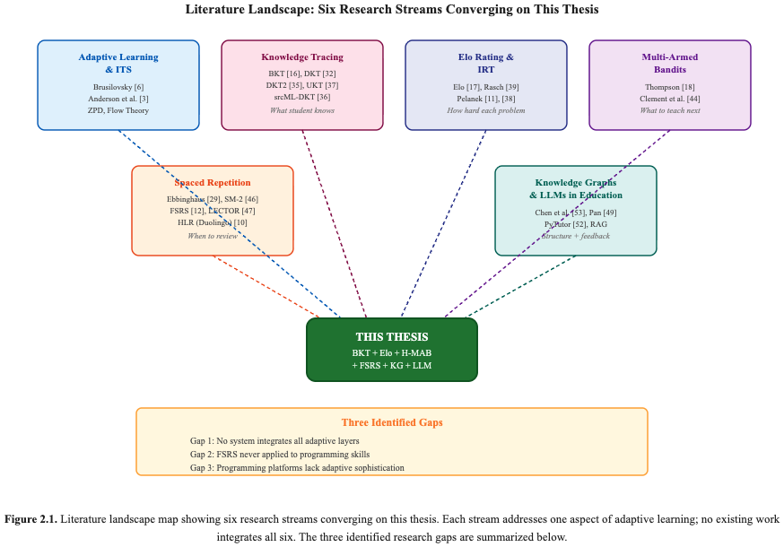
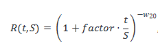
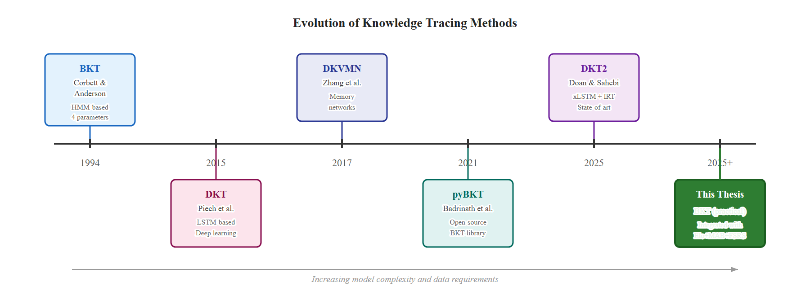
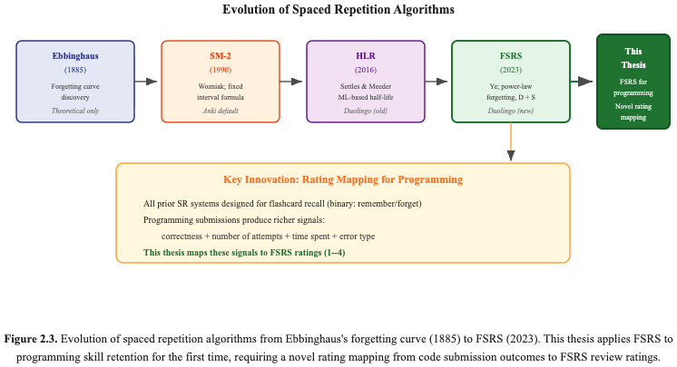
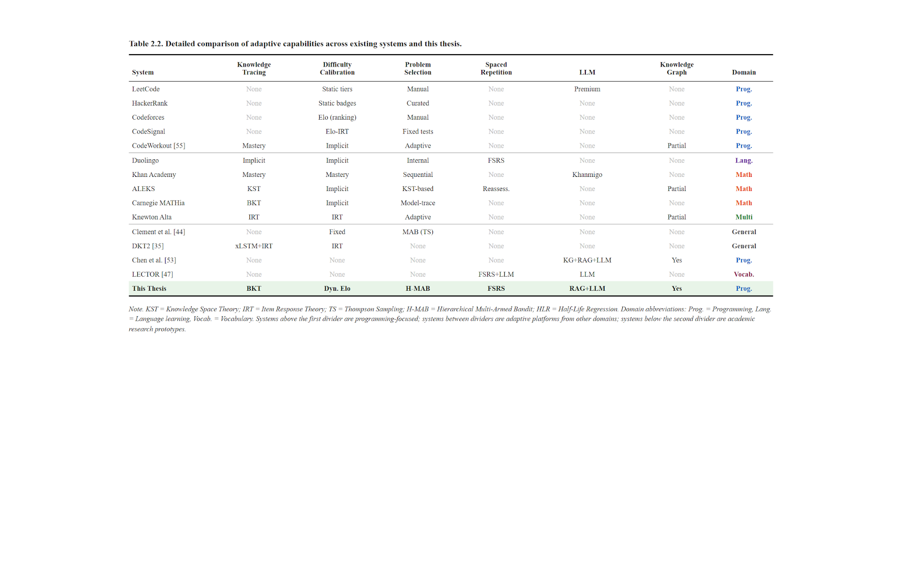
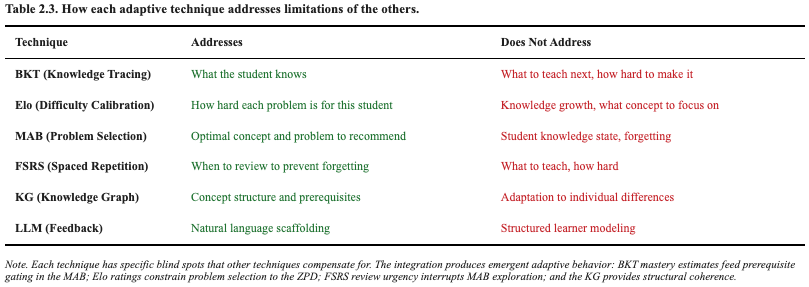

# CHAPTER 2. LITERATURE REVIEW AND THEORETICAL BACKGROUND

This chapter presents the theoretical and technological basis upon which the adaptive learning platform is constructed. Section 2.1 introduces the relevant theories that provide the basis for the adaptive learning platform’s design: the adaptive learning theory, the Zone of Proximal Development, desirable difficulties, and the spacing effect. Section 2.2 discusses the relevant technological and algorithmic developments that the five adaptive learning layers employ: Bayesian Knowledge Tracing, Deep Knowledge Tracing, the Elo rating system, Multi-Armed Bandits, FSRS spaced repetition, knowledge graphs, and large language models in education. Section 2.3 examines existing commercial and research adaptive learning systems to analyze their adaptive learning functionalities. Lastly, Section 2.4 brings together the theories and technological developments to identify the gap that this thesis seeks to fill: the lack of a multi-layer adaptive learning platform for programming education.

Figure 2.1. Literature landscape map showing six research streams converging on the thesis.

## 2.1. Theoretical Foundations

#### 2.1.1 Adaptive Learning and Intelligent Tutoring Systems

Adaptive learning is defined as “educational approaches that can be characterized by the ability of the system to adjust the instruction content, speed, and methodology in relation to the characteristics of the learner and the results of the learning process” [6]. The main idea behind adaptive learning is that the result of the learning process will be more effective if the instruction is more closely aligned with the knowledge state, cognitive ability, and learning path of the learner. Brusilovsky [6] has identified two main forms of adaptation in web-based educational systems: adaptive presentation and adaptive navigation support. Paramythis and Loidl-Reisinger [7] have proposed a more complete classification of the dimensions of adaptive educational systems: adaptive interaction, adaptive content selection, adaptive assessment, and adaptive collaboration. The platform proposed in this thesis is mainly based on adaptive content selection and adaptive assessment.

The first adaptive education systems were Intelligent Tutoring Systems (ITS), which were introduced in the 1970s to the 1990s. Anderson, Boyle, and Reiser [3] introduced the first ITS, the LISP Tutor, which was later followed by the Cognitive Tutors series, which was based on the ACT-R cognitive framework. The systems had an explicit student model, which was a representation of what the student knew. The systems also had a set of production rules that determined the actions to be taken next. The Cognitive Tutor for math was shown to increase student problem-solving skills by 50 to 100% compared to traditional teaching methods [8]. An important result from the Cognitive Tutor studies was the differentiation between model tracing, which compares the student’s solution to an expert model, and knowledge tracing, which estimates the student’s mastery of skills. Both model tracing and knowledge tracing require the decomposition of the domain knowledge into fine-grained skills that the student must master—a concept that directly relates to the knowledge graph that the platform introduced in this thesis is founded upon.

Adaptive system evolution continued in the form of web-based Adaptive Educational Hypermedia (AEH) systems in the 2000s. Examples of AEH systems include AHA! [22] and KnowledgeTree [23]. These systems adapt hyperlinks' visibility and content presentation based on user models. Although the accessibility of adaptive systems improved significantly with the shift from desktop to web-based systems, the adaptation mechanisms were still rule-based. Currently, adaptive systems that utilize machine learning techniques in their adaptation processes were developed starting from the 2010s. Examples of such systems include ALEKS, which uses knowledge space theory in student state representation and learning path planning [9]. Another example is Khan Academy, which uses a mastery learning approach in guiding students in their learning process [24]. Additionally, Duolingo uses spaced repetition and half-life regression in teaching programming skills to millions of students. This shows that it is possible to apply machine learning in programming education.

#### 2.1.2 Zone of Proximal Development

The Zone of Proximal Development (ZPD), first described by Vygotsky in his seminal work [20], is arguably the most popular and influential concept in the study of educational psychology. Vygotsky described the ZPD as the "difference between the level of independent solving and the level of solving in collaboration with a more capable peer." In other words, the zone below the ZPD represents the level at which the task is too easy and will yield minimal learning, while the zone above the ZPD represents the level at which the task is too hard and will lead to frustration.

ZPD has been computationally defined in various forms in adaptive learning systems. For the purpose of this thesis, the ZPD is defined by the Elo rating system (Layer 2): if the problem's Elo rating is within a certain range above the student's Elo ability rating, then it is within the ZPD. This is defined by the following formula: within the range of the problem rating and the student rating plus a minimum offset to the student rating plus a maximum offset. All of these offsets are hyperparameters that correspond to an expected success rate of approximately 36-64%. This range is in line with the flow theory of Csikszentmihalyi [25]. This theory indicates that the flow state is achieved by matching challenges with skills. ZPD is used as a hard constraint in the problem selection pipeline. This ensures that all problems selected by the system are within the ZPD of the student.

#### 2.1.3 Desirable Difficulties

The concept of "desirable difficulties" was first proposed by Bjork and Bjork [21]. Desirable difficulties are the conditions that make the learning process more difficult in the short term, while at the same time they make the long-term retention and transfer of the learning more effective. The main idea behind the concept of desirable difficulties is counterintuitive: the more retrieval practice is facilitated, the less effective the long-term retention of the material will be. On the contrary, the more "difficult" the retrieval practice is, the more effective the long-term retention of the material will be.

There are three specific desirable difficulties that are particularly relevant for the design of the proposed platform:

1. The "spacing effect": the more time is given for the practice of the material, the stronger the long-term retention of the material will be in comparison with massed practice in a single session [26]. The "spacing effect" is the basis for the integration of the FSRS in the proposed platform (Layer 4).

2. The "testing effect": the retrieval of the material from the long-term memory is more effective for long-term retention in comparison with restudying the material [27]. In the context of programming education, the "testing effect" means that the solution of a problem requiring the application of a specific concept is more effective for the long-term retention of the concept in comparison with the reading of the definition of the concept. The proposed platform's "review" mechanism is based on the "testing effect": the learner is shown a new problem associated with the concept that is due for review, rather than the definition of the concept itself.

3. "Interleaving": interleaving the practice of the material with the practice of the material from different categories or topics makes the long-term retention of the material more effective in comparison with the exclusive practice of the material from a single category or topic [28]. The Hierarchical MAB (Layer 3) is based on the "interleaving" principle: the exploration of the Hierarchical MAB is balanced over many concepts rather than being focused exclusively on a single concept.

#### 2.1.4 Spacing Effect and Forgetting Curves

The scientific investigation of the decay of memory was first conducted by Ebbinghaus [29]. He showed, through self-experimentation, that the decay of memory is initially fast, with the speed of the decay gradually slowing down. This phenomenon is termed the "Forgetting Curve." The Forgetting Curve has been repeatedly observed with many different materials and populations. The exact mathematical form of the Forgetting Curve has been the subject of much debate, with suggestions of exponential, power law, and logarithmic forms.

Recent results indicate that the power-law form is the most accurate[12] [30]:

Here,  R(t.S) is the retrieval of the information (i.e., the probability that it can be retrieved), t is the time since the last review, S is the stability of the memory (related to the strength of the memory), and  is the constant. This form is that used in the FSRS algorithm [12], where the values of  and  are chosen such that  (stability is the time at which the retrievability falls below 90%).

The spacing effect was also first identified by Ebbinghaus, and has recently been confirmed in a comprehensive quantitative meta-analysis of 254 studies by Cepeda et al. [26]. The optimal spacing between studies is dependent on the retention interval that is desired; the longer the retention interval, the longer the spacing between reviews. This is exactly what the SR algorithm takes into account: each individual’s memory decay is modeled, and the reviews are scheduled at the optimal time – just before the individual is likely to forget the information.

The application of memory science principles in programming is an interesting part of the thesis. Spaced repetition has been successfully used in learning vocabulary words [10] and recalling facts. However, spaced repetition in learning programming skills has not been explored thoroughly. This is because programming is not just learning facts; it is learning procedures. This thesis has addressed the difference by using a rating mapping that converts code submission results into FSRS review ratings, as described in Chapter 4.

## 2.2. Related Technologies

#### 2.2.1 Bayesian Knowledge Tracing

Bayesian Knowledge Tracing (BKT), introduced by Corbett and Anderson [16], is the foundational algorithm for modeling student knowledge in adaptive learning systems. BKT formulates knowledge tracing as a Hidden Markov Model (HMM) with two hidden states — Learned (<!-- unsupported: equation -->) and Not Learned (<!-- unsupported: equation -->) — and four parameters per skill:

- <!-- unsupported: equation -->: the prior probability that the student already knows the skill before any practice (typically 0.0–0.5);

- <!-- unsupported: equation -->: the probability of transitioning from  to  after a single practice opportunity (the learn rate, typically 0.01–0.4);

- <!-- unsupported: equation -->: the probability of a correct response when the skill is not known (the guess rate, typically 0.0–0.3);

- <!-- unsupported: equation -->: the probability of an incorrect response when the skill is known (the slip rate, typically 0.0–0.2).

The model assumes that once a skill is learned, it remains learned (no forgetting), and that learning can only occur through practice opportunities. Given an observed response (correct or incorrect), BKT updates the posterior mastery probability using Bayes’ theorem. After a correct response:

<!-- unsupported: equation -->

After an incorrect response:

<!-- unsupported: equation -->

The learning transition is then applied:

<!-- unsupported: equation -->

BKT has several strengths that make it a good candidate to be used as a baseline knowledge tracer for this thesis. Firstly, BKT parameters have a direct interpretation.  has a clear pedagogical meaning as a learn rate, and  has a direct and easily understandable meaning as a probability of mastery, which can be used for gating. Secondly, BKT has low computational cost, requiring only  operations to update the model. This makes BKT a good candidate for a real-time application. Thirdly, BKT has been extensively researched and validated over three decades of research in Intelligent Tutoring Systems [8], [16]. Fourthly, BKT works well even with sparse data. This is important for a pilot study with a small number of participants.

BKT has several well-known limitations. For example, the binary skill state ( <!-- unsupported: equation -->or <!-- unsupported: equation --> ) is a poor approximation of the continuous nature of knowledge. Additionally, the independence of skills is not well justified, as programming skills are correlated with each other (i.e., “loop” knowledge helps with “sort” knowledge). The no-forgetting assumption is not realistic, especially for skills not practiced often, which is where Layer 4 (FSRS) comes in. Fourth, the assumption of equal problem informativeness for a given skill is violated when the problem is of significantly varying difficulty.

For BKT parameter estimation, the Expectation-Maximization (EM) algorithm is commonly employed. pyBKT is a free library for BKT parameter estimation with the EM algorithm and cross-validation, including standard educational data formats[31].

#### 2.2.2 Deep Knowledge Tracing and Recent Advances

Deep Knowledge Tracing (DKT). Piech et al. [32] have proposed Deep Knowledge Tracing, where a recurrent neural network with LSTMs replaces the HMM in BKT. DKT takes a series of (skill, correctness) pairs as input and outputs the probabilities of correctness for the next timestep for every skill. DKT has the following problems: the hidden state of DKT cannot be related to the mastery of the skills [33]; DKT has the reconstruction inconsistency problem, where the model outputs different levels of mastery for the same skill at the same timestep [33]; DKT has the need for large datasets (thousands of students) in order to learn the representations.

Yeung and Yeung proposed DKT+, which includes additional regularizers for prediction consistency and waviness reduction in the mastery estimates. Zhang et al. proposed Dynamic Key-Value Memory Networks (DKVMN), where the student's skill is stored in the key matrix, and the knowledge state is stored in the value matrix using memory networks. DKVMN has some interpretability compared to DKT.

However, Doan and Sahebi proposed DKT2, which is the state-of-the-art model in knowledge tracing until now, i.e., until 2025. DKT2 replaced the LSTM unit with an xLSTM unit, where the exponential activation functions, i.e., sLSTM, are incorporated to make better decisions regarding the storage, and the matrix memory, i.e., mLSTM, is incorporated to increase the capacity of the model with full parallelization. The most important contribution of DKT2 was the integration of the Item Response Theory in the output layer, where the prediction was made in terms of the student's ability and item difficulty. DKT2 achieved state-of-the-art results on the five benchmark datasets, i.e., ASSISTments, EdNet, Junyi, Statics, and NIPS34, where DKT2 was better than the remaining 18 models, i.e., DKT, AKT, SAINT, SAKT, etc.

One particularly relevant advancement for programming education is srcML-DKT [36], which leverages feature information from actual submitted source code rather than relying only on binary correctness feedback. By using srcML code representations that can handle unparsable code, which is common in programming code due to introductory programming student errors, srcML-DKT far outperforms traditional DKT on programming exercises with students. This shows that the rich signal space of code submissions can help improve accuracy in knowledge tracing for programming.

In the Uncertainty-aware Knowledge Tracing model [37], the knowledge state of the students is represented as a probability distribution rather than a point estimate. In the UKT model, the process of learning the state transitions is carried out with the help of Wasserstein Self-Attention and uncertainty-aware contrastive learning. Here, the major contribution is the mapping of the uncertainty level with the exploration bonus in the multi-armed bandit problem.

Table 2.1. Comparison of knowledge tracing approaches.

| Approach | Architecture | Interpretable | Forgetting | Multi-skill | Data Req. | Year |
| --- | --- | --- | --- | --- | --- | --- |
| BKT [16] | HMM | Yes | No | Independent | Low | 1994 |
| DKT [32] | LSTM | No | Implicit | Implicit | High | 2015 |
| DKT+ [33] | LSTM + reg. | No | Implicit | Implicit | High | 2018 |
| DKVMN [34] | Memory NN | Partial | Implicit | Explicit keys | High | 2017 |
| DKT2 [35] | xLSTM + IRT | Partial | Implicit | Implicit | High | 2025 |
| srcML-DKT [36] | DKT + code | No | Implicit | Implicit | High | 2025 |
| UKT [37] | Wasserstein attn. | Uncertainty | Implicit | Implicit | High | 2025 |

BKT is chosen as the knowledge tracing engine for the proposed platform for the following reasons: First and foremost, the explicit mastery probability of BKT can be used as the prerequisite gating condition for the MAB layer. A concept can only be considered for recommendation if all the prerequisite concepts have been mastered. This requires the ability to provide interpretable estimates of the level of mastery of each skill, something that the hidden state of the DKT does not provide without further extraction. Another reason is the low data requirement of the BKT model, which is vital for the pilot with 40-60 students and 30 concepts. Lastly, the update time of the BKT model is sufficient such that the knowledge state can be updated after each submission without any latency issues. DKT2 is also presented as a possible future improvement once sufficient interaction data is available to train a deep model (Chapter 6).

#### 2.2.3 Elo Rating System and Item Response Theory

The Elo rating system, which was originally developed by Arpad Elo to rate chess players, is a rational approach to rate the skills of all the competitors at once by using the outcome of all pairwise comparisons between the competitors [17]. In the context of educational research, the interaction between the student and the problem is defined as a "match" between the student and the problem. The probability of the solution of problem <!-- unsupported: equation -->  by student <!-- unsupported: equation --> with rating <!-- unsupported: equation --> is given by:

<!-- unsupported: equation -->

After observing the actual outcome <!-- unsupported: equation --> (1 for correct, 0 for incorrect), both ratings are updated:

<!-- unsupported: equation -->

<!-- unsupported: equation -->

where <!-- unsupported: equation --> is the update step size (K-factor) controlling the sensitivity of rating changes. When a student solves a problem they were not expected to solve (<!-- unsupported: equation -->), their rating increases substantially; when they fail a problem they were expected to solve (<!-- unsupported: equation -->), their rating decreases. This mechanism naturally calibrates both student ability and problem difficulty through ongoing interactions.

Pelanek [11] has given a detailed analysis of the Elo system in the context of adaptive educational systems. He has shown that Elo ratings converge to stable estimates in about 20 attempts per student and 30 attempts per problem, and the Elo system correctly identifies problems that have been incorrectly categorized by domain experts in terms of difficulty level. An empirical study of the Elo system on 76 programming tasks by 299 students (50,055 attempts) has shown that the Elo system correctly predicts the probability of success for students with AUC greater than 0.7 [38].

Connection to Item Response Theory. Item Response Theory (IRT) is the standard psychometric theory used in educational assessment. The simplest IRT model, the Rasch model or one-parameter logistic model (1PL), has a mathematical form similar to the Elo expected score formula [39]:

<!-- unsupported: equation -->

where <!-- unsupported: equation --> is the student’s ability parameter and <!-- unsupported: equation --> is the item’s difficulty parameter. The Elo expected score formula (Equation 2.4) is equivalent to the Rasch model with a scaling factor: <!-- unsupported: equation -->. Pelanek in [11] has shown the convergence of Elo ratings to IRT ability and difficulty estimates under the Rasch model. The advantage of using Elo ratings over the conventional IRT is that the Elo ratings are updated after each interaction using the concept of online learning, whereas the conventional IRT requires the re-estimation of parameters after the receipt of each new set of data.

The fixed value of the K-factor in Standard Elo rating implies a basic trade-off: large <!-- unsupported: equation -->values enable rapid adaptation to learning, but at the cost of rating stability, while small <!-- unsupported: equation -->values provide rating stability at the cost of slow adaptation to changes in abilities. The recent study [40] introduced a dynamic mechanism for changing the K-factor in proportion to the learning trend of the student. The trend is defined as a weighted sum of residuals computed from recent differences between actual and expected scores:

<!-- unsupported: equation -->

where <!-- unsupported: equation --> are exponential recency weights, <!-- unsupported: equation --> is the window size, <!-- unsupported: equation --> is the actual score, and <!-- unsupported: equation -->  is the expected score for the <!-- unsupported: equation -->-th recent interaction. When the trend is positive (the student is improving), <!-- unsupported: equation --> decreases to stabilize the improving rating; when the trend is negative (the student is struggling), <!-- unsupported: equation --> increases to enable faster re-calibration:

<!-- unsupported: equation -->

where  and  define the range of permissible K-factors (typically 10 and 40, respectively) and  controls the sensitivity to the trend magnitude. This mechanism ensures that struggling students receive faster rating adjustments (they are not stuck at an inaccurate rating), while stable students experience smaller fluctuations.

Multidimensional Elo. Recent work in educational data mining [41] extends the Elo system to multiple dimensions, maintaining separate ratings for each concept or skill. A student thus has a vector of Elo ratings , and each problem’s Elo is associated with its primary concept. This multidimensional approach aligns naturally with the concept-based knowledge graph that underpins the proposed platform: BKT provides probabilistic mastery for prerequisite checking, while concept-specific Elo ratings provide difficulty-calibrated matching for problem selection within each concept.

Relevance to this thesis. The Elo system serves as Layer 2 (Difficulty Calibrator) of the proposed architecture. Its role is twofold: (1) to continuously calibrate the difficulty of each problem relative to each student’s ability, enabling the operationalization of the ZPD (Section 2.1.2) as an Elo rating range; and (2) to provide the expected success probability that feeds into the MAB reward function (Layer 3). The dynamic K-value mechanism ensures efficient convergence for both rapidly improving and struggling students.

#### 2.2.4 Multi-Armed Bandits in Education

Problem Formulation. The Multi-Armed Bandit (MAB) problem, first formalized by Robbins [42], is a classical formulation of the exploration–exploitation tradeoff. An agent faces  arms (actions), each yielding stochastic rewards drawn from an unknown distribution. At each time step, the agent must choose one arm to pull and observes the resulting reward. The objective is to maximize cumulative reward over time, which requires balancing exploitation (choosing the arm with the highest estimated reward) against exploration (trying less-certain arms to gather information and potentially discover superior alternatives).

In the educational context, each arm represents a learning activity (a concept to study or a problem to attempt), and the reward represents the learning gain resulting from the activity. The MAB formulation is natural for educational recommendation because the system faces genuine uncertainty about which activity will produce the most learning for a given student at a given time, and the only way to resolve this uncertainty is to recommend activities and observe outcomes.

Thompson Sampling. Thompson Sampling [18], originally proposed in 1933, is a Bayesian approach to the MAB problem that has experienced a renaissance in recent years due to its strong theoretical and empirical performance [19]. For each arm , the algorithm maintains a Beta distribution  representing its belief about the arm’s reward probability. At each decision point, the algorithm samples a value  from each arm’s distribution and selects the arm with the highest sampled value. After observing the reward , the distribution is updated:  for success,  for failure.

Thompson Sampling offers several advantages for educational recommendation. Arms with high uncertainty (wide distributions) are explored more frequently because their samples have higher variance and thus a higher probability of being the maximum — this is precisely the behavior desired when the system is uncertain about a student’s readiness for a concept. As evidence accumulates, distributions narrow and exploitation dominates, concentrating recommendations on concepts with high observed learning gains. Unlike Upper Confidence Bound (UCB) algorithms, Thompson Sampling requires no tuning parameter, making it practical for deployment.

Hierarchical MAB for Problem Selection. Standard MAB treats each problem as a separate arm, which becomes impractical when the problem bank contains hundreds of items. The hierarchical approach [43] introduces two levels of selection:

•Level 1 (Concept Selection): The system selects which concept to study from among those whose prerequisites are satisfied. Each concept is an arm with its own Beta distribution.

•Level 2 (Problem Selection): Within the selected concept, the system selects a specific problem whose difficulty falls within the student’s ZPD. Each problem within a concept is an arm at this level.

This hierarchical structure mirrors the natural organization of educational content and reduces the effective number of arms at each level, enabling faster convergence. Clement et al. [44] demonstrated that MAB-based problem selection in intelligent tutoring systems produces superior learning outcomes compared to random selection and expert-designed curricula, validating the approach for educational applications.

MAB with Abandonment. A critical limitation of standard educational MAB models is their failure to account for student disengagement. Shen et al. [45] addressed this at NeurIPS 2024 by introducing MAB with abandonment (MAB-A), where a third outcome is modeled alongside success and failure: the student abandons the recommended activity without attempting it. Abandonment provides a strong negative signal indicating that the recommendation was inappropriate (typically too difficult or too tedious). The ULCB and KL-ULCB algorithms proposed in this work increase exploration when the student is engaged and decrease it when disengagement is detected. This finding is relevant to programming education, where abandonment rates are high for problems outside the student’s ZPD — the Elo-based ZPD filtering in the proposed platform partially addresses this, and future versions may incorporate explicit abandonment signals into the MAB reward.

Relevance to this thesis. The MAB framework serves as Layer 3 (Problem Selector) of the proposed architecture. The hierarchical structure, combined with BKT-based prerequisite gating (concepts are eligible only when prerequisites are mastered) and Elo-based ZPD filtering (problems are eligible only when their difficulty falls within the student’s productive range), ensures that recommendations are both pedagogically sound and optimally challenging. The reward function combines BKT learning gain, difficulty appropriateness, and time efficiency, as detailed in Chapter 4.

#### 2.2.5 Free Spaced Repetition Scheduler (FSRS)

SM-2 and Traditional Algorithms. The first widely adopted spaced repetition algorithm was SM-2, developed by Wozniak [46] for the SuperMemo system. SM-2 computes review intervals using a simple recursive formula:  day,  days, , where  (Easiness Factor) is updated after each review based on a subjective quality rating on a 0–5 scale. While SM-2 was a pioneering system that enabled millions of learners to practice spaced repetition (and was later adopted by Anki), it has significant limitations: its parameters are fixed rather than optimized from data, the same parameters apply to all users regardless of individual memory characteristics, the quality rating is subjective and difficult to calibrate consistently, and the algorithm lacks a principled foundation in memory science.

FSRS. The Free Spaced Repetition Scheduler (FSRS), proposed by Ye [12], represents a substantial advancement over SM-2. FSRS is grounded in the DSR model (Difficulty, Stability, Retrievability), which tracks three memory states per item:

•Difficulty (, scale 1–10): how inherently hard this material is for this learner.

•Stability (, in days): the time for retrievability to decay to 90% — the “half-life” of the memory.

•Retrievability (, probability in [0, 1]): the current probability of successful recall.

The core forgetting curve is modeled as a power law:

where  is the elapsed time since the last review. By construction,  (perfect recall immediately after review) and  (stability is defined as the point at which retrievability drops to 90%). The stability update after a successful review is:

where – are optimizable parameters,  is a hard penalty factor (applied when the rating is 2), and  is an easy bonus factor (applied when the rating is 4). After a failed review (rating = 1), the stability is reset to a shorter value based on the current difficulty and retrievability:

FSRS uses four ratings to capture the quality of recall: 1 (Again — complete failure), 2 (Hard — recalled with significant difficulty), 3 (Good — recalled with moderate effort), and 4 (Easy — recalled effortlessly). The 19 parameters ( through ) are optimized from the user’s actual review history using gradient descent, enabling personalization to individual memory characteristics.

Empirical validation. FSRS has been empirically validated to require 20–30% fewer reviews than SM-2 for the same retention target [12]. It has been integrated into Anki since version 23.10 (released October 2023), providing the algorithm access to a user base of millions and enabling large-scale validation. The adoption of FSRS by a major production system provides confidence in its robustness and scalability.

LECTOR. A recent extension, LECTOR [47], integrates large language models with spaced repetition scheduling. LECTOR uses in-context learning to assess semantic similarity between concepts, identifying “confusable” items that should be reinforced together. The system achieved a 90.2% retention success rate compared to 88.4% for the best baseline across 100 simulated learners over 100 days. While LECTOR focuses on vocabulary-style learning, its architecture of combining spaced repetition with AI-generated content mirrors the combination of Layer 4 (FSRS) and Layer 5 (LLM feedback) in the proposed platform.

Relevance to this thesis. FSRS is applied as Layer 4 (Review Scheduler) in the proposed architecture. Within the scope of the literature surveyed in Chapter 2, this appears to be among the first applications of FSRS to programming concept review scheduling. The key adaptation is the rating mapping: rather than asking students to self-assess their recall quality (as in flashcard applications), the system automatically maps code submission outcomes to FSRS ratings based on correctness, number of attempts, and time spent. This mapping connects FSRS’s flashcard-oriented design and the richer signal space of programming exercises. The specific mapping is detailed in Chapter 4. FSRS addresses a limitation that Layers 1–3 alone cannot resolve: without scheduled review, mastered concepts gradually decay, leading to knowledge fragmentation that undermines the prerequisite dependencies modeled in the knowledge graph.

#### 2.2.6 Knowledge Graphs and Graph Neural Networks

Knowledge Graphs for Programming Concepts. A Knowledge Graph (KG) represents domain concepts as nodes and relationships between concepts as directed edges. In the context of programming education, the primary relationship is the prerequisite relation: concept  is a prerequisite of concept  if mastery of  is necessary for productive learning of . For example, understanding variables is prerequisite to understanding arrays, which is prerequisite to understanding sorting algorithms. This hierarchical structure has been recognized in the programming education literature [2] and is a key structural feature that distinguishes programming from domains without strong prerequisite chains.

Knowledge graph construction can proceed through manual curation by domain experts, automated extraction from course materials, or a hybrid approach. The ACE (Automatic Concept Extraction) methodology [48] automates KG construction by parsing course materials, extracting key concepts using NLP, identifying prerequisite relationships from section ordering and reference patterns, and validating using student performance data. Pan et al. [49] demonstrated that prerequisite-enhanced category-aware Graph Neural Networks improve educational recommendation quality by leveraging prerequisite structures as first-class features.

GNN-Based Educational Recommendation. Graph Neural Networks (GNN) have been applied to educational recommendation by modeling the tripartite relationship between students, learning resources, and knowledge points. Liu et al. [50] achieved NDCG@10 of 0.93 in standard scenarios and 0.88 in knowledge gap scenarios using GNN-based recommendation on educational tripartite graphs, significantly outperforming collaborative filtering baselines. Gu et al. [51] combined Graph Attention Networks (GAT) with deep reinforcement learning for personalized learning path generation, achieving 5.8–12.8 point improvements in test scores compared to fixed curricula. These results demonstrate the value of explicitly modeling concept relationships in educational recommendation.

Relevance to this thesis. The proposed platform uses a manually curated knowledge graph of approximately 30 Python programming concepts with 40–50 prerequisite edges. Manual curation is justified by the manageable scale of a single-course concept space, the need for accuracy in prerequisite relationships (a single incorrect edge could permanently block learner progression), and the requirement for alignment with the specific university curriculum. The knowledge graph serves three roles: (1) defining the concept space for BKT knowledge tracing (Layer 1), (2) constraining the MAB concept selection to respect prerequisite mastery (Layer 3), and (3) providing structured context for RAG-based LLM feedback generation (Layer 5). Automated KG construction using ACE or LLM-based methods is identified as a direction for future work.

2.2.7 Large Language Models in Education

LLMs as Tutoring Agents. Large Language Models (LLMs) such as GPT-4 have demonstrated strong capabilities in educational settings. PyTutor [52], a ChatGPT-based intelligent tutoring system for Python programming, employs Socratic questioning to guide students toward solutions rather than providing direct answers. PyTutor maintains a dialogue state to track student understanding and uses prompt engineering to implement pedagogical strategies including scaffolding, analogies, and worked examples. Student satisfaction ratings of 4.2/5.0 were reported in usability studies. However, significant challenges remain in deploying LLMs for education: hallucination (generating incorrect code or explanations), tendency to give direct answers rather than guiding discovery, inconsistency across interactions, and API cost at scale.

RAG-Enhanced Educational Systems. Retrieval-Augmented Generation (RAG) addresses several LLM limitations by grounding generated responses in retrieved factual content. Chen et al. [53] demonstrated a three-component architecture combining a knowledge graph (storing structured domain knowledge), RAG (retrieving relevant KG subgraphs based on the student’s current problem and knowledge state), and an LLM (generating personalized feedback grounded in retrieved knowledge). Testing across 4,956 code submissions, the hybrid GenAI-adaptive mode achieved the highest number of correct submissions and the fewest incorrect attempts, outperforming both adaptive-only and GenAI-only modes. Wang et al. [54] extended this approach to multimodal knowledge graphs, incorporating code examples, diagrams, and video explanations as node attributes, and achieved a 15% improvement in concept mastery compared to text-only tutoring.

Relevance to this thesis. The proposed platform includes an optional Layer 5 (LLM Feedback Engine) that generates Socratic hints when students struggle with a problem (three or more failed attempts). The RAG pipeline retrieves the student’s knowledge state from BKT, the problem’s concept prerequisites from the knowledge graph, and common mistakes associated with the concept, then prompts the LLM to generate a guiding question rather than a direct answer. This layer is explicitly designated as supplementary; the core thesis contribution stands on Layers 1 through 4. The integration of LLM feedback with a structured learner model (BKT mastery states) and a knowledge graph distinguishes this approach from standalone LLM tutors, which lack awareness of the student’s knowledge state and the domain’s prerequisite structure.

## 2.3. Related Work

#### 2.3.1 Commercial Programming Platforms

The most widely used platforms for programming practice are LeetCode, HackerRank, Codeforces, and CodeSignal, collectively serving tens of millions of users. These platforms have achieved remarkable scale and offer extensive problem repositories, but their pedagogical architecture is fundamentally static.

LeetCode classifies problems into three fixed difficulty tiers (Easy, Medium, Hard) that are identical for all users regardless of their skill level. Problem selection is entirely user-driven: students browse by topic tag or difficulty label and choose their own problems. There is no knowledge model, no difficulty calibration based on individual performance, no spaced repetition, and no prerequisite awareness. LeetCode recently introduced LLM-powered hints as a premium feature, but these operate independently of any learner model. The platform is designed primarily for interview preparation rather than structured learning, and its lack of adaptation means that students have no guidance on what to practice next or when to review previously learned concepts.

HackerRank offers curated skill tracks and binary skill badges (attempted/not attempted) but lacks probabilistic knowledge modeling, difficulty calibration, or adaptive recommendation. Assessment is based on fixed skill tests with predetermined question sets. Like LeetCode, the platform provides no mechanism for scheduling review of previously mastered concepts.

Codeforces is notable for its Elo-based rating system, which accurately tracks competitive programming ability across thousands of participants. However, the Elo system is used exclusively for competitive ranking and contest matchmaking, not for pedagogical recommendation. There is no knowledge tracing, no concept prerequisite awareness, and no mechanism to recommend practice problems matched to a specific learner’s ZPD. Codeforces is designed for competitive programmers, not for learners who need structured guidance through a curriculum.

CodeSignal employs an Elo-IRT hybrid system for skill assessment, providing more sophisticated ability estimation than simple binary scoring. However, the assessment results are used primarily for candidate evaluation in hiring contexts rather than for adaptive problem recommendation or learning path construction.

#### 2.3.2 Adaptive Learning Platforms

Several platforms from non-programming domains demonstrate sophisticated adaptive capabilities that serve as reference points for this thesis.

Duolingo is the most widely cited example of data-driven adaptive learning at scale. The platform employs spaced repetition — having recently migrated from its proprietary Half-Life Regression model [10] to FSRS [12] — for scheduling vocabulary review. Duolingo’s adaptation primarily targets retention of discrete vocabulary items, a domain well-suited to flashcard-style spaced repetition. However, Duolingo does not employ explicit knowledge tracing (its learner model is implicit within the recommendation algorithm) and does not use Multi-Armed Bandits for content selection. Its adaptation is limited to within-skill review scheduling rather than cross-skill exploration.

Khan Academy uses a mastery-based learning model where students must demonstrate proficiency on a set of practice problems before advancing to the next topic. Khan Academy has recently integrated Khanmigo, an LLM-based tutoring assistant, for providing personalized explanations and hints. However, its mastery model is deterministic (a fixed number of correct answers in a row constitutes mastery) rather than probabilistic, and it does not employ Elo-based difficulty calibration or MAB-based concept selection.

ALEKS (Assessment and LEarning in Knowledge Spaces) is among the most academically rigorous adaptive platforms. Based on Knowledge Space Theory [9], ALEKS maintains a detailed map of each student’s knowledge state and selects learning activities that are on the boundary of the student’s current knowledge space. ALEKS includes periodic reassessment to account for forgetting and supports prerequisite-aware sequencing. However, ALEKS uses a binary (mastered/not mastered) assessment model rather than probabilistic mastery estimation, does not employ Elo-based continuous difficulty calibration, and does not use MAB algorithms for exploration–exploitation optimization in activity selection.

Carnegie MATHia (formerly Cognitive Tutor for mathematics) implements BKT for knowledge tracing and model tracing for solution evaluation [8]. It is the platform most similar to the proposed system in its use of explicit knowledge tracing. However, Carnegie MATHia does not incorporate Elo-based difficulty calibration, MAB-based selection, or spaced repetition scheduling.

Knewton Alta uses IRT for both learner ability estimation and content difficulty calibration, combined with an adaptive sequencing engine. While IRT and Elo are mathematically related (Section 2.2.3), Knewton Alta’s batch-mode IRT requires periodic re-calibration rather than real-time updates, and it does not employ MAB-based exploration or explicit spaced repetition scheduling.

#### 2.3.3 Academic Research Systems

Recent academic research has produced prototype adaptive systems that combine subsets of the techniques reviewed in this chapter, though none integrate all five layers.

Clement et al. [44] demonstrated the effectiveness of MAB-based activity selection in an intelligent tutoring system, showing that Thompson Sampling outperforms random selection and expert-designed curricula. However, their system assumed a fixed difficulty model and did not incorporate knowledge tracing or spaced repetition. Edwards et al. [55] developed CodeWorkout, an exercise repository with adaptive selection based on concept mastery, but without Elo calibration, MAB optimization, or retention scheduling. The DKT2 system [35] achieves state-of-the-art knowledge tracing accuracy but is purely a predictive model without a recommendation or scheduling layer.

The KG + RAG + LLM framework by Chen et al. [53] demonstrates the value of combining structured knowledge with generative AI for programming feedback, but does not include knowledge tracing, Elo calibration, or MAB selection. LECTOR [47] combines spaced repetition with LLM-generated content but operates in the vocabulary domain rather than programming and does not include knowledge tracing or adaptive difficulty calibration.

These systems collectively demonstrate the individual merit of each adaptive technique but leave the integration challenge unresolved. The proposed platform addresses this gap by orchestrating all five techniques into a unified pipeline, as discussed in the following section.

## 2.4. Research Gap

#### 2.4.1 Synthesis of Adaptive Capabilities

Table 2.2 extends the comparison from Chapter 1 (Table 1.1) with additional detail on the specific algorithms and adaptation mechanisms employed by each platform and research system.

#### 2.4.2 Identified Gaps

The literature review reveals three principal gaps:

Gap 1: No integration of all adaptive layers. Each reviewed technique addresses a distinct aspect of the adaptive learning problem, but no existing system combines all five. As summarized in Table 2.3, each technique has specific blind spots that other techniques compensate for:

*Table 2.3. How each adaptive technique addresses limitations of the others.*

Gap 2: Spaced repetition has not been applied to programming skills. FSRS and its predecessors (SM-2, Half-Life Regression) have been developed and validated exclusively in the context of declarative knowledge — vocabulary, facts, formulas. Programming skills are fundamentally different: they are procedural rather than declarative, require problem-solving rather than recall, and produce rich behavioral signals rather than binary correct/incorrect. The application of FSRS to programming concept retention requires a mapping from code submission outcomes to FSRS review ratings, bridging two distinct research traditions that have not previously been connected.

Gap 3: Programming platforms lack adaptive sophistication. The most popular programming platforms (LeetCode, HackerRank, Codeforces) offer extensive problem repositories but provide no meaningful adaptation to individual learners. Conversely, the most sophisticated adaptive platforms (ALEKS, Carnegie MATHia, Duolingo) operate in non-programming domains. Programming education sits at the intersection of these two categories: it requires the domain-specific infrastructure of a programming platform (code editor, sandboxed execution, test-case-based evaluation) combined with the adaptive sophistication of a modern learning platform (knowledge tracing, difficulty calibration, intelligent selection, retention scheduling). This intersection is precisely where the proposed system is positioned.

#### 2.4.3 How This Thesis Addresses the Integration Question

This thesis addresses all three identified gaps through the design, implementation, and evaluation of an integrated multi-layer adaptive platform for university programming courses:

1.Integration gap. The five-layer architecture (Chapter 3) specifies explicit data flows between layers: BKT mastery estimates gate MAB concept eligibility; Elo ratings constrain MAB problem selection to the ZPD; FSRS retrievability scores trigger review priorities that the MAB respects; and the knowledge graph provides the structural backbone that coordinates all layers. Each layer can be independently upgraded (e.g., replacing BKT with DKT2) without disrupting the overall pipeline.

2.FSRS for programming gap. The platform applies FSRS to programming concept review scheduling with a rating mapping that translates code submission outcomes (correctness, number of attempts, time spent) into FSRS review ratings (1–4). “Reviewing” a concept means solving a new problem tagged with that concept, not simply recalling a definition — preserving the retrieval practice effect that makes spaced repetition effective.

3.Programming platform sophistication gap. The platform combines domain-specific programming infrastructure (React-based code editor, Docker-sandboxed execution, test-case evaluation) with the full adaptive pipeline, delivering a system that is both functionally complete as a programming practice tool and adaptively sophisticated as a personalized learning engine.

The following chapter presents the detailed system design and architecture that realizes this integration.
