# CHAPTER 3. SYSTEM REQUIREMENTS AND ARCHITECTURE

Chapter 2 identified three important gaps in the literature: the lack of an integrated multi-layer adaptive architecture in programming education, the lack of spaced repetition in procedural programming skills, and the lack of adaptive sophistication in current platforms. This chapter turns those gaps into system requirements and a detailed system architecture that meets all three gaps identified in the literature.

Section 3.1 describes the functional and non-functional system requirements that are derived from the identified research objectives presented in Chapter 1 and the identified theoretical principles presented in Chapter 2. Section 3.2 describes the system architecture, including the design principles that have guided this architecture. Section 3.3 describes the proposed five-layer adaptive architecture that is presented in this thesis as a solution to the gaps identified in the literature, including a description of each component’s function, input, output, and interaction. Section 3.4 describes the data flow of the two main functions: recommendation generation and submission processing. Section 3.5 describes the proposed database schema that meets the needs of the adaptive architecture. Section 3.6 describes the API design for both the AI service and the NestJS gateway. Section 3.7 describes the caching strategy to meet system requirements for an acceptable system response time.

## 3.1. Requirements Analysis

There are three sources of requirement for the adaptive learning platform: the six research goals specified in Section 1.3, the theoretical foundations proposed in Chapter 2, and the practical realities of implementation in the university setting. In this case, the requirements are broken down into functional requirements (what the system needs to be able to do), non-functional requirements (how the system needs to perform), and use cases (how the system needs to be used).

#### 3.1.1 Functional Requirements

The requirements have been divided into three categories: the essential platform functionality that needs to be present, innovative adaptive features, and analytics tools that help us measure our success.

Core Platform Functions:

FR1: User Authentication and Role Management. The system needs to have user authentication with role-based access control. There will be three types of roles: student, instructor, and admin. Each role type will have different permissions. For example, students can submit their code, while instructors can create problems, test cases, courses, etc. Administrators have all permissions, including managing all entities, including the knowledge graph. Authentication is done using JSON Web Tokens (JWT).

FR2: Problem Management with Test Cases and Concept Tagging. Instructors can create programming problems, which have problem descriptions, test cases, etc. Each problem is associated with one or more concepts from the knowledge graph, where one concept is designated as primary. Each problem is assigned a static difficulty level, such as EASY, MEDIUM, or HARD, which is used to initialize Elo ratings. However, once there is enough data, Elo ratings take precedence over this static difficulty level.

FR3: Sandboxed Code Execution. When students submit their code, it is executed in a sandboxed environment, where their code is tested against test cases, and results are returned within a certain time bound. The sandboxed environment is isolated, meaning there is no network access, and there are restrictions on memory and CPU time to prevent students from intentionally or unintentionally creating infinite loops.

Adaptive Capabilities:

FR4: Knowledge tracing. For each student-concept pair, we use Bayesian Knowledge Tracing to track a probabilistic mastery estimate, P(L_t). Following a student’s submission, we update P(L_t) by applying Bayesian inference. If the updated P(L_t) is greater than or equal to 0.85, then the concept is deemed mastered for gating the student’s prerequisites.

FR5: Difficulty calibration. We use Elo ratings for both students and problems, updating both after each submission based on the relative unexpectedness of the result. The K-factor is dynamically updated according to the student’s recent performance trend and their past interaction count, as per the adaptive K-value method by Pelanek.

FR6: Adaptive Problem Selection. Our recommendation pipeline utilizes a Hierarchical Multi-Armed Bandit with Thompson Sampling. Level 1 chooses a concept for which the student is deemed proficient by passing the gating criteria. Level 2 chooses a specific problem from the selected concept with an Elo rating within the student’s Zone of Proximal Development. Our pipeline also takes into account the urgency of FSRS reviews by prioritizing concepts with retrievability below a certain threshold.

FR7: Schedule for review. The system retains memory states for each pair of student and concept using the FSRS algorithm [12]. If a concept’s estimated retrievability is less than a specified threshold (by default 0.7), it is scheduled for review. In order to review a concept, a student must solve a problem associated with it, not simply read a definition in order to maintain the retrieval practice effect [21].

FR8: Progress dashboard with skill visuals. The system provides a student with a visual dashboard that displays probabilities for mastering concepts, trends in Elo ratings, a schedule for upcoming reviews, and a submission history. Instructors have access to a class-level view that displays distributions for concept mastery and areas of confusion.

FR9: Optional hint generation. After a student has made a number of unsuccessful attempts at a problem, it is possible for the system to generate Socratic hints using a Retrieval-Augmented Generation pipeline that uses a knowledge graph and problem context. This requirement is optional; the main requirement stands independently of its implementation.

Analytics Capabilities.

FR10: Event logging for evaluation. The system should log each and every event that is relevant to education, such as submissions, which recommendations were shown and which were accepted or skipped, completion of reviews, and hints requested, together with exact timestamps and session IDs. This will be used for experimental evaluation as presented in Chapter 5.

FR11: Experiment group management. The system should support assigning students into experiment groups for between-subject experiments comparing adaptive and control conditions. Students in the control group will be shown content-based filtering recommendations, while students in the adaptive group will be shown the entire pipeline of five layers.

#### 3.1.2 Non-Functional Requirements (NFR)

NFR1: Code execution latency: The code execution time should not exceed 5 seconds for typical problems. This time is measured from the time the code is received until the results are ready. This requirement affects the timeout of the Docker sandbox and the choice of the execution strategy, whether warm or cold start is used.

NFR2: Recommendation latency: The time it takes for the adaptive recommendation pipeline to go from receiving the request to sending the ranked list of problems should not take longer than 500 milliseconds. This is only achievable with the caching mechanism proposed in Section 3.7, as it involves the loading of the knowledge states, the Elo ratings, the FSRS cards, and the knowledge graph structure, followed by the execution of the Hierarchical MAB sampling algorithm.

NFR3: Concurrent user support: The system should support at least 100 concurrent active users without compromising the response time requirements of NFR1 and NFR2. This is the expected size of the class in the pilot evaluation, and it is assumed that the system will be used by 40-60 students. The proposed AI service is a stateless FastAPI service, and it is expected to support a large number of users through scaling. For the purpose of this thesis, the requirement of 100 concurrent users is sufficient for the pilot.

NFR4: Execution security: The sandbox provided by the Docker container should enforce strict isolation between containers. Containers have no network access, a memory limit of 256 MB, a CPU time limit of 5 seconds, and run as unprivileged users. The sandbox should prevent fork bombs, filesystem escapes, and inter-container communication.

NFR5: Architectural extensibility: The proposed adaptive engine should be modular in the sense that each of the individual layers is easily replaceable. For example, if the decision is made to replace the BKT with the DKT2 algorithm in Layer 1, only the knowledge tracing module will need to be changed, while the rest of the layers will remain the same. This is achieved through the strict contract between the layers.

3.1.3 Use Case Diagram

The actors in this system are the Student, Instructor, and Administrator. They all interact with the system’s two subsystems: the platform and the adaptive engine. Below is a brief description of the major use cases in this system.

Actors:

- Student: UC1, UC2, UC3, UC4, UC5, UC6, UC7, UC8, UC9

- Instructor: UC1, UC2, UC11, UC12, UC13, UC14, UC15

- Admin: UC1, UC11, UC12, UC13, UC15, UC16

The use case labeled UC6, Get Adaptive Recommendation, is the heart of the system’s adaptivity. The system’s adaptivity is what differentiates this system from an online judge. “The knowledge tracer is run to determine the student’s knowledge state. Then the difficulty calibrator is run to generate the student’s Elo ratings. Next, the review scheduler is run to mark the student’s overdue knowledge. Finally, the problem selector is run to generate the student’s problem queue.” Note that this use case assumes that UC3 has been performed at least once. If the student has no history with the system, then a cold start case will occur (see Section 3.4.3).

The use case UC10, Process Submission, occurs asynchronously after UC3. This use case does not start with the student but is important for the adaptive system. “The submission is passed through all four adaptive layers: knowledge tracer, difficulty calibrator, review scheduler, and problem selector. Without this background task, the adaptive engine would not have the latest information with which to make recommendations.”

### 3.1.4. Requirements Traceability

Table 3.2 maps each requirement to the architectural components responsible for fulfilling it, the design sections in this chapter where the relevant specifications appear, the implementation sections in Chapter 4, and the evaluation metrics that will be used to verify compliance. This traceability matrix serves two purposes: it confirms that every requirement has a corresponding design specification and implementation plan, and it provides a roadmap for the evaluation protocol in Chapter 5.

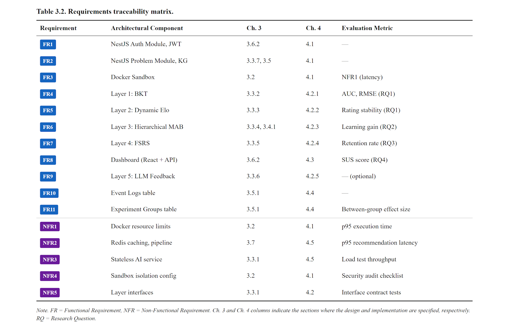

*Table 3.2. Requirements traceability matrix.*

FR1: User Authentication and Role Management

Implemented by the NestJS Auth Module using JWT tokens. Design is specified in Section 3.6.2 and implemented in Section 4.1.

FR2: Problem Management with Test Cases

Implemented by the NestJS Problem Module and Knowledge Graph. Design is specified in Sections 3.3.7 and 3.5, with implementation in Section 4.1.

FR3: Sandboxed Code Execution

Implemented through Docker-based sandboxing. Design is specified in Section 3.2, implemented in Section 4.1, and evaluated against NFR1 latency targets.

FR4: Knowledge Tracing

Implemented by Layer 1 (BKT). Design is specified in Section 3.3.2, implemented in Section 4.2.1, and evaluated using AUC and RMSE metrics for RQ1.

FR5: Difficulty Calibration

Implemented by Layer 2 (Dynamic Elo). Design is specified in Section 3.3.3, implemented in Section 4.2.2, and evaluated through rating stability analysis for RQ1.

FR6: Adaptive Problem Selection

Implemented by Layer 3 (Hierarchical MAB). Design is specified in Sections 3.3.4 and 3.4.1, implemented in Section 4.2.3, and evaluated by measuring learning gains for RQ2.

FR7: Review Scheduling

Implemented by Layer 4 (FSRS). Design is specified in Section 3.3.5, implemented in Section 4.2.4, and evaluated through retention rate measurements for RQ3.

FR8: Progress Dashboard

Implemented through a React frontend combined with API endpoints. Design is specified in Section 3.6.2, implemented in Section 4.3, and evaluated using the System Usability Scale for RQ4.

FR9: LLM Feedback Engine

Implemented by Layer 5. Design is specified in Section 3.3.6, implemented in Section 4.2.5. This requirement is optional and not tied to a specific evaluation metric.

FR10: Event Logging

Implemented through the Event Logs table. Design is specified in Section 3.5.1, implemented in Section 4.4.

FR11: Experiment Group Management

Implemented through the Experiment Groups table. Design is specified in Section 3.5.1, implemented in Section 4.4, and evaluated through between-group effect size comparisons.

NFR1-NFR5: Non-Functional Requirements

NFR1 (execution latency) and NFR4 (security) are addressed through Docker sandbox configuration in Section 3.2. NFR2 (recommendation latency) relies on the Redis caching strategy in Section 3.7. NFR3 (concurrent users) is handled by the stateless AI service design in Section 3.3.1. NFR5 (extensibility) is achieved through the strict layer interfaces described in Section 3.3.1. All non-functional requirements are verified through corresponding evaluation metrics: p95 latency measurements, load test throughput, and interface contract tests.

## 3.2. System Overview and Design Rationale

This section describes the overall architecture of the adaptive learning platform and the reasoning behind its design decisions. The platform was built from the ground up to support adaptive programming education at the university level. Rather than bolting adaptive features onto an existing online judge system, we designed every component — from the frontend code editor to the backend AI service — with adaptive learning as a core concern from the outset.

### 3.2.1. Four-Component Architecture

The platform is organized around four principal components, each responsible for a distinct role in the adaptive learning pipeline.

React + TypeScript Frontend (Vite, Ant Design, Monaco Editor).

The client application provides students with a Monaco-based code editor for writing and submitting solutions, a problem browser with concept-based navigation, an adaptive dashboard showing mastery progress and Elo ratings, and a review queue that surfaces concepts due for spaced repetition practice. We chose Vite as the build tool for its fast development iteration and optimized production bundles. Ant Design supplies a consistent, accessible component library well suited to data-rich educational interfaces.

NestJS API Gateway (TypeScript, Prisma ORM).

The API gateway manages authentication through JWT tokens, handles user and course management, supports problem CRUD operations, and orchestrates code execution. When a student submits code, the gateway saves the submission record, dispatches it to the Docker sandbox, and returns the execution result. For adaptive features, the gateway acts as a proxy to the FastAPI AI service, forwarding recommendation and update requests while shielding the frontend from the AI service’s internal API. Prisma serves as the ORM, providing type-safe database access and version-controlled schema migrations.

FastAPI AI Service (Python 3.11, SQLAlchemy).

The AI service hosts the five-layer adaptive engine: Bayesian Knowledge Tracing in Layer 1, Dynamic Elo rating in Layer 2, Hierarchical Multi-Armed Bandits with Thompson Sampling in Layer 3, FSRS spaced repetition scheduling in Layer 4, and LLM-based feedback generation in Layer 5. We chose Python for this component because the relevant machine learning ecosystem — including pyBKT [56], NumPy, SciPy, and the FSRS algorithm library — is implemented primarily in Python. FastAPI’s asynchronous request handling supports high-throughput recommendation serving, and SQLAlchemy provides direct database access for the adaptive state tables that the AI service owns.

PostgreSQL (pgvector) + Redis + Docker Sandbox.

PostgreSQL serves as the single persistent store, with the pgvector extension reserved for future embedding-based features such as semantic similarity in hint retrieval. Its mature JSONB support enables flexible storage of rating history and event metadata. Redis provides a caching layer for recommendation results and MAB state reads, along with per-student distributed locks that prevent concurrent update race conditions. Docker containers provide isolated sandboxes for executing student-submitted code, with CPU, memory, and time limits enforced at the container level to satisfy the security and fairness requirements defined in NFR4.

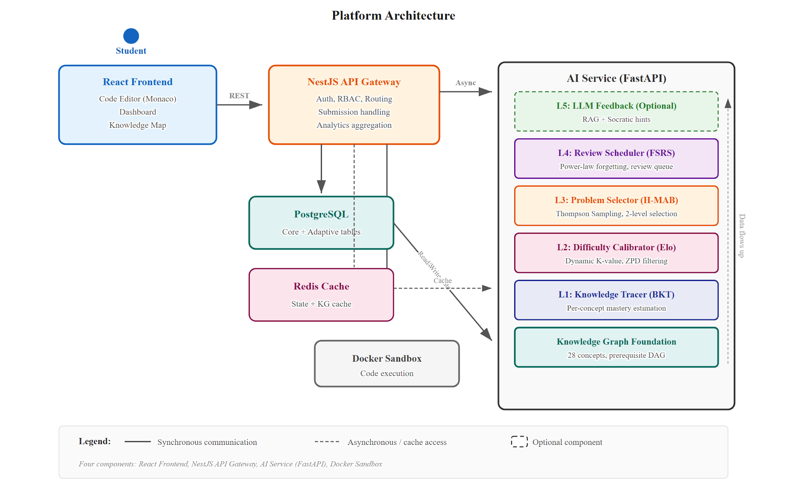

*Figure 3.1. Five-layer adaptive architecture within the four-component platform.*

### 3.2.2. Design Principles and Key Decisions

Six design principles guided the architecture. Each principle maps to one or more concrete architectural decisions, as summarized in Table 3.1.

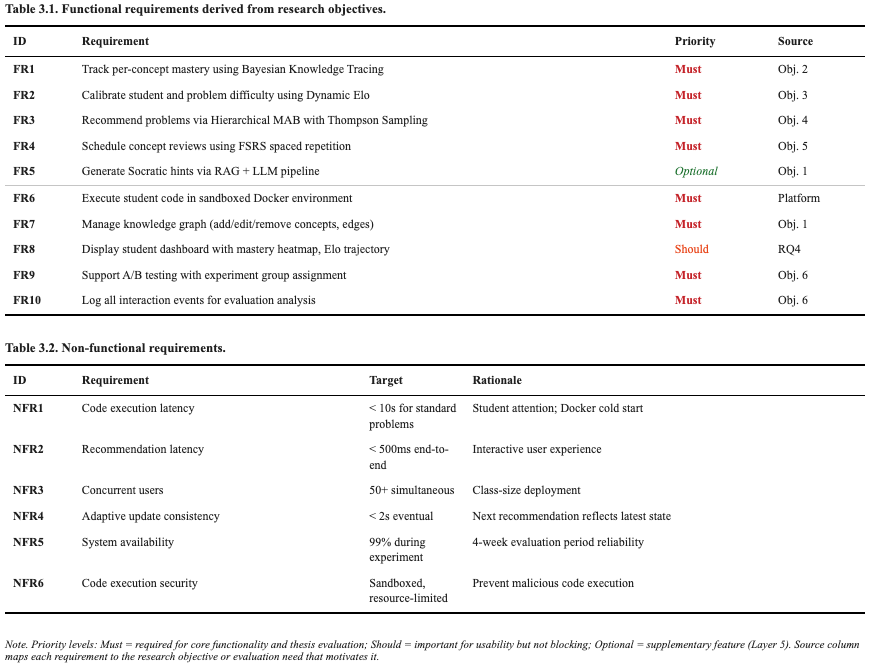

*Table 3.1. Design principles and corresponding architectural decisions.*

The most consequential decision is the separation of the AI service from the NestJS gateway. This separation allows the Python ML ecosystem (pyBKT [56], NumPy, SciPy, FSRS) to be used natively, enables independent scaling and deployment of the adaptive engine, and enforces a clean interface contract between platform logic and adaptive intelligence. The write-ownership convention complements this separation: the NestJS gateway owns writes to core domain tables, while the AI service owns writes to adaptive state tables, eliminating the need for distributed transactions.

Asynchronous adaptive updates further decouple the two services. Submission results are returned to the student synchronously, while adaptive state updates covering BKT, Elo, MAB, and FSRS are processed in the background. Redis provides both caching to meet the 500ms recommendation latency target specified in NFR2, and per-student distributed locks to serialize concurrent adaptive updates. If Redis becomes unavailable, the system degrades gracefully to direct database queries.

The progressive enhancement principle deserves particular emphasis. The platform is designed so that its core functionality — problem browsing, code submission, execution, and verdict display — operates independently of the adaptive engine. Each adaptive layer adds a capability that can be independently enabled or disabled via feature flags. This design ensures that a partial failure in the AI service does not prevent students from practicing, and it simplifies evaluation by allowing controlled comparisons between adaptive and non-adaptive conditions.

## 3.3. Proposed Five-Layer Adaptive Architecture

This section presents the five-layer adaptive architecture that constitutes the primary contribution of this thesis. The architecture is built around three principles: modularity, where each layer encapsulates a single adaptive concern and communicates through well-defined interfaces; composability, where layers build upon each other’s outputs to produce adaptive behavior that exceeds what any single layer achieves in isolation; and extensibility, where any layer can be replaced with an alternative algorithm without disrupting the overall pipeline, satisfying NFR5.

### 3.3.1. Architecture Overview

The adaptive engine runs as a FastAPI application alongside the NestJS backend, with both services sharing the same PostgreSQL database under a strict write-ownership model. The NestJS backend owns writes to core tables including users, problems, test cases, submissions, courses, concepts, knowledge graph edges, and problem-concept mappings. The AI service owns writes to adaptive state tables including knowledge states, Elo ratings, MAB states, FSRS cards, and event logs. Both services have read access to all tables. Redis is introduced as a caching layer between the two services.

The layered structure in Figure 3.1 reflects a logical dependency ordering from bottom to top. The Knowledge Graph Foundation provides structural information — concept nodes and prerequisite edges — that all layers consume. Layer 1 (BKT) consumes submission outcomes and produces mastery estimates. Layer 2 (Elo) consumes submission outcomes and produces difficulty ratings on a shared scale. Layer 3 (MAB) consumes the outputs of Layers 1, 2, and 4 to select problems. Layer 4 (FSRS) consumes submission outcomes and produces review scheduling information that Layer 3 respects. Layer 5 (LLM) operates independently, triggered on demand when students request hints. The following subsections describe each component in detail.

### 3.3.2. Layer 1: Knowledge Tracer (BKT)

Purpose.

Layer 1 maintains a probabilistic estimate of each student’s mastery of each programming concept. This estimate serves two critical downstream functions: prerequisite gating, where a concept becomes eligible for recommendation only when all its prerequisites have mastery probability exceeding the threshold of 0.85; and reward signal computation for the MAB, where learning gain is defined as the change in mastery probability resulting from a practice opportunity.

Model.

The Knowledge Tracer implements standard Bayesian Knowledge Tracing [16] as described in Section 2.2.1. For each student-concept pair, the model maintains four parameters — P(L_0), P(T), P(G), P(S) — and the current mastery estimate P(L_t). Parameters are initialized with concept-level defaults: P(L_0) = 0.1, P(T) = 0.2, P(G) = 0.15, P(S) = 0.1. These values are drawn from Corbett and Anderson’s original BKT formulation [16] and are consistent with the defaults used in pyBKT [56]. The specific values reflect typical introductory programming exercises where prior knowledge is low, learning per opportunity is moderate, and guessing rates are constrained by the multi-test-case evaluation format.

Mastery threshold.

The mastery threshold of 0.85 was selected based on standard practice in BKT implementations, where mastery at or above 0.80 to 0.90 is recommended for prerequisite gating [16]. Setting the threshold at 0.95 would require excessive practice on already-understood concepts, while 0.70 risks advancing students before they are ready. The sensitivity of this threshold is evaluated in Section 5.4.

Input.

After each graded submission, Layer 1 receives the student identifier, the concept identifier derived from the problem’s primary concept tag, and a binary correctness signal where 1 indicates ACCEPTED and 0 indicates otherwise.

Output.

The updated mastery probability P(L_t), which is written to the knowledge_states table and made available to Layers 3 and 4.

Interaction with other layers.

Layer 1 feeds Layer 3 in two ways. First, the binary mastery classification determines which concepts are eligible at the MAB’s Level 1 by enabling their dependents. If concept B requires concept A as a prerequisite, then B becomes eligible only when concept A’s mastery probability reaches 0.85 or higher. Second, the change in mastery probability serves as the reward signal for the MAB: concepts that produce larger mastery gains are more likely to be selected in the future. Layer 1 also triggers Layer 4: when a concept first reaches mastery, an FSRS card is initialized for that concept, beginning the spaced repetition cycle.

### 3.3.3. Layer 2: Difficulty Calibrator (Dynamic Elo)

Purpose.

Layer 2 maintains numerical ratings for both students and problems on a shared scale, enabling principled difficulty matching. By placing students and problems on the same rating scale, the system can operationalize Vygotsky’s Zone of Proximal Development [20] as a numerical interval: problems whose rating falls within a calibrated range above the student’s rating are considered to lie within the student’s ZPD.

Model.

The Difficulty Calibrator implements a dual Elo rating system [17] with dynamic K-values [11]. Each student and each problem maintains a rating initialized at 1200 and a K-factor that controls the sensitivity of rating updates. The expected probability that student A with rating R_A solves problem B with rating R_B is given by Equation 3.1:

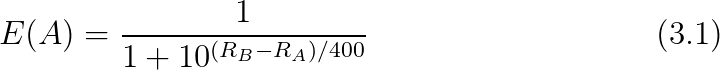

After a submission, ratings are updated based on the discrepancy between expected and actual outcomes:

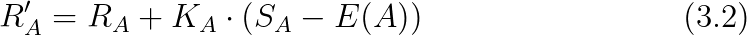

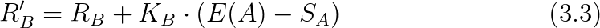

Here, S_A equals 1 if the student solved the problem (ACCEPTED) and 0 otherwise. The student’s K-factor is dynamically adjusted based on two criteria: the number of prior attempts, where higher K values allow rapid convergence for newer students, and the recent performance trend, where higher K values accommodate students on a steep learning curve. Specifically:

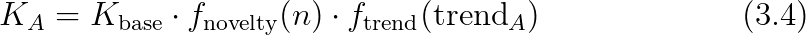

The base value K_base is set to 25. Elo [17] originally recommended K = 32 for new players and K = 16 for established players in chess; the base value of 25 serves as a midpoint suitable for the educational context, where rating volatility should be moderate. The function f_novelty(n) = max(1.0, 2.0 - n/30) provides a boost for students with fewer than 30 interactions, and f_trend scales K based on the exponential moving average of recent rating changes. Problem K-factors follow an analogous formula but with f_novelty based on the number of submissions the problem has received.

Input.

After each graded submission, Layer 2 receives the student identifier, problem identifier, and the binary outcome.

Output.

Updated student and problem Elo ratings, written to the elo_ratings table.

Interaction with other layers.

Layer 2 feeds Layer 3 by defining the ZPD filter. When the MAB at Level 2 considers candidate problems within a selected concept, only problems whose Elo rating satisfies the following condition are eligible:

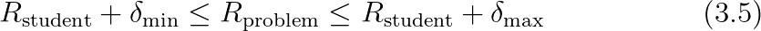

The lower bound δ_min is set to 50 and the upper bound δ_max to 250. These bounds are derived from the expected success probability in Equation 3.1: substituting δ_min = 50 yields an expected success probability of approximately 0.43, while δ_max = 250 yields approximately 0.15. After accounting for the asymmetric nature of educational gains, where students learn more from moderately challenging tasks, these bounds approximate the 36 to 64 percent success rate range recommended by flow theory [57] and the desirable difficulty framework [21]. The exact values will be validated through sensitivity analysis in Section 5.4.

### 3.3.4. Layer 3: Problem Selector (Hierarchical MAB)

Purpose.

Layer 3 is the recommendation engine. It formulates problem selection as a two-level Hierarchical Multi-Armed Bandit problem and solves it using Thompson Sampling [18], [19]. The hierarchical structure mirrors the natural two-step decision process in programming education: first, decide which concept the student should practice; then, decide which specific problem within that concept is optimal.

Model.

The Hierarchical MAB operates at two levels:

Level 1 (Concept Selection).

Each eligible concept constitutes an arm. An arm is eligible if and only if all prerequisite concepts have been mastered and the concept itself is either not yet mastered or flagged for review by Layer 4 because its FSRS retrievability has dropped below the threshold. For each eligible arm, the bandit maintains a Beta distribution modeling the expected learning gain. Thompson Sampling draws a sample from each concept’s distribution and selects the concept with the highest sampled value.

Level 2 (Problem Selection).

Within the selected concept, each unsolved problem whose Elo rating falls within the student’s ZPD constitutes an arm. Each arm maintains its own Beta distribution. Thompson Sampling again draws samples and selects the problem with the highest sampled value.

Reward Signal.

After the student submits a solution, the reward is computed as a composite signal combining three components:

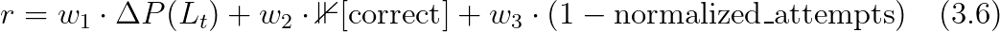

Here, ΔP(L_t) is the learning gain from Layer 1, I[correct] is the binary correctness indicator, and normalized_attempts equals min(attempt_number, M) / M, where M = 5 is a configurable cap beyond which the attempt penalty is saturated. The weights w_1 = 0.5, w_2 = 0.3, and w_3 = 0.2 are initial values selected to prioritize learning gain as the primary optimization objective. These weights will be tuned through grid search during the evaluation phase described in Section 5.4.

The reward r is clipped to the interval [0, 1] before updating the Beta distribution parameters to ensure mathematical validity. While Thompson Sampling’s convergence guarantees were originally proved for Bernoulli rewards [18], using a continuous reward with Beta priors is a well-established approximation that retains favorable empirical performance [58]. The Beta parameters are updated as follows: α is incremented by r and β is incremented by (1 - r).

Interaction with other layers.

Layer 3 is the integration point where all other layers converge. It consumes mastery estimates and prerequisite gating from Layer 1, ZPD constraints from Layer 2, review urgency from Layer 4, and structural information from the Knowledge Graph Foundation. The integration of FSRS with the MAB deserves particular attention: when concepts are due for review, they are injected into the Level 1 candidate set with a priority boost to their Thompson Sampling prior, ensuring that review needs are addressed without entirely overriding exploration of new material.

The specific combination of prerequisite constraints derived from a knowledge graph, BKT-based mastery gating, and FSRS review urgency within a hierarchical Thompson Sampling framework has not, to the best of our knowledge, been previously reported. While Multi-Armed Bandits have been applied to educational recommendation before — notably by Clement et al. [22] — the integration of these four components into a single hierarchical decision process is the second key contribution of this thesis.

### 3.3.5. Layer 4: Review Scheduler (FSRS)

Purpose.

Layer 4 addresses the forgetting problem by modeling memory decay for each mastered concept and scheduling timely reviews to maintain long-term retention. Within the scope of the literature surveyed in Chapter 2, this appears to be among the first applications of the FSRS algorithm [12] to programming skill retention, and is described here as a secondary contribution of the thesis.

Model.

The implementation is based on FSRS v4 [12], whose power-law retrievability decay has been empirically validated against the SM-2 algorithm on large-scale flashcard datasets. FSRS models each student-concept pair as a memory card with two state variables: difficulty D, ranging from 1 to 10 and representing how inherently hard the concept is for this student; and stability S, which is the time interval in days at which retrievability drops to 90 percent. The retrievability at time t after the last review is:

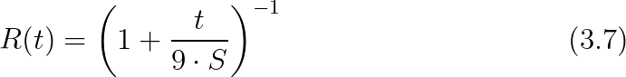

When the student reviews a concept by solving a problem tagged with that concept, the FSRS algorithm updates both difficulty and stability based on the review outcome. The review outcome is expressed as a rating from 1 (complete failure) to 4 (effortless recall), which requires a mapping from code submission outcomes to FSRS ratings. The details of this rating mapping are presented in Chapter 4.

Input.

After a submission on a mastered concept, Layer 4 receives the student identifier, concept identifier, and a submission-derived FSRS rating.

Output.

Updated FSRS card parameters including difficulty, stability, retrievability, and due date, all written to the fsrs_cards table. Concepts whose retrievability has dropped below the review threshold of 0.7 are flagged as due for review.

Interaction with other layers.

Layer 4 feeds Layer 3 by identifying concepts that need review. The MAB treats review-due concepts as eligible arms at Level 1 even when they are already mastered, with a priority boost proportional to the urgency of the review, determined by how far below the threshold the retrievability has dropped. This integration ensures that the system balances three competing objectives: advancing to new concepts through exploitation, exploring uncertain concepts through exploration, and reviewing mastered concepts at risk of being forgotten to support retention. The specific mechanism for this integration is described in Section 3.4.1.

### 3.3.6. Layer 5: LLM Feedback Engine (Optional)

Purpose.

Layer 5 provides contextual, pedagogically appropriate hints when students are struggling with a problem. It is designated as optional because the core thesis contribution — the integration of Layers 1 through 4 — is independent of LLM-based feedback.

Model.

The feedback engine uses a Retrieval-Augmented Generation pipeline. When a student requests a hint or after a configurable number of failed attempts, the system constructs a query combining the problem description, the student’s latest code, the error message, and the relevant concept from the knowledge graph. This query is used to retrieve relevant context: concept descriptions and prerequisite information from the knowledge graph, similar solved examples from the problem bank, and common misconceptions associated with the concept. The retrieved context and the student’s submission are passed to a large language model with a prompt template that enforces Socratic questioning, guiding the student toward the solution through questions and partial explanations rather than providing the answer directly.

Interaction with other layers.

Layer 5 operates independently of the recommendation pipeline. It is triggered on demand by the student or automatically after repeated failures, and it consumes the student’s current knowledge state from Layer 1 to calibrate the level of the hint. A student with low mastery of the concept receives more fundamental guidance, while a student with moderate mastery receives a more targeted nudge.

### 3.3.7. Knowledge Graph Foundation

Purpose.

The Knowledge Graph provides the structural backbone that coordinates all adaptive layers. It is a directed acyclic graph in which nodes represent programming concepts and edges represent prerequisite relationships. The graph encodes the pedagogical sequencing implicit in any programming curriculum: understanding variables is prerequisite to understanding loops, understanding loops is prerequisite to understanding nested loops and basic algorithms, and so forth.

Structure.

The knowledge graph consists of approximately 30 programming concepts organized into six topic groups: Basics (variables, data types, I/O), Control Flow (conditionals, loops, nested loops), Functions (function definition, parameters, return values, recursion), Data Structures (lists, tuples, dictionaries, sets, strings), Algorithms (sorting, searching, two pointers), and Advanced (dynamic programming, graph algorithms). The complete concept inventory is provided in Appendix B. Each concept has a difficulty tier ranging from 1 to 5 that reflects its position in the curriculum. Prerequisite edges are weighted with a default weight of 1.0 to allow for soft prerequisites in future extensions.

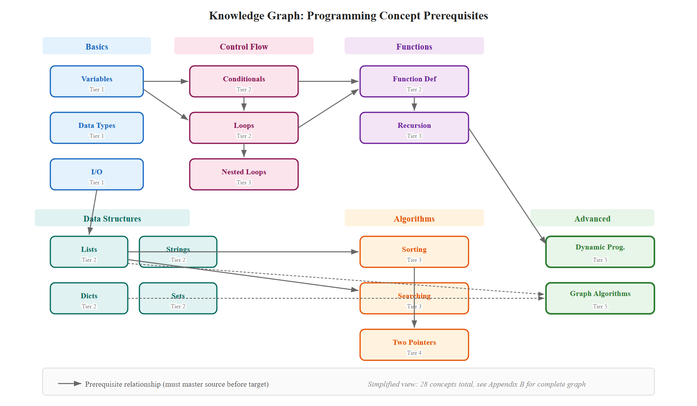

*Figure 3.2. Simplified view of the knowledge graph showing concept nodes and prerequisite edges. The complete 28-concept graph is provided in Appendix B.*

Role in the architecture.

The Knowledge Graph is consumed by multiple layers. Layer 1 (BKT) uses the graph to identify which concepts each problem assesses via the problem_concepts mapping. When a student solves a problem tagged with concept C, the BKT update is applied to concept C. Layer 3 (MAB) uses prerequisite edges to determine concept eligibility, where a concept is eligible only if all concepts connected to it by incoming prerequisite edges have been mastered, and the graph’s topological sort defines the natural learning progression. Layer 4 (FSRS) uses the graph to ensure that when a concept is due for review, the system selects a problem that specifically targets that concept rather than a related but distinct concept. Layer 5 (LLM) uses concept descriptions and prerequisite chains to provide contextually grounded hints.

The graph is managed by instructors and administrators through the NestJS API and is expected to evolve as the platform’s problem bank grows. A dedicated management interface (UC12) supports adding, editing, and removing concepts and edges, with validation to ensure the graph remains a DAG since cycles would create impossible prerequisite requirements.

### 3.3.8. Hyperparameter Summary

Table 3.3 consolidates all hyperparameters introduced in this section with their default values, valid ranges, and justifications. This table serves as a critical reference for Chapter 4 (implementation choices) and Chapter 5 (sensitivity analysis).

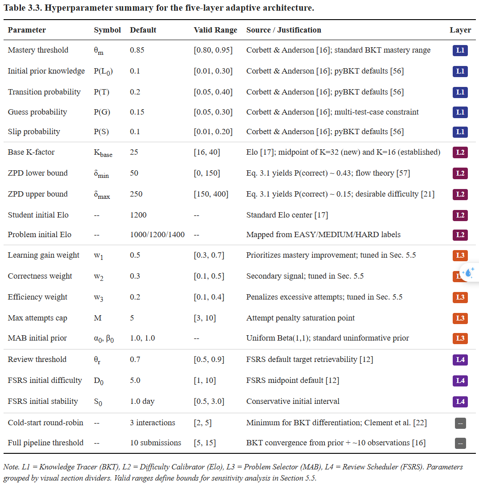

*Table 3.3. Hyperparameter summary for the five-layer adaptive architecture.*

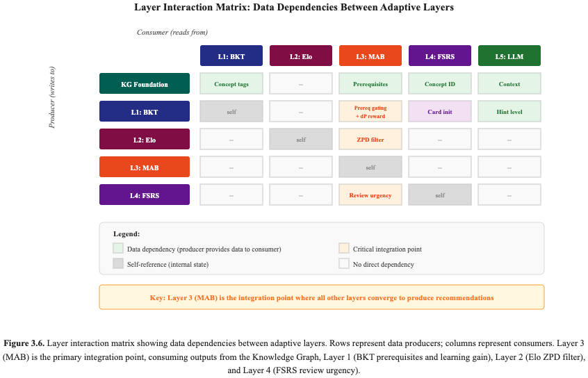

*Figure 3.6. Layer interaction matrix showing data dependencies between the five layers and the Knowledge Graph Foundation.*

## 3.4. Data Flow Design

The adaptive platform operates through two primary data flows: the recommendation flow, triggered when a student requests a problem, and the submission processing flow, triggered when a student submits a solution. This section describes each flow in detail, followed by the error handling provisions and the cold-start handling strategy.

### 3.4.1. Recommendation Flow

The recommendation flow is triggered when a student requests a practice problem. It traverses all adaptive layers to produce a personalized recommendation. Figure 3.3 illustrates the sequence of interactions between the five system actors: Student, React Client, NestJS API, Redis Cache, and AI Service.

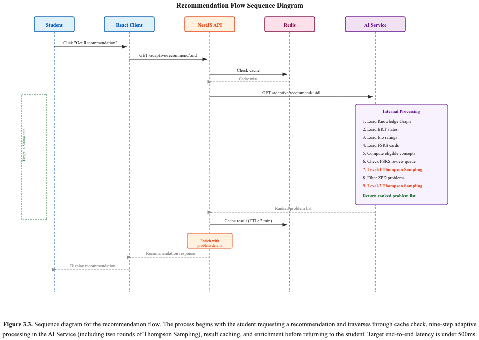

*Figure 3.3. Sequence diagram for the recommendation flow.*

The recommendation process within the AI service proceeds through seven steps. First, the service loads the knowledge graph, either from Redis cache or from the concepts and knowledge_graph_edges tables if the cache has expired. The graph structure changes infrequently and is cached with a one-hour TTL. Second, the service loads the student’s BKT knowledge states, Elo ratings, MAB states, and FSRS cards, each cached in Redis with TTLs appropriate to their update frequency, as detailed in Section 3.7.

Third, using the knowledge graph and BKT mastery estimates, the service computes the set of eligible concepts at Level 1. A concept c is eligible if all prerequisites of c are mastered and either c itself is not yet mastered or c is due for review according to FSRS. Concepts due for review that are also mastered are included in the eligible set with a priority boost: their Thompson Sampling prior is inflated by adding a review urgency bonus proportional to how far the retrievability has fallen below the threshold.

Fourth, for each eligible concept, the service draws a sample from the concept’s Beta distribution using Thompson Sampling and selects the concept with the highest sampled value. Fifth, within the selected concept, the service retrieves all unsolved problems tagged with that concept and filters them by the ZPD constraint defined in Equation 3.5. If no problems pass the ZPD filter, the service falls back to the next-highest concept from the previous step.

Sixth, among the ZPD-filtered problems, the service draws Thompson Sampling samples and selects the problem with the highest sampled value. Seventh, the service returns a ranked list of recommended problems, typically three to five, rather than just the single top recommendation. This gives the student some agency in choosing among appropriately challenging options. The NestJS API enriches the list with full problem details before returning it to the client.

### 3.4.2. Submission Processing Flow

The submission processing flow is triggered when a student submits code for a problem. It involves two phases: synchronous code execution, which must return promptly to the student, and asynchronous adaptive layer updates, which happen in the background.

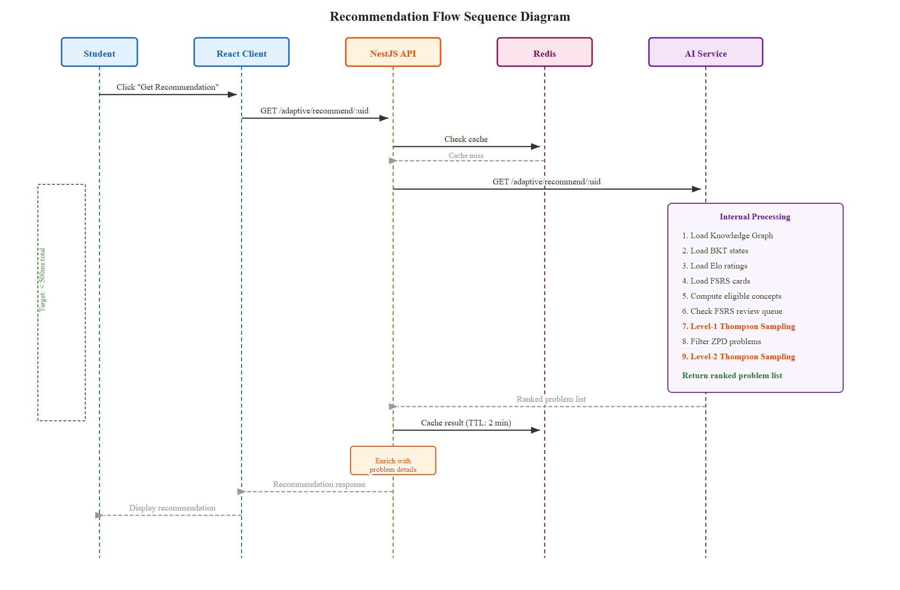

*Figure 3.4. Submission processing flow showing the separation of synchronous execution from asynchronous adaptive updates.*

Phase 1: Synchronous Execution.

The student submits code via the React client. The NestJS API receives the submission, saves it to the submissions table with status PENDING, and dispatches it to the Docker sandbox. The Docker sandbox executes the code against each test case, recording pass or fail for each. The NestJS API then updates the submission status to ACCEPTED, WRONG_ANSWER, TIME_LIMIT, RUNTIME_ERROR, or COMPILATION_ERROR and returns the result to the student.

Phase 2: Asynchronous Adaptive Updates.

After the submission status is finalized, the NestJS API sends an asynchronous POST request to the AI service at /adaptive/update with a payload containing the student identifier, problem identifier, concept identifier, correctness indicator, attempt number, time spent, and error type. The AI service processes the update through each layer sequentially.

Layer 1 (BKT) updates the mastery probability using the Bayesian inference equations from Chapter 2 and computes the learning gain. Layer 2 (Elo) updates both student and problem ratings using Equations 3.1 through 3.4 with dynamically adjusted K-factors. Layer 3 (MAB) computes the composite reward signal using Equation 3.6 and updates the Beta distribution parameters for both the selected concept arm and the selected problem arm. Layer 4 (FSRS) either updates an existing FSRS card if the concept was previously mastered, or creates a new card if the concept has just reached mastery for the first time.

All updated states are then written to the database, Redis caches for the affected student are invalidated, and an event log entry is created recording the full update for evaluation purposes.

The sequential ordering of layer updates in Phase 2 is important: Layer 1 must execute before Layer 3 because the MAB reward depends on the learning gain from BKT. Layer 2 can execute in parallel with Layer 1 since it depends only on the submission outcome. Layer 4 depends on Layer 1 to know whether mastery has been reached and must therefore execute after Layer 1.

This asynchronous pattern introduces an eventual consistency window typically under two seconds, which is acceptable given that a single recommendation cycle based on slightly stale state has minimal pedagogical impact. In the worst case, a student who submits a solution and immediately requests a new recommendation may receive a recommendation computed from pre-update state; the next recommendation request will reflect the updated state.

### 3.4.3. Error Handling and Edge Cases

The adaptive pipeline must handle failures gracefully to prevent inconsistent state and ensure a reliable student experience. This section describes the error handling strategy for the primary failure modes.

Transactional boundaries:

Each adaptive update covering Layers 1 through 4 is wrapped in a database transaction. A failure in any layer rolls back all updates for that submission event, preventing inconsistent state where, for example, BKT mastery is updated but the corresponding Elo rating is not.

Retry mechanism:

Failed adaptive updates are enqueued in a Redis-backed retry queue with exponential backoff, starting at a one-second delay with a maximum of three retries. After three failures, the event is written to a dead-letter table for manual inspection. The student’s submission result is unaffected by adaptive update failures, since Phase 1 code execution completes independently.

Empty eligible set:

If no eligible concepts exist because all non-mastered concepts have unmet prerequisites, the system falls back to recommending the concept with the highest mastery progress — the concept closest to the 0.85 threshold. This situation arises rarely in practice, as the knowledge graph is designed with multiple prerequisite-free entry points, but it can occur if a student has partially mastered several prerequisite chains without completing any.

ZPD exhaustion.

If no problems fall within the ZPD bounds after the initial filter, the system performs up to two expansion steps, each widening the bounds by 50 Elo points in both directions. If no problems are found after two expansions, the system returns the easiest unsolved problem in the concept regardless of Elo matching, accepting the pedagogical compromise in favor of providing a recommendation.

Concurrent submissions:

Per-student sequential processing is enforced via a per-student Redis lock using the SETNX pattern with a 30-second TTL to prevent deadlocks. If a lock is held when a new update arrives, the update is queued and processed after the lock is released. This prevents race conditions where two concurrent submissions produce inconsistent state updates.

AI service unavailability:

If the AI service is temporarily unavailable, for example during a restart, the NestJS API returns a fallback recommendation drawn from the pool of unsolved problems in the student’s most recently active topic group, ordered by static difficulty label. The submission result is always returned to the student regardless of AI service availability.

### 3.4.4. Cold Start Handling

The cold-start problem arises when the system has insufficient data to make informed adaptive decisions. This occurs in two scenarios: new students with no submission history, and new problems with no submission data.

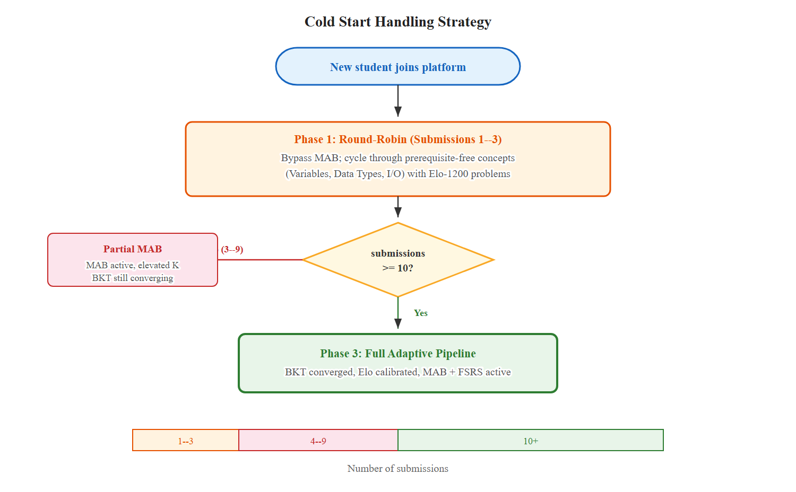

*Figure 3.7. Cold start handling flowchart showing the three-phase transition from round-robin to full adaptive pipeline.*

New Student Cold Start:

When a student first uses the platform, all adaptive state is at its default values: BKT mastery at P(L_0) = 0.1 for all concepts, Elo rating at 1200, MAB priors at Beta(1, 1), and no FSRS cards. The system handles this through a structured onboarding phase with three stages.

For the first 3 interactions, the system bypasses the MAB and uses a round-robin strategy over prerequisite-free concepts such as Variables and Data Types. This ensures that the earliest submissions provide signal across the foundational concepts. The threshold of 3 interactions is informed by Clement et al. [22], who demonstrated that MAB-based educational recommendations require a minimum exploration period to outperform random selection. Within each concept, the system selects the problem closest to Elo 1200, ensuring a moderate difficulty level for the first interactions.

After approximately 10 submissions, the BKT and Elo models have accumulated sufficient data to differentiate the student from the population mean, and the full adaptive pipeline takes over. This threshold reflects BKT’s convergence behavior: given the initial prior P(L_0) = 0.1 and transition probability P(T) = 0.2, approximately 10 observations are sufficient for the posterior to diverge meaningfully from the prior [16].

The cold-start phase resolves quickly because BKT’s Bayesian update meaningfully shifts posterior estimates from each observation, and the elevated initial K-factor in the Elo system amplifies early rating changes, enabling rapid calibration.

New Problem Cold Start:

When a new problem is added to the platform, it has no submission history from which to derive an empirical Elo rating. The system initializes the problem’s Elo rating based on its static difficulty label: EASY maps to Elo 1000, MEDIUM to 1200, and HARD to 1400. The initial K-factor is set to 50, which is double the base K-factor, to allow rapid convergence toward the problem’s true difficulty. After approximately 30 submissions from diverse students, the problem’s Elo rating stabilizes and the K-factor decays to the base value. The MAB prior for the new problem is initialized at Beta(1, 1), ensuring that Thompson Sampling’s natural exploration tendency gives the problem a fair chance of being recommended despite its uncertain reward distribution.

## 3.7. Caching Strategy

The recommendation pipeline involves multiple database queries — loading knowledge states, Elo ratings, FSRS cards, MAB states, and the knowledge graph — followed by computational processing including prerequisite gating, ZPD filtering, and Thompson Sampling. To meet the 500ms recommendation latency target specified in NFR2 under concurrent load, the system employs Redis as a caching layer with the following policies.

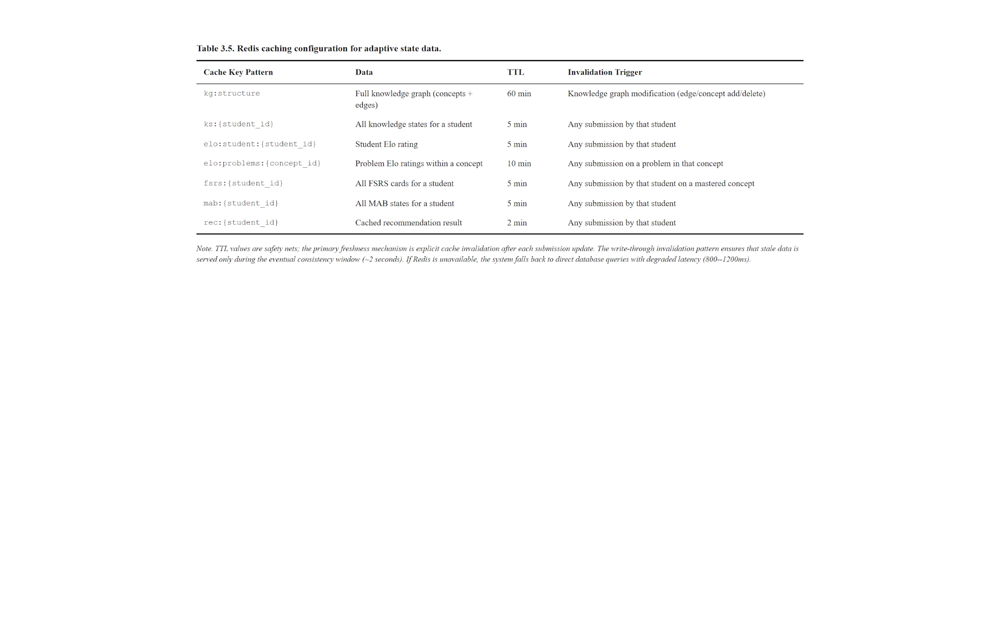

*Table 3.5. Redis caching configuration for adaptive state data.*

The TTL values are designed to balance freshness against cache hit rate. The knowledge graph changes infrequently, only when instructors modify the curriculum, so a 60-minute TTL is appropriate. Student-specific state has a 5-minute TTL, which serves as a safety net against missed invalidation events. The primary freshness mechanism is explicit invalidation after each submission update, so the TTL is expected to expire rarely under normal operation. The recommendation result itself has the shortest TTL of 2 minutes because it should reflect the student’s most recent submission.

Invalidation strategy:

Cache invalidation follows the write-through pattern: when the AI service processes a submission update, it invalidates the relevant cache entries for the affected student. Specifically, after updating Layers 1 through 4, the service deletes the cached knowledge states, student Elo rating, MAB states, FSRS cards, and recommendation result for that student. Problem-level Elo cache is invalidated only when a problem’s rating changes by more than 10 points, reducing unnecessary cache churn for minor rating fluctuations.

Fallback behavior:

If Redis is unavailable due to a transient failure, the AI service falls back to direct database queries. The recommendation latency may increase to an estimated 800 to 1200 milliseconds without caching, but the system remains functional. This graceful degradation ensures that the adaptive features are not gated on Redis availability.
