# CHAPTER 4. IMPLEMENTATION

The previous chapter (3) included detailed architecture of the adaptability of the learning environment at all levels including each layer's responsibilities; interaction with other layers, their interfaces, data flow; etc. In this chapter I will discuss how each of these five layers was developed into working software. The length of this chapter is a result of the following topics included: Technical options to implement each layer along with a rationale as to why those technical options were chosen; Knowledge Graph (the core of the adaptive engine); The development code walkthrough for all five layers; Front-end components to display adaptive data; and Finally the deployment process of the entire system.

The project followed the phased roadmap outlined in the Implementation Plan. Phase 0 -- Initial Phase -- was dedicated to the establishment of the Knowledge Graph and the creation of the Database schema. During Phases 1 to 4, the four adaptive layers were constructed in the order of their dependencies. Phase 5 combined all of these layers into a single delivery pipeline. Phase 6 refreshed the frontend. Lastly, Phase 7 provided optional feedback from an LLM. The content in this chapter maps to these phases and to the nine content sections defined in the thesis outline.

## 4.1. Technology Stack

There are four main components included in the platform, each chosen for a specific reason. The rationale for the selection and an explanation of the components follow.

**Frontend: React 18 + TypeScript + Ant Design.** The client-side application is driven by React 18. Vite is the build tool for the application. TypeScript is included for static type checking for the data-intensive components for the dashboards displaying the probabilities, Elo histories, and review schedules. Ant Design is included for the rich component library --- data tables, charts, form elements --- that speeds up development of the instructor and student dashboards. The component-based approach offered by React is a good fit for the modular approach required by the adaptive UI: every adaptive metric (mastery radar, Elo chart, review queue) is its own component and can be dropped anywhere on the page.

**Backend API: NestJS 10 + Prisma 6.** NestJS, a TypeScript-based framework that follows the module controller service pattern, is used as the API gateway. This was chosen over Express and Fastify due to the native support for dependency injection and decorators, which reduces code complexity in a system with a lot of modules that are very tightly integrated (authentication, problems, submissions, courses, adaptive proxy). Prisma is used for the ORM layer, which provides a type-safe ORM solution with a declarative schema that generates the TypeScript client and database migrations from a single source of truth. The NestJS server is responsible for handling JWT authentication, problem storage, test case storage, dynamic request routing to the AI service, and Docker sandbox orchestration for code execution.

**AI Service: FastAPI + Python 3.11.** Another microservice, written in Python, is responsible for hosting the adaptive engine. This was a natural choice, as the machine learning libraries --- NumPy for Thompson Sampling, mathematical libraries for BKT and FSRS calculations, sentence-transformers for the legacy embedding-based recommender --- are much more developed than their counterparts in TypeScript. FastAPI was chosen for this service based on its native async support, auto-generation of OpenAPI documentation, and throughput for I/O-bound tasks. It provides RESTful interfaces for all of the adaptive layers and the pipeline orchestrator, using the same PostgreSQL database as the NestJS server but through SQLAlchemy. This eliminates the need for API calls between services for database access while keeping service boundaries clean.

**Database: PostgreSQL 16 + pgvector + Redis 7.** All data for platform users is stored in PostgreSQL: user accounts, problems, submissions, knowledge states, Elo ratings, MAB states, and FSRS cards. The pgvector extension is used for efficient cosine similarity search for the legacy content-based filtering system using 384-dimensional sentence-transformer embeddings. The Redis database is used for caching the recommendation pipeline with precomputed recommendation lists and knowledge states with configurable TTLs to meet the 500-millisecond latency target from NFR2.

**Code Execution: Docker Sandbox.** Code written by a student runs inside a temporary Docker container with very restrictive access, including no network access, a maximum memory allocation of 256 MB, a CPU timeout of 5 seconds, and running in an unprivileged mode. A new container is started for every student code submission, and once the code has run against test cases and captured stdout and stderr, the container is immediately discarded. This isolation approach satisfies NFR4 (execution security) and guards against fork bombs, filesystem escape, and cross-student interference.

Table 4.1 gives an overview of the technology stack with version numbers and primary responsibilities.

Table 4.1. Technology Stack Summary

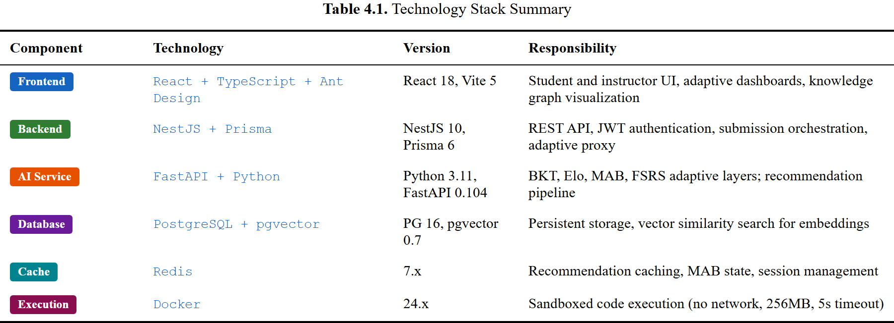

## 4.2. Knowledge Graph Construction

The knowledge graph is the bedrock upon which the entire adaptive engine sits. It feeds the concept taxonomy, prerequisites, and the relationship between problems and concepts, which are used by Layer 1 (BKT), Layer 3 (MAB), and Layer 4 (FSRS). In other words, without a good knowledge graph, prerequisites in the MAB fail, BKT loses its ability to track student mastery for individual concepts, and FSRS loses the ability to schedule reviews for individual concepts.

### 4.2.1. Concept Taxonomy

The taxonomy was curated by hand and was based on an introductory Python programming course curriculum offered by Hanoi University. It comprises approximately 30 programming concepts divided into five tiers of difficulty and seven topic groups. The tiers reflect a logical progression of an introductory Python programming course: Tier 1 (Foundations) deals with variables, data types, and input/output; Tier 2 (Core Skills) deals with operators, conditionals, and loops; Tier 3 (Intermediate) deals with functions, strings, and lists; Tier 4 (Advanced Application) deals with dictionaries, file I/O, exceptions, and object-oriented programming; and Tier 5 (Expert) deals with recursion, sorting algorithms, and advanced data structures.

The `concepts` table stores each concept with these attributes:

1 | concepts (

2 |     id              SERIAL PRIMARY KEY,

3 |     name            VARCHAR(100) UNIQUE,

4 |     display_name    VARCHAR(200),

5 |     description     TEXT,

6 |     topic_group     VARCHAR(100),

7 |     difficulty_tier INT DEFAULT 1

8 | )

Seven topic groups --- Fundamentals, Control Flow, Functions and Scope, Data Structures, Object-Oriented Programming, Algorithms, and File and Error Handling --- provide a second organizational axis. These are used for the dashboard's mastery radar chart, where each axis corresponds to a topic group.

### 4.2.2. Prerequisite Relationships

Prerequisites are represented as directed edges in a directed acyclic graph (DAG). The edge states that a student should have a good grasp of the source concept before the target concept is learned. As a concrete example, "for_loops" has "conditionals" and "variables" as prerequisites, reflecting the pedagogical reality that one should understand conditionals and variable assignment before one can write useful loop statements.

These edges live in the `knowledge_graph_edges` table:

1 | knowledge_graph_edges (

2 |     id               SERIAL PRIMARY KEY,

3 |     from_concept_id  INT REFERENCES concepts(id),

4 |     to_concept_id    INT REFERENCES concepts(id),

5 |     relation_type    VARCHAR(20) DEFAULT 'PREREQUISITE',

6 |     weight           FLOAT DEFAULT 1.0,

7 |     UNIQUE(from_concept_id, to_concept_id)

8 | )

There are approximately 45 prerequisite edges in the graph. The DAG property is maintained at the application level: before adding a new edge, the system checks whether it does not form a cycle with existing edges. The weight field is included for future use in weighted prerequisite gating, where partial knowledge of a prerequisite could grant access to the next concept under certain conditions.

### 4.2.3. Problem-to-Concept Mapping

Each problem is related to one or more concepts via the `problem_concepts` junction table. One such relation per problem is marked as primary, which means that this is the main concept that this particular problem was written for. The secondary concepts are used for the skills that this particular problem also exercises, but not as a main focus. A problem that requires a student to implement binary search, for example, is related to "searching_algorithms" as a primary concept, and also to "lists" and "while_loops" as secondary concepts.

1 | problem_concepts (

2 |     id          SERIAL PRIMARY KEY,

3 |     problem_id  UUID REFERENCES problems(id),

4 |     concept_id  INT REFERENCES concepts(id),

5 |     is_primary  BOOLEAN DEFAULT false,

6 |     UNIQUE(problem_id, concept_id)

7 | )

This primary vs. secondary distinction is used directly in the BKT update logic. A correct submission will update the mastery estimate for the primary concept fully, but only partially for secondary concepts. Conversely, an incorrect submission will only penalize the primary concept, since the error is likely due to a lack of the primary skill rather than the secondary ones.

### 4.2.4. Future Direction: Automated Knowledge Graph Construction

While the manual curation of the knowledge graph is feasible for a single course, it is not feasible for a multi-course deployment. Future work will explore the use of Automated Concept Extraction (ACE), a methodology that uses natural language processing and code analysis to automatically infer concept tags and prerequisite relationships from problem descriptions, solution code, and student submission patterns. The manually constructed graph doubles as a validated ground truth for benchmarking any automated extraction approach.

## 4.3. Layer 1: Knowledge Tracing

The first layer utilizes Bayesian Knowledge Tracing (BKT) to maintain a probabilistic estimate of mastery *P(L**t**)* for every (student, concept) pair. The code lives in `ai-service/app/services/bkt_service.py` and follows the mathematical model laid out in Section 3.3.1.

### 4.3.1. BKT Implementation

The student-concept pair is modeled as a two-state Hidden Markov Model where the hidden states are Learned (*L*) and Not Learned (*¬ L*). The model has four parameters: prior knowledge *P(L**0**)*, learn rate *P(T)*, guess rate *P(G)*, and slip rate *P(S)*. The default values of the parameters differ by difficulty tier, a choice motivated by the observation that basic concepts such as variables have higher prior knowledge and learn rates than advanced concepts such as recursion.

Below is the core update function, which computes the posterior mastery probability once a student's response has been observed:

 1 | def bkt_update(p_mastery: float, is_correct: bool, params: BKTParams) -> float:

 2 |     p_l = p_mastery

 3 |     p_g = params.p_guess

 4 |     p_s = params.p_slip

 5 | 

 6 |     if is_correct:

 7 |         p_correct = p_l * (1 - p_s) + (1 - p_l) * p_g

 8 |         p_l_given_obs = (p_l * (1 - p_s)) / p_correct if p_correct > 0 else p_l

 9 |     else:

10 |         p_incorrect = p_l * p_s + (1 - p_l) * (1 - p_g)

11 |         p_l_given_obs = (p_l * p_s) / p_incorrect if p_incorrect > 0 else p_l

12 | 

13 |     # Apply learning transition

14 |     p_l_new = p_l_given_obs + (1 - p_l_given_obs) * params.p_transit

15 | 

16 |     return max(0.001, min(0.999, p_l_new))

There are two stages in the update process. The first one uses Bayes' theorem to compute the posterior probability that the student has mastered the concept given the observed response. For a correct response, this posterior is *P(L**t** |* correct*) = P(L**t**)(1 - P(S)) / P(*correct*)*, where *P(*correct*) = P(L**t**)(1 - P(S)) + (1 - P(L**t**))P(G)*. The second stage uses the learning transition to compute the probability that the student picked up the concept during practice, even if mastery was not yet established: *P(L**t+1**) = P(L**t** |* obs*) + (1 - P(L**t** |* obs*))P(T)*. The final value is clamped to *[0.001, 0.999]* to prevent any numerical boundary problems.

Figure 4.2. BKT as a Hidden Markov Model: the two hidden states (Learned, Not Learned) and the four transition/emission parameters.

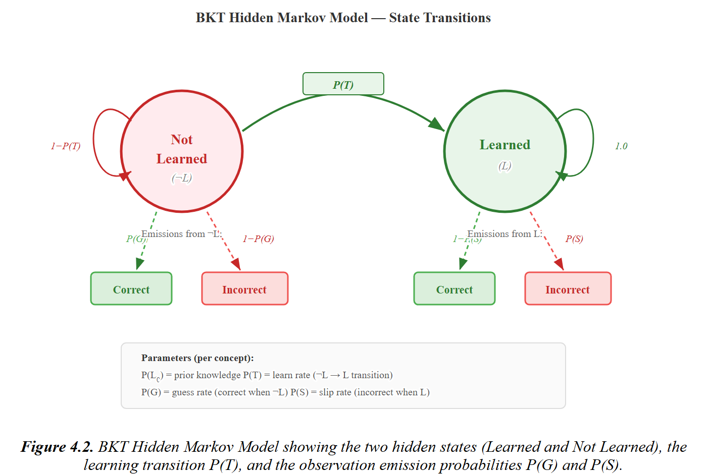

Default parameters break down by difficulty tier as follows:

Table 4.2. Default BKT Parameters by Difficulty Tier

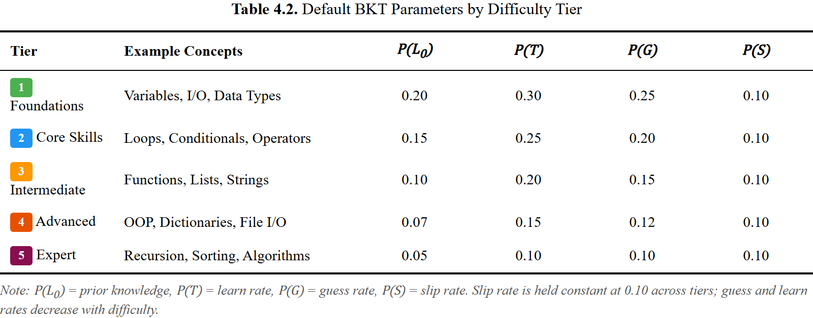

One code submission can affect several concepts simultaneously. The `BKTService.update` method retrieves all the concept mappings for the submitted problem and applies differentiated updates:

 1 | async def update(self, session, student_id, problem_id, is_correct):

 2 |     mappings = await get_problem_concepts(session, problem_id)

 3 |     updates = []

 4 |     for mapping in mappings:

 5 |         state = await self.get_or_create_state(

     |             session, student_id, mapping.concept_id)

 6 |         params = BKTParams(p_l0=state.p_l0, p_transit=state.p_transit,

 7 |                            p_guess=state.p_guess, p_slip=state.p_slip)

 8 |         p_before = state.p_mastery

 9 | 

10 |         if mapping.is_primary:

11 |             state.p_mastery = bkt_update(state.p_mastery, is_correct, params)

12 |             state.n_attempts += 1

13 |             if is_correct:

14 |                 state.n_correct += 1

15 |         else:

16 |             if is_correct:

17 |                 state.p_mastery = bkt_update(state.p_mastery, True, params)

18 | 

19 |         updates.append({"concept_id": mapping.concept_id,

20 |                          "p_mastery_before": p_before,

21 |                          "p_mastery_after": state.p_mastery})

22 |     await session.commit()

23 |     return {"updates": updates}

The main design decision here is the softened update for secondary concepts. Only a correct answer moves the needle on secondary concept mastery; an incorrect answer does not touch them. The idea is simple: a failure on a problem that is mostly about recursion should not negatively impact the mastery estimate for list operations, even though the problem also involves lists.

After each submission, the BKT service runs asynchronously through the adaptive engine's `process_submission` method. This event-driven wiring ensures mastery estimates are current without introducing latency into the synchronous submission-execution flow that the student waits on.

Figure 4.1. Submission processing pipeline: sequence diagram showing how a code submission triggers updates across all four adaptive layers.

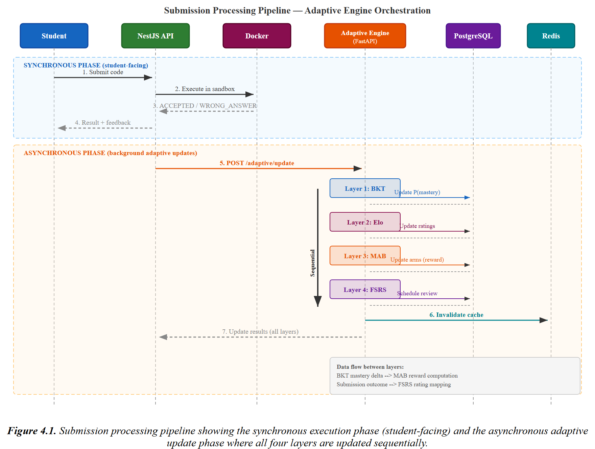

## 4.4. Layer 2: Elo System

In addition, Layer 2 brings a dual Elo rating system into play, including dynamic difficulty ratings for both students and problems. The code in `ai-service/app/services/elo_service.py` builds on the standard Elo formula but adds a dynamic K-factor that adjusts to each student's recent learning trajectory.

### 4.4.1. Dual Elo Implementation

Each student and each problem has a numerical Elo rating. When a student submits a solution, the expected outcome is calculated from the difference in ratings, then the ratings are adjusted based on how far the actual outcome deviates from the expected outcome.

The expected probability that a student solves a given problem is:

After observing the outcome *S* (1 if correct, 0 otherwise), both ratings are updated:

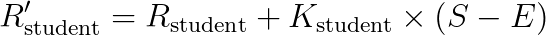

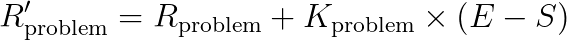

Student ratings and problem ratings move in opposition: a correct answer increases a student's rating while decreasing a problem's rating because the outcome indicates that the problem was easier than its rating suggested.

Student ratings are initially set at 1200; problems draw their initial ratings from their static difficulty label --- EASY = 1000, MEDIUM = 1400, HARD = 1800. All ratings are clamped to [400, 2800] so that no extreme values can warp the expected-score calculation.

1 | DEFAULT_STUDENT_ELO = 1200.0

2 | ELO_INIT = {"EASY": 1000.0, "MEDIUM": 1400.0, "HARD": 1800.0}

3 | 

4 | def expected_score(r_student: float, r_problem: float) -> float:

5 |     return 1.0 / (1.0 + 10 ** ((r_problem - r_student) / 400))

The innovation of this system is its dynamic K-factor. Rather than keeping K fixed, the system adjusts it based on the current trend of the student's performance. A student who has been performing better than expected is given a lower K, which stabilizes their rating. A student who has been performing worse than expected is given a higher K, allowing the system to recalibrate more quickly. This design draws on the adaptive K-value methodology from Pelanek [11].

 1 | def compute_dynamic_k(history: list[dict], k_min=10, k_max=40) -> float:

 2 |     if len(history) < 3:

 3 |         return k_max  # New students get high K for fast initial calibration

 4 | 

 5 |     recent = history[-10:]

 6 |     trend = 0.0

 7 |     total_weight = 0.0

 8 |     for i, h in enumerate(recent):

 9 |         weight = 0.9 ** (len(recent) - 1 - i)

10 |         actual = 1.0 if h.get("is_correct") else 0.0

11 |         residual = actual - h.get("expected_score", 0.5)

12 |         trend += weight * residual

13 |         total_weight += weight

14 | 

15 |     trend = trend / total_weight if total_weight > 0 else 0.0

16 | 

17 |     if trend > 0:

18 |         k = k_min + (k_max - k_min) * math.exp(-2.0 * trend)

19 |     else:

20 |         k = k_min + (k_max - k_min) * (1 - math.exp(2.0 * trend))

21 |     return k

The trend is an exponentially weighted average of residuals (actual outcome minus expected score) over the last 10 submissions. Exponential recency weighting (*0.9**n-1-i*) gives the most recent submissions the strongest influence on the trend calculation. K then interpolates between *K = 10* and *K = 40* via an exponential decay function with *λ = 2.0*.

However, problem K-factors work differently: they decrease as the square root of the number of attempts, based on the idea that the estimate of difficulty for a given problem becomes more reliable as more students have attempted it.

1 | def compute_problem_k(n_attempts: int) -> float:

2 |     return max(K_MIN, K_MAX / math.sqrt(max(1, n_attempts)))

The ratings history for each student is stored as a JSON array in the `elo_ratings` table, capped at the 100 most recent entries. This keeps storage bounded while preserving enough data for trend calculations and dashboard visualizations.

### 4.4.2. ZPD Filtering

The Zone of Proximal Development (ZPD) filter is how the Elo system interacts with the MAB problem selector. It refines the pool of candidate problems to those with an Elo rating within a configurable band above the student's own rating, targeting problems that stretch the student without overwhelming them.

By default, the ZPD range is *[R*student* + 100, R*student* + 300]*, which translates to a success rate between roughly 36--64%. This window lines up with the principles of desirable difficulty [32] and flow theory [33]: problems need to be hard enough to drive learning yet not so hard that they breed frustration.

 1 | async def get_zpd_problems(self, session, student_id, concept_id=None,

 2 |                             zpd_min=100, zpd_max=300):

 3 |     student_rating = await self.get_or_create_rating(

     |         session, student_id, "STUDENT")

 4 |     target_min = student_rating.rating + zpd_min

 5 |     target_max = student_rating.rating + zpd_max

 6 | 

 7 |     query = select(EloRating).where(

 8 |         EloRating.entity_type == "PROBLEM",

 9 |         EloRating.rating >= target_min,

10 |         EloRating.rating <= target_max,

11 |     )

12 |     problem_elos = (await session.execute(query)).scalars().all()

13 |     # ... concept filtering and fallback logic

There are two fallback mechanisms for edge cases. First, if no problems are within the ZPD range for a given concept, the range is expanded to *[R*student*, R*student* + 400]*. If this wider range is still empty, the algorithm falls back to the easiest unsolved problems for that concept. These two fallbacks ensure that the recommendation pipeline will never stall due to a lack of suitable problems --- a concern most relevant in the early days of deployment when the problem pool may still be thin.

## 4.5. Layer 3: Hierarchical MAB

Problem selection is handled in Layer 3 through a Hierarchical Multi-Armed Bandit driven by Thompson Sampling. The code in `ai-service/app/services/mab_service.py` implements a two-level hierarchy from Section 3.3.5: Level 1 picks which concept to study; Level 2 picks which specific problem within that concept.

### 4.5.1. Thompson Sampling

Thompson Sampling is a Bayesian method for balancing exploration and exploitation. Each arm (concept or problem) has a Beta distribution Beta*(α, β)* representing the system's belief about the arm's reward probability. When Thompson Sampling is used for selection, a random sample is taken from each arm's distribution, and the arm with the highest sample is chosen. Exploration is done naturally through arms with wide uncertainty producing wildly varying samples, while arms with strong track records concentrate their distributions on high values, favoring exploitation.

 1 | def thompson_select(arms: list[dict]) -> dict | None:

 2 |     if not arms:

 3 |         return None

 4 |     best_arm = None

 5 |     best_sample = -1.0

 6 |     for arm in arms:

 7 |         sample = np.random.beta(arm["alpha"], arm["beta"])

 8 |         if sample > best_sample:

 9 |             best_sample = sample

10 |             best_arm = arm

11 |     return best_arm

Every arm begins with Beta*(1, 1)*, the uniform distribution over *[0, 1]*. This maximally uninformative prior ensures all arms are explored before any single arm becomes dominant. As data accumulate, the posterior distributions tighten, and Thompson Sampling shifts toward arms with higher observed rewards.

### 4.5.2. Reward Function

There are three parts to the reward signal that guides MAB learning: learning gain, difficulty match, and efficiency. Learning gain carries a weight of 0.5 and measures the change in BKT mastery before and after the attempt. Because raw mastery deltas are typically small (0.01--0.05 per interaction), they are scaled by 10 to bring them into a range where Beta distribution updates register meaningfully. Difficulty match, weighted at 0.3, gives credit when a student solves the problem within a reasonable number of tries. Efficiency, at 0.2, adds a time-based bonus that rewards quick solves.

 1 | def compute_reward(p_mastery_before, p_mastery_after, is_correct,

 2 |                     attempt_number, time_spent) -> float:

 3 |     learning_gain = p_mastery_after - p_mastery_before

 4 |     if is_correct and attempt_number <= 3:

 5 |         difficulty_reward = 1.0

 6 |     elif is_correct and attempt_number > 3:

 7 |         difficulty_reward = 0.5

 8 |     elif not is_correct and attempt_number >= 3:

 9 |         difficulty_reward = 0.0

10 |     else:

11 |         difficulty_reward = 0.3

12 | 

13 |     efficiency = min(1.0, 300.0 / max(time_spent, 30.0))

14 | 

15 |     reward = (0.5 * max(0, learning_gain * 10)

16 |               + 0.3 * difficulty_reward

17 |               + 0.2 * efficiency)

18 |     return min(1.0, max(0.0, reward))

Using this multi-component approach helps mitigate the noise inherent in relying on BKT mastery deltas alone. Any single BKT update has a limited impact, and the difficulty and efficiency terms provide less noisy auxiliary signals to help the MAB converge even when mastery shifts are tiny.

### 4.5.3. Hierarchical Selection Pipeline

The full recommendation pipeline weaves together FSRS review urgency and the two-level MAB hierarchy through four stages:

1. **FSRS conflict resolution.** First, the system finds concepts with FSRS cards whose retrievability has dropped below threshold. Critical reviews (retrievability under 0.7) claim absolute priority. Standard reviews (retrievability between 0.7 and 0.9) can take up to half of the remaining recommendation slots. This threshold scheme guarantees the MAB at least one exploration slot unless critical reviews consume them all.

2. **Eligible concept filtering.** A query against the knowledge graph identifies concepts where all prerequisites are satisfied (every prerequisite concept mastery *≥ 0.85*) and the concept is not yet fully mastered (mastery *< 0.95*). Concepts flagged for FSRS review are included even if they would otherwise count as mastered.

3. **Level 1 MAB: Concept selection.** Thompson Sampling selects which concepts to recommend from the eligible pool. Each concept is an arm with its own Beta distribution.

4. **Level 2 MAB: Problem selection.** Within each selected concept, Thompson Sampling picks a specific problem. Any problem attempted in the last 24 hours is filtered out to prevent repetition, and ZPD filtering from the Elo system restricts candidates to appropriately difficult ones.

After each submission, the `update` method feeds the computed reward into both the concept-level and problem-level arms:

 1 | async def update(self, session, student_id, concept_id, problem_id, reward):

 2 |     concept_arm = await self._get_or_create_arm(session, student_id,

 3 |                                                   str(concept_id), "CONCEPT")

 4 |     concept_arm.alpha += reward

 5 |     concept_arm.beta += (1.0 - reward)

 6 |     concept_arm.n_pulls += 1

 7 |     concept_arm.total_reward += reward

 8 | 

 9 |     problem_arm = await self._get_or_create_arm(session, student_id,

10 |                                                   problem_id, "PROBLEM")

11 |     problem_arm.alpha += reward

12 |     problem_arm.beta += (1.0 - reward)

13 |     problem_arm.n_pulls += 1

14 |     problem_arm.total_reward += reward

15 |     await session.commit()

As the reward *r ∈ [0, 1]* is continuous, it is divided between *α* (the reward portion) and *β* (one minus the reward). This allows the Beta distribution to handle partial successes instead of forcing every outcome into a binary mold.

Figure 4.3. Hierarchical MAB decision flow: Level 1 selects a concept using Thompson Sampling with prerequisite and FSRS constraints; Level 2 selects a problem within the ZPD.

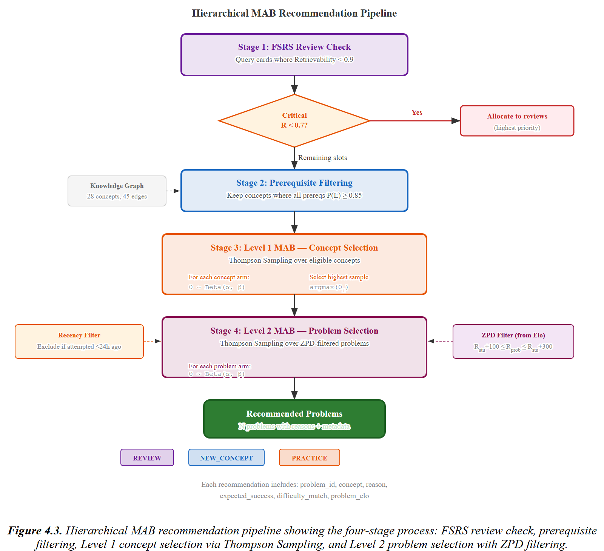

## 4.6. Layer 4: FSRS

The fourth layer deploys the Free Spaced Repetition Scheduler (FSRS-5) to combat knowledge decay over time. Implemented in `ai-service/app/services/fsrs_service.py`, it tracks three memory states for each (student, concept) card --- difficulty, stability, and retrievability --- and the review schedule is designed to maintain recall above a target threshold.

### 4.6.1. FSRS-5 Algorithm

Memory is modeled by FSRS-5 as three quantities: difficulty *D ∈ [1, 10]*, stability *S > 0* (the number of days until retrievability falls to 90%), and retrievability *R ∈ [0, 1]* (the current probability of recall). The rate at which retrievability decreases is governed by a power-law curve:

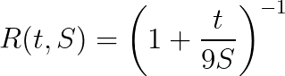

Here *t* represents the number of days since the last review. Three properties are notable: *R(0, S) = 1* (a just-reviewed concept is perfectly recalled), *R(S, S) = 0.9* (after *S* days recall sits at exactly 90%, which is how stability is defined), and *R  0* as *t  ∞* (if the concept is never reviewed, it will be forgotten).

There are nineteen optimizable weights, *w**0* through *w**18*, controlling how stability and difficulty change after each review. The implementation adopts the FSRS-5 default weights published by the open-source FSRS research community [12]:

 1 | W = [

 2 |     0.4072,   # w0: initial stability for rating 1 (Again)

 3 |     1.1829,   # w1: initial stability for rating 2 (Hard)

 4 |     3.1262,   # w2: initial stability for rating 3 (Good)

 5 |     15.4722,  # w3: initial stability for rating 4 (Easy)

 6 |     7.2102,   # w4: initial difficulty scale

 7 |     0.5316,   # w5: initial difficulty offset

 8 |     1.0651,   # w6: difficulty update from rating

 9 |     0.0046,   # w7: difficulty mean reversion weight

10 |     1.5401,   # w8-w11: stability success factors

11 |     0.1700, 1.0100, 2.0700,

12 |     0.0500,   # w12-w16: stability failure factors

13 |     0.3600, 0.1500, 0.2100, 0.0500,

14 |     2.5000,   # w17: hard penalty

15 |     0.2700,   # w18: easy bonus

16 | ]

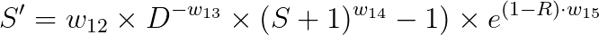

The constraint *S' ≤ S* holds: stability never rises after a failure.

Figure 4.4. FSRS card lifecycle: state transitions showing how difficulty, stability, and retrievability evolve through successive reviews.

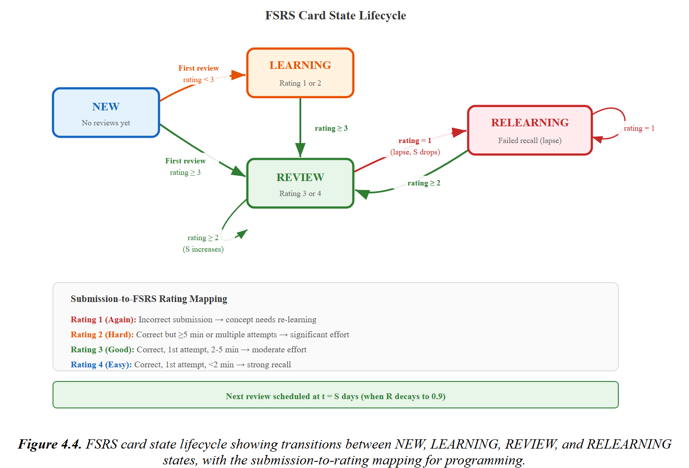

### 4.6.2. Rating Mapping for Programming Submissions

Another notable aspect of this implementation's design is the mapping from programming submission outcomes to FSRS ratings. The traditional spaced repetition system relies on flashcard-style recall where the user self-reports difficulty. However, in a programming environment, the system has to infer the rating from what it can observe.

 1 | def submission_to_fsrs_rating(is_correct, attempt_number, time_spent_seconds):

 2 |     if not is_correct:

 3 |         return 1  # Again --- concept needs re-learning

 4 |     if attempt_number == 1:

 5 |         if time_spent_seconds < 120:

 6 |             return 4  # Easy --- strong recall, solved quickly

 7 |         elif time_spent_seconds < 300:

 8 |             return 3  # Good --- moderate effort

 9 |         else:

10 |             return 2  # Hard --- correct but took a long time

11 |     elif attempt_number <= 3:

12 |         return 2  # Hard --- needed multiple attempts

13 |     else:

14 |         return 2  # Hard --- many attempts before success

Two observable signals feed the mapping: correctness and effort. Solving a problem on the first try in under two minutes signals strong recall (Easy); getting it right on the first try but taking longer points to moderate effort (Good). Needing multiple attempts always yields Hard, no matter how long the student spent. A wrong final submission maps to Again, which resets stability. This scheme respects the FSRS assumption that higher ratings reflect stronger memory traces, while adapting it to programming, where "recall" shows up as the ability to produce correct code rather than to recognize a fact.

### 4.6.3. Review Queue and Scheduling

The FSRS service maintains a review queue of concepts whose retrievability falls below threshold. Its `get_review_queue` method calculates the current retrievability of each active card and divides them into two groups --- due (retrievability below 0.9) and upcoming (due within three days) --- sorted by urgency.

The scheduling of the next review is straightforward. The system targets the moment when retrievability will hit exactly 0.9. Solving *R(t, S) = 0.9* gives *t = S* days, so the due date after each review is simply the current time plus *S* days. This clean property of the FSRS retrievability function means the stability value also serves as the review interval.

Figure 4.5. FSRS retrievability decay curve: the power-law relationship between elapsed time and recall probability for different stability values.

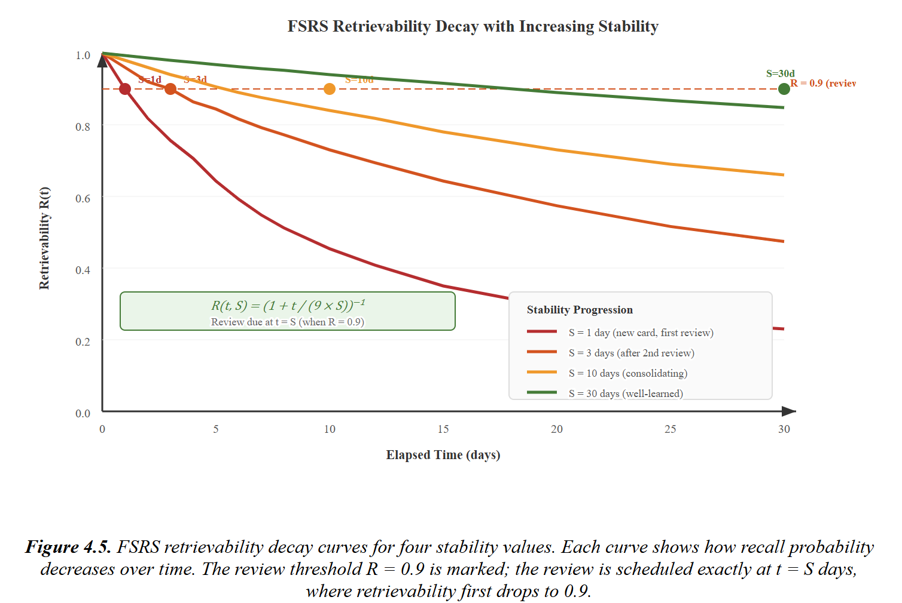

## 4.7. Layer 5: LLM Feedback

Layer 5 offers optional Socratic hints to students who are stuck on a problem. It becomes active once a student has made three or more failed attempts on a single problem and works through a Retrieval-Augmented Generation (RAG) pipeline that blends knowledge graph context with the student's code and error messages to produce pedagogically sound hints.

The RAG pipeline runs in three steps. First, the system fetches the relevant concept from the knowledge graph using the problem's primary concept mapping, along with the concept description and its prerequisite chain. Second, a prompt template merges this context with the student's latest code submission and the error message, telling the LLM to pose a Socratic question that nudges the student toward the answer without giving it away. Third, the assembled prompt goes to a language model API at temperature 0.7, striking a balance between creative and reliable responses.

Per-user rate limiting ensures that the number of hint requests each student can make per hour is controlled, keeping API costs in check. Hint generation is entirely optional and can be toggled off through a feature flag (`ENABLE_LLM_HINTS`) without affecting the other four layers.

This layer is supplementary by design. The core contribution of the thesis --- weaving BKT, Elo, MAB, and FSRS into a unified adaptive pipeline --- stands on its own without LLM feedback. Layer 5 is here to showcase the architecture's extensibility and to explore the pedagogical promise of LLM-generated hints, but the evaluation in Chapter 5 focuses specifically on the first four layers.

## 4.8. Frontend Implementation

Three principal views expose the adaptive engine's outputs to students: an enhanced dashboard, an adaptive recommendation page, and a review queue interface. All frontend components pull data from the NestJS API, which in turn proxies requests to the AI service.

### 4.8.1. Student Dashboard

The dashboard gives students a quick read on their adaptive state. Its main components are:

**Mastery radar chart.** A radar chart presents mastery probabilities aggregated by topic group (Fundamentals, Control Flow, Functions, Data Structures, OOP, Algorithms, File Handling). Each axis shows the average BKT mastery for concepts within that group, producing a visual fingerprint of where the student is strong and where gaps remain.

**Elo rating card with trend.** The card displays the student's current Elo rating alongside a trend indicator --- improving, stable, or declining --- drawn from the exponentially weighted residual that the dynamic K-value algorithm computes. A mini sparkline traces the rating trajectory across the last 20 submissions.

**Review queue badge.** A notification badge shows how many concepts are currently due for FSRS review. Tapping it takes the student straight to the review queue page.

**Concept mastery tree.** An interactive tree renders the knowledge graph with color-coded nodes: green for mastered (*P(L**t**) ≥ 0.85*), yellow for in-progress, gray for not started, and a padlock icon for concepts whose prerequisites have not yet been met. Prerequisite edges appear as directed arrows, and clicking any node opens up that concept's mastery history and associated problems.

### 4.8.2. Adaptive Recommendation Page

The recommendation page displays a list of problems selected by the hierarchical MAB, each annotated with relevant context. Every recommendation card shows the problem title, Elo-based difficulty estimate, expected success probability, the concept being targeted, and the reason behind the recommendation (REVIEW, NEW_CONCEPT, or PRACTICE). A color-coded difficulty-match indicator tells the student how well the problem fits their current ability: green for a good match, yellow for a stretch, and red for a potential mismatch.

### 4.8.3. Review Queue Page

Concepts flagged by the FSRS scheduler appear on the review queue page, ranked by urgency (lowest retrievability first). Each entry shows the concept name, current retrievability percentage, days overdue, and stability. A "Start Review" button sends the student to a recommended problem for that concept, selected by the Level 2 MAB.

### 4.8.4. Technology Choices for Frontend Components

The simpler visualizations are handled by Ant Design's built-in chart components, while Recharts powers the more complex ones such as the mastery radar and Elo history graphs. The knowledge graph tree uses a custom SVG-based renderer that lays out nodes by difficulty tier (vertical axis) and topic group (horizontal axis), connecting them with curved-path edges. TanStack Query (React Query) manages server state, delivering automatic caching, background refetching, and optimistic updates that keep the dashboard snappy even on slow connections.

## 4.9. Deployment

Docker Compose orchestrates the platform's five services: the React frontend (served by Nginx), the NestJS backend, the FastAPI AI service, the PostgreSQL database, and the Redis cache. A single `docker-compose.yml` file pins down service dependencies, network configuration, port mappings, and volume mounts.

### 4.9.1. Docker Compose Configuration

Each service has its own set of environment variables. The NestJS server takes the database URL, JWT secret, and AI service URL. The AI service takes the database URL, Redis URL, and feature flags that toggle individual adaptive layers on or off (`ENABLE_BKT`, `ENABLE_ELO`, `ENABLE_MAB`, `ENABLE_FSRS`, `ENABLE_LLM_HINTS`). These flags play a critical role in the Chapter 5 evaluation: the control group runs with all adaptive layers disabled, falling back to the legacy content-based filtering system, while the treatment group runs the full five-layer pipeline.

### 4.9.2. Environment Configuration

Three environment profiles are supported: development (hot-reloading, debug logging, seeded database), staging (production-like settings, synthetic data), and production (optimized builds, strict security headers, real data). All configuration lives in `.env` files kept out of version control. Prisma's CLI manages database migrations across environments.

### 4.9.3. Monitoring and Logging

Python's built-in logging module, configured to emit structured JSON, handles logging in the AI service. All adaptive layers record their inputs and outputs at the DEBUG level, making it possible to reconstruct the recommendation pipeline's decisions after the fact during the evaluation period. On the NestJS side, all API requests are logged with their response times, supplying the data needed to verify that the latency requirements (NFR1 and NFR2) are being met. Redis's built-in monitoring commands (`INFO`, `MONITOR`) round out the picture with cache hit-rate data.

## Chapter Summary

This chapter discussed the implementation of the adaptive learning platform: the technology stack, knowledge graph construction, the four adaptive layers (BKT, Elo, MAB, FSRS), the optional LLM feedback layer, the frontend components, and the deployment configuration. In total, the implementation translates Chapter 3's architectural design into a working system comprising roughly 2,500 lines of Python for the adaptive engine, 4,000 lines of TypeScript for the NestJS backend extensions, and 3,000 lines of TypeScript/React for the frontend additions.
