# <!-- page break -->
CHAPTER 5. PILOT EVALUATION DESIGN AND PRELIMINARY PROTOCOL

At the time of writing, the adaptive learning platform has been designed, implemented, and deployed in a functional form, as documented in Chapters 3 and 4. However, the full classroom intervention described in this chapter has not yet been executed. This chapter therefore presents the pilot evaluation protocol that will be used to assess the platform, together with the associated instruments, metrics, and statistical analysis plan, rather than a report of completed experimental results. The chapter is written in the future or conditional tense where appropriate to reflect this status.

Four research questions guide the evaluation, as introduced in Section 1.4. RQ1 concerns the predictive validity of the learner model (BKT and Elo). RQ2 concerns whether the adaptive recommendation pipeline, taken as a whole, yields different learning outcomes than a content-based baseline. RQ3 concerns short-term retention under FSRS-scheduled reviews. RQ4 concerns students' perception of usability and usefulness. A mixed-methods approach is adopted, combining system logs, pre-test / post-test scores, and standardized questionnaires (SUS, TAM) with semi-structured interviews. Because the experimental condition enables Layers 1-4 of the adaptive pipeline simultaneously (Layer 5, the LLM hint feature, is disabled for the pilot to avoid confounding and to keep hint-quality questions out of scope), the pilot is not designed to isolate the causal contribution of any individual layer; this limitation is discussed explicitly in Section 5.4 (Threats to Validity).

## 5.1. Research Methodology

The evaluation of the adaptive learning platform employs a mixed-methods research approach, which combines both quantitative and qualitative approaches. The quantitative approach is based on two sources of data: (a) system logs, which record all interactions, including all submissions, recommendations, and adaptive states, during the intervention period, and (b) pre-test and post-test scales, which measure learning gains and retention. The qualitative approach is based on three sources of data, including the System Usability Scale questionnaire [51], the Technology Acceptance Model survey [52], and thematic interviews [54]. This triangulation of data sources ensures that, in addition to quantitatively measured learning outcomes, the evaluation also considers the subjective experience of students, which is also critical for the success of the platform in a real-world university.

### Experimental Design Overview

The study employs a between-subjects, pre-test / post-test design with a control group. Participants are randomly assigned, after stratification by pre-test score, to one of two conditions:

The experimental group receives the full adaptive pipeline comprising Layers 1-4: Bayesian Knowledge Tracing, the Dynamic K-Value Elo rating system, Hierarchical Multi-Armed Bandit recommendation with Thompson Sampling, and FSRS-scheduled reviews. Layer 5 (LLM-generated Socratic hints) is deliberately disabled (ENABLE_LLM_HINTS=false) for this pilot, so that hint-quality, hallucination, and cost concerns are kept out of scope. The control group receives content-based filtering over sentence-transformer embeddings with no adaptive components.

This design holds constant the effect of the four-layer adaptive engine (Layers 1-4) while varying for other potential influences such as platform newness, problem content, or practicing with the online system itself. Both groups use the same interface; the only difference is the algorithm that operates behind the interface.

Because the experimental condition enables Layers 1-4 simultaneously, the design does not permit attributing any observed outcome to a single layer in isolation. In particular, a positive effect on RQ2 cannot be cleanly separated from the effect of FSRS-scheduled reviews, and vice versa for RQ3. The pilot is therefore positioned as a first assessment of the integrated platform as a whole; finer-grained layer-level ablations are identified as future work. This limitation is revisited in Section 5.4.

### Research Questions and Measurements

Table 5.1 presents the four research questions along with their respective measurements and the type of analysis. The consolidation from five to four research questions by merging the two questions on the accuracy of BKT and Elo accuracy into one research question, RQ1, is to ensure that the questions can be adequately covered given the sample size and the evaluation period.

Table 5.1. Research Questions and Corresponding Measurements

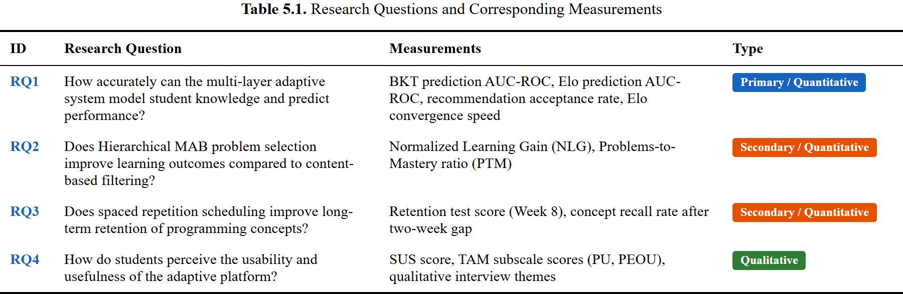

### Ethical Considerations

The research follows the usual ethical standards for conducting research in education. Participants' written informed consent is obtained prior to data collection, and the consent form will include an explanation of the purpose of the research, data collection methods, and the right to refuse participation or leave the research at any point without any negative impact on academic grades. Student identifiers are replaced with random codes during the data export process, and all data analysis is done on coded data. Raw data is kept for two years after the completion of the data collection process, after which it is discarded. A provision for fairness is included by providing access to all the adaptive features for the control group of students after the completion of the data collection process. An application for ethical review is submitted to the institutional review board of Hanoi University.

## 5.2. Experiment Design

This section identifies the participants, the experimental protocol, and the variables involved. This design balances methodological rigor with the logistical constraints of completing a study within a single university semester.

### 5.2.1. Participants

The target sample size is between 40 and 60 students enrolled in programming classes offered by the Faculty of Information Technology, Hanoi University, which include Introduction to Programming, Data Structures, and Algorithms --- all of which use Python as the primary language and match the knowledge graph of approximately 30 concepts developed in Section 4.2.

**Inclusion criteria.** The participants must meet three requirements. First, they must be enrolled in one of the programming courses. Second, they must have access to the web-based platform either through their personal computer or a university lab. Finally, they must provide written informed consent.

**Exclusion criteria.** We exclude two categories of students: (a) those with previous competitive programming experience, defined by an estimated Elo rating above 1600; we assume that students from this category would not benefit from the current set of problems, which we consider introductory to intermediate; (b) students without the ability to use the platforms for four weeks.

**Sample size justification.** A priori power calculation for an independent sample t-test was conducted with G*Power, where the effect size is set as a medium (Cohen's *d = 0.5*), significance level is set as *lpha = 0.05*, and power is set as $1 - eta = 0.80$, which gives a sample size of 26 for each group [55]. However, since a dropout rate of about 20% is expected, a total of 30 subjects will be enrolled for each group, totaling 60 subjects.

**Contingency for smaller samples.** In case the recruitment results in a sample size of only 20 to 30 participants (10 to 15 per group), the statistical plan is adapted to this smaller sample size. In this case, large effects (*d ≥ 0.8*) can be identified at a power of 80% but only large effects. The plan changes to non-parametric tests (Mann-Whitney U tests), which are more reliable at small *n*. In addition, the within-group information is enhanced by including per-student BKT and Elo convergence plots, per-concept mastery plots, and system logs of recommendation acceptance. The contribution changes from showing a statistically significant group difference to showing a whole-system description of the adaptive platform with preliminary effectiveness. In addition, all participants are interviewed instead of a subset of them.

**Randomization.** In this study, the random assignment to the experimental and control groups is done through stratified randomization based on the pre-test score. In this regard, the pre-test score is divided into terciles: low, medium, and high. In each tercile, the students are randomly assigned to one of the two groups. This is done to prevent a situation where one group is composed mainly of high- and low-performing students.

### 5.2.2. Protocol

The experiment has an eight-week duration, consisting of four phases: baseline, intervention, post-assessment, and retention testing. Figure 5.1 depicts the timeline of the experiment, while Table 5.2 compares the differences between the experimental and control conditions.

Figure 5.1. Eight-Week Experiment Protocol Timeline

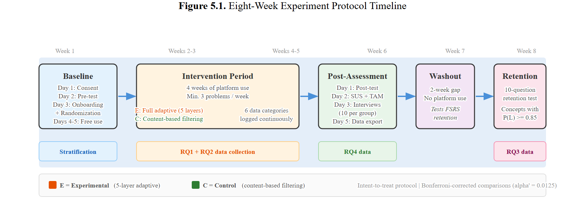

**Week 1: Baseline and setup.** In this first week, a series of four activities will be carried out over the course of consecutive days. On Day 1, an information session will take place, followed by the collection of signed informed consent documents (30 minutes). On Day 2, a pre-test will be carried out. In this test, which will take 60 minutes to complete, 20 questions will be asked, divided into five different levels of difficulty, each consisting of four questions. The pre-test will cover variables, control of flow, functions, data structures, and algorithms. The pre-test will be a mix of multiple-choice and short-answer questions. The pre-test will be auto-graded. On Day 3, a series of activities will take place. First, a tutorial on how to use the interface of the platform will be carried out (30 minutes). Then, a stratified randomization procedure will be carried out. Finally, on Days 4 and 5, a free exploration period will take place. In this period, the platform will be available to the students without any requirements.

**Weeks 2--5: Intervention.** During the four-week intervention period, both groups are using the platform regularly. A minimum requirement of three problems per week is communicated to all participants, and students who are below this requirement are flagged but not excluded from the main analysis, which is based on an intent-to-treat protocol. The differences in features across conditions are provided in Table 5.2.

Table 5.2. Experimental Group vs. Control Group Feature Comparison

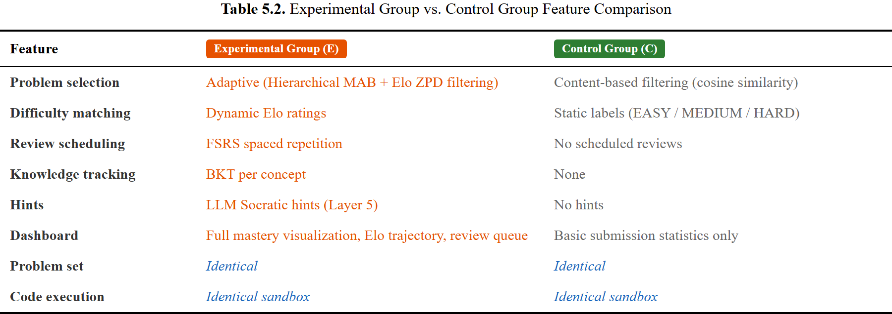

The system accumulates six types of data during the intervention process. First, all the submission events are recorded with their respective timestamps, code content, correctness verdicts, attempt numbers, and time spent. Second, all the recommendation events are recorded with the problems included, their order, and the reason for inclusion. Third, click events are recorded with the included recommendations and their order in the list. Fourth, page views and session times are recorded for engagement analysis. Fifth, for the experimental group, daily snapshots of the knowledge states in BKT are recorded. Sixth, for the experimental group, Elo rating histories and FSRS review events are recorded for the purpose of convergence and retention analysis in RQ1 and RQ3.

**Week 6: Post-assessment.** This phase is similar in design to the pre-test phase. On Day 1, the post-test, which is a parallel form test identical in content and difficulty distribution to the pre-test but with different items to prevent test-retest effects, is administered. On Day 2, the SUS questionnaire is administered, which takes about 10 minutes, and the TAM questionnaire, which also takes about 10 minutes. On Day 3, semi-structured interviews are conducted with a subsample of 10 students from each group, representing a range of high, medium, and low learning gains based on the difference between the post-test and pre-test scores. Each interview will take about 20 minutes. By Day 5, all data is exported.

**Week 8: Retention test.** Two weeks after the intervention ends, a retention test consisting of 10 questions related to a part of the concepts studied during the intervention is given to all participants. Only concepts that have been rated as mastered (BKT *P(L**t**) ≥ 0.85*) during the intervention are considered for the retention test. Two weeks may be a short period for a proper evaluation of the spaced repetition effect; however, it is considered the minimum period to detect changes in the stability values of FSRS for the two conditions [25]. The participants are reminded of the retention test three days and one day before it is actually taken. The retention test is considered a committed task rather than an optional one; otherwise, it is possible to claim that there was a positive effect on short-term learning improvement, but RQ3 could not be addressed properly.

### 5.2.3. Variables

The experiment involves one independent variable, multiple dependent variables, and several covariates.

**Independent variable.** The treatment condition is a two-level between-subjects factor: adaptive (the experimental group E receives the full Layers 1-4 pipeline), and non-adaptive (the control group C receives content-based filtering only). This variable is implemented through the feature flags described in Section 4.9.1: `ENABLE_BKT`, `ENABLE_ELO`, `ENABLE_MAB`, `ENABLE_FSRS`, `ENABLE_LLM_HINTS`.

**Dependent variables.** The dependent variables fall into four categories, all of which are related to the research questions. First, for learning effectiveness (RQ2), we have Normalized Learning Gain and Problems-to-Mastery ratio. Second, for model accuracy (RQ1), we have BKT prediction AUC-ROC, Elo prediction AUC-ROC, and Elo convergence speed. For engagement: session frequency, session duration, problems per session, voluntary return rate, dropout rate, and abandonment rate. Last, for usability (RQ4), we have SUS composite score and TAM subscale means for Perceived Usefulness and Perceived Ease of Use.

**Covariates.** Three covariates are collected to account for individual differences: (a) the pre-test score, which is a measure of prior knowledge that serves as a baseline for stratified randomization; (b) prior programming experience, which is a self-reported item on the consent form with response categories: none, less than six months, six months to one year, more than one year; (c) course enrollment level: introductory programming versus data structures/algorithms. These covariates are used to refine the regression analysis to better understand the precision of the treatment effect estimate and whether the adaptive system benefits some students more than others.

## 5.3. Evaluation Metrics

This section specifies the quantitative and qualitative metrics to be used for evaluating the platform. Each metric is linked to one or more research questions, and where possible, target thresholds are provided based on relevant benchmarks from the literature.

### 5.3.1. Learning Effectiveness Metrics

Learning effectiveness metrics address RQ2, measuring whether the adaptive platform helps students learn programming concepts more efficiently than content-based filtering alone.

**Normalized Learning Gain (NLG).** The primary outcome measure is the Normalized Learning Gain, defined as:

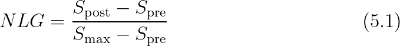

where *S*pre is the pre-test score, *S*post is the post-test score, and *S*max is the maximum possible score. NLG normalizes for different starting points. A student who scores 90% on the pre-test has less room to improve than a student who scores 30%, and NLG accounts for this ceiling effect. The values of NLG are interpreted as low gain (*NLG < 0.3*), medium gain (*0.3 ≤ NLG < 0.7*), and high gain (*NLG ≥ 0.7*) following the classification of Hake [53]. Negative NLG values represent a regression. The main hypothesis is *NLG**E** > NLG**C*, which is tested by an independent-samples t-test if the normality assumption is met (tested by Shapiro-Wilk normality test). Otherwise, a non-parametric alternative, the Mann-Whitney U test, is used. The effect size is calculated as Cohen's *d* (or Hedges' *g* for small samples) [55].

**Problems-to-Mastery Ratio (PTM).** The efficiency of problem selection is captured by the Problems-to-Mastery ratio:

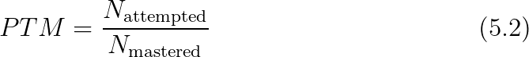

where *N*attempted is the total number of problems attempted by a student and *N*mastered is the number of concepts that have been mastered by reaching the mastery threshold (*P(L**t**) ≥ 0.85*). A lower PTM score indicates a more efficient learning process, where fewer problems are needed to master each concept. For the control group, their learning efficiency is indirectly assessed by running the BKT model on their submission logs, even though BKT was not active during their sessions.

**Concept Mastery Progression.** For the experimental group, the progression of the BKT mastery probability *P(L**t**)* over time for each concept is displayed in a set of learning curves, which show the rate at which concepts are mastered, the rate at which mastery is maintained or reversed, and which concepts are most difficult for the student. Although descriptive in nature, these plots can yield a great deal of information about the adaptive system's behavior.

**Time to First Mastery (TFM).** The time from a student's first interaction with a concept to the point at which mastery is achieved is defined as:

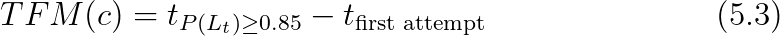

where *c* denotes the concept. As TFM values decrease, it indicates that the adaptive system is more efficiently guiding students toward mastery. The comparison of TFM among groups is done using the Mann-Whitney U test, since it is expected not to be normally distributed.

### 5.3.2. Recommendation Quality Metrics

Recommendation quality metrics address RQ1, evaluating the accuracy of the learner model and the relevance of the adaptive recommendations.

**Acceptance Rate.** The proportion of recommended problems that students choose to attempt measures the perceived relevance of recommendations:

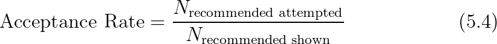

A high acceptance rate suggests that the system is providing problems that the student perceives as appropriate for their skill level and learning needs. Planned acceptance threshold: 70--85% for the experimental group and 40--60% for the control group; these are pre-registered targets rather than observed values.

**Completion Rate.** Among the recommended problems that students attempt, the completion rate measures the proportion solved:

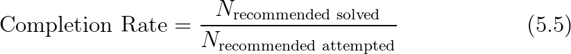

The planned target range is 60--80%. A completion rate higher than 90% indicates that the recommended problems are too easy and not sufficiently challenging, while a rate below 40% indicates that the problems are too difficult and might be frustrating for the student. The optimal range relates to the Zone of Proximal Development, as defined in Layer 2 (Section 3.3.3).

**BKT Prediction Accuracy.** The predictive validity for Layer 1 (Knowledge Tracer) is determined by computing the Area Under the Receiver Operating Characteristic curve (AUC-ROC) for the predictions made by the BKT model on the correctness of the submissions:

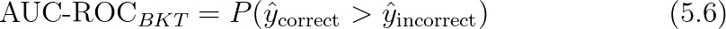

where *̂y* is the predicted probability of a correct submission. Each submission in the log file of the experimental group is a prediction-outcome pair, where the BKT-predicted probability *P(*correct*)* is recorded prior to the submission being graded, and the actual binary outcome (correct or incorrect) is recorded subsequent to grading. The pre-registered target is AUC* ≥ 0.65*, in line with the moderate predictive power reported for BKT in the literature [13]. Confidence intervals are computed via bootstrapping (1,000 resamples).

**Elo Prediction Accuracy.** The predictive validity of Layer 2 (Difficulty Calibrator) can be assessed in a similar manner. The predicted probability of a correct submission is given by the Elo-based expected score *E(A)* --- computed from the student's current Elo rating and the problem's Elo rating. The AUC-ROC is computed over all (prediction, outcome) pairs:

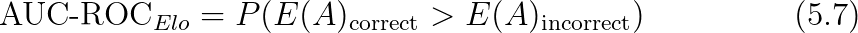

The pre-registered target is AUC* ≥ 0.65*, consistent with Pelanek's findings on Elo-based prediction in educational systems [38].

**Elo Convergence Speed.** The speed at which the ratings converge is defined as the number of submissions until the standard deviation of a student's Elo ratings, computed over a window of the last 10 submissions, is less than 50 rating points:

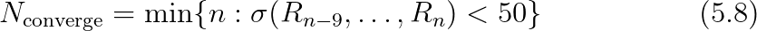

This faster rate of convergence suggests that the dynamic K-value mechanism (Section 4.4.1) is successfully calibrating the student abilities. This metric is only computed for the experimental group and is reported as a median number of submissions to convergence.

### 5.3.3. Engagement Metrics

Engagement metrics are supplementary evidence for the effectiveness of the platform on student behavior. Although not directly related to a research question, these metrics help provide context for the results on learning effectiveness and can help disentangle actual improvements in learning from differences in engagement.

**Session frequency** is defined as the number of different platform sessions per student per week, where a session is defined by a difference of at least 30 minutes between successive page views. The target is for this to be at least three sessions per week. **Session duration** is defined as the average duration of a session in minutes, with a target range of 20 to 40 minutes. **Problems per session** is defined as the average number of problems per session, with a target of at least three problems per session.

**Voluntary return rate** measures the proportion of sessions initiated without any external reminder. A value above 60% indicates an intrinsic motivation for using the platform. **Dropout rate** is the proportion of enrolled users who stop using the platform before the end of the intervention period (Week 5), and it should be below 20%. **Abandonment rate** is the proportion of problems initiated but never submitted by a student, and it should be below 30%. A high abandonment rate might imply that the problems are too difficult or not engaging enough.

Engagement metrics are compared between groups using the Mann-Whitney U test (for continuous measures) and the chi-square test (for dropout rate).

### 5.3.4. Usability Metrics

Usability metrics address RQ4, assessing students' subjective perception of the platform through standardized instruments.

**System Usability Scale (SUS).** The SUS is a 10-item questionnaire that provides a composite measure of overall usability on a 0--100 scale [51]. Brooke, who originally proposed it in 1996, has extensively validated it. The SUS is widely applied for software evaluation. According to Bangor et al. (2008), who proposed adjective rating scales, SUS results can be interpreted as: not acceptable (*< 50*), marginal (*50*--*70*), good (*70*--*85*), and excellent (*> 85*). The pre-registered goal is a mean SUS of at least 70 for the experimental group; the observed value will be reported post hoc. The SUS is compared for both groups using an independent-samples t-test, since it is known that SUS composite results are normally distributed for sample sizes of this size.

**Technology Acceptance Model (TAM).** The TAM survey measures two constructs theorized by Davis (1989) to predict technology adoption [52]:

- **Perceived Usefulness (PU):** The six items are measured using a 7-point Likert scale (1 = strongly disagree to 7 = strongly agree), and assess the extent to which students perceive that their learning experience was enhanced by the adaptive features. Sample item: "The adaptive recommendations helped me learn programming more effectively." - **Perceived Ease of Use (PEOU):** The six items are measured using a 7-point Likert scale (1 = strongly disagree to 7 = strongly agree), and assess the extent to which students perceive that using the adaptive interface was easy. Sample item: "The difficulty indicators were clear and helpful."

To evaluate the internal consistency of the subscales, Cronbach's *α* is used, with *α ≥ 0.70* or higher considered acceptable. The target for PU and PEOU subscales should be a mean of at least 5.0 on the 7-point scale. To compare the means for the subscales between the groups, independent-samples t-tests are used.

**Semi-Structured Interviews.** The qualitative data collected through the 20 semi-structured interviews (10 per group) is analyzed using a six-phase approach to thematic analysis following Braun and Clarke [54]: familiarization with the data, initial coding, generation of themes, review of themes, definition of themes, and reporting. The interview questions are intended to gather information on problem selection behavior, perceived difficulty calibration, progress awareness, and platform improvement suggestions. The themes that emerge from the experimental group are then compared with the themes that emerge from the control group to determine qualitative differences in the learning experience that are a result of the adaptive features.

**Summary of All Metrics.** Table 5.3 consolidates all evaluation metrics, their definitions, target values, and the research questions they address.

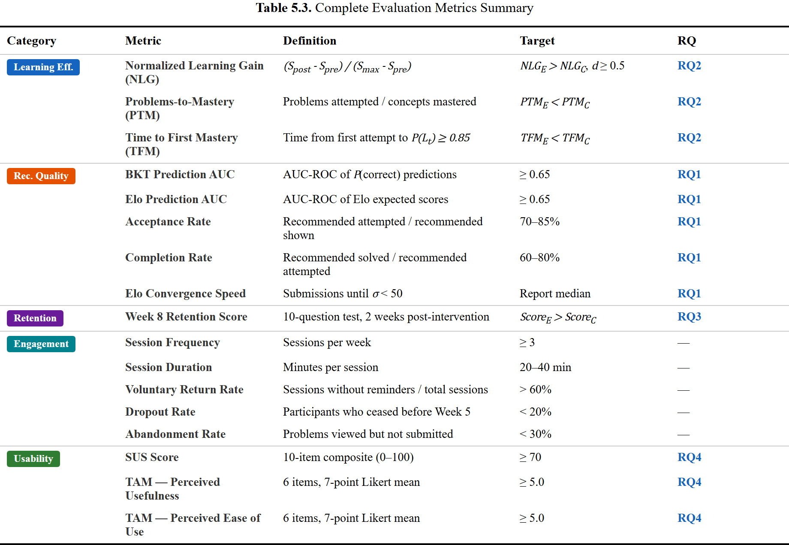

For each quantitative outcome in Table 5.3, the following analysis procedure applies: First, normality of the distribution for each group is checked using the Shapiro-Wilk test; second, homogeneity of variance for each group is checked using Levene's test. When assumptions are met, an independent-samples t-test is used for the between-group analysis; when normality assumption is violated, a non-parametric Mann-Whitney U test is used; and when homogeneity of variance assumption is violated, Welch's t-test is used. In addition, for each analysis, the test statistic, *p*-value, 95% confidence interval, and a measure of effect size (Cohen's *d* or Hedges' *g* for small samples) are included. In order to control for family-wise error rate for the four main analyses (one for each research question), the Bonferroni correction is used, which sets *α' = 0.05 / 4 = 0.0125* as the adjusted alpha level for significance. In addition, secondary analyses --- such as analysis of per-concept learning gains and comparisons of engagement --- are conducted without correction and are specifically identified as exploratory in nature. Missing data are addressed with an intent-to-treat approach for the main analysis, with a supplementary analysis using a per-protocol approach for individuals who completed a minimum of three problems a week.

## 5.4. Threats to Validity

Several characteristics of the proposed pilot limit the strength of the conclusions that can be drawn from it. They are stated explicitly so that readers can calibrate the weight given to any future results.

**Small and single-site sample.** Recruitment is confined to a single cohort at Hanoi University, with a target of 40-60 participants and a fallback plan for as few as 20-30. With approximately 20-30 students per condition in the nominal case, the study is only powered to detect large effect sizes (Cohen's d >= 0.8). Generalization to other institutions, curricula, or student populations is therefore not supported by the data that this pilot can produce.

**Short intervention window.** The four-week intervention, together with a two-week gap before the retention test, is short relative to the full forgetting curves that the FSRS algorithm is designed to exploit. Results on RQ3 should therefore be read as suggestive of short-term retention differences rather than as a validation of long-term spaced repetition benefits in programming.

**Confounded treatment condition.** The experimental group receives Layers 1-4 of the adaptive pipeline simultaneously (BKT, Dynamic Elo, Hierarchical MAB, and FSRS), while the control group receives none of these components. Any observed difference between the two groups therefore cannot be attributed to any single layer - for example, a positive effect on RQ2 cannot be cleanly separated from the effect of FSRS review scheduling, and vice versa. Within-system analyses based on feature-flag replay may offer partial triangulation, but they rely on the same set of interaction logs and cannot replicate a true ablation experiment. Layer 5 (LLM hints) is disabled in the pilot and is therefore not a source of confounding.

**Metric-model coupling.** Several of the reported metrics, notably BKT prediction AUC and Elo convergence speed, are computed using the same model that also drives the platform's recommendations. A favourable value on these metrics demonstrates internal consistency of the model but does not, on its own, constitute independent evidence of learning effectiveness.

**Self-selection, novelty, and attention effects.** Participation is voluntary, and the experimental interface is more feature-rich than the control interface. Observed differences may partly reflect novelty, increased perceived attention, or self-selection of more motivated students into the study rather than the adaptive mechanisms themselves.

**Assessment instrument.** The pre-test and post-test are parallel-form instruments constructed for this study and have not been independently validated. Their reliability and concurrent validity will be reported post hoc, but this remains a limitation of the pilot.

Taken together, these threats mean that any findings reported from this pilot should be interpreted as preliminary evidence about the feasibility and perceived value of the integrated platform, not as a definitive comparative evaluation of the individual adaptive techniques.
