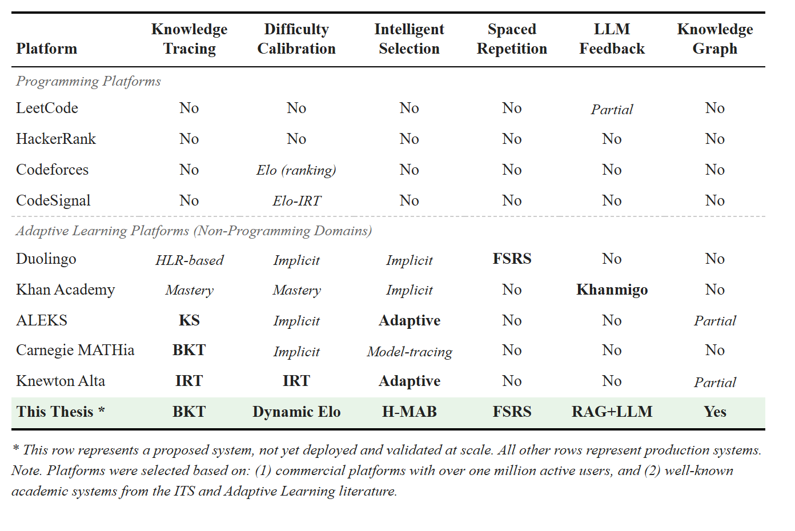
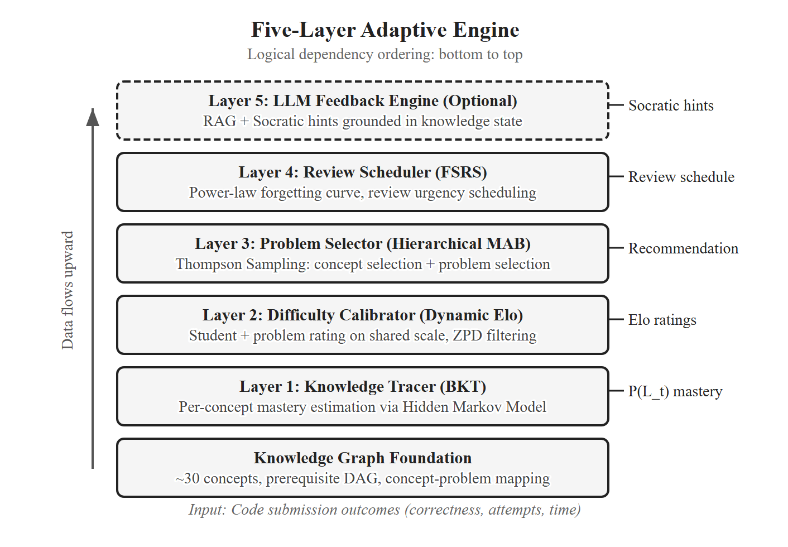
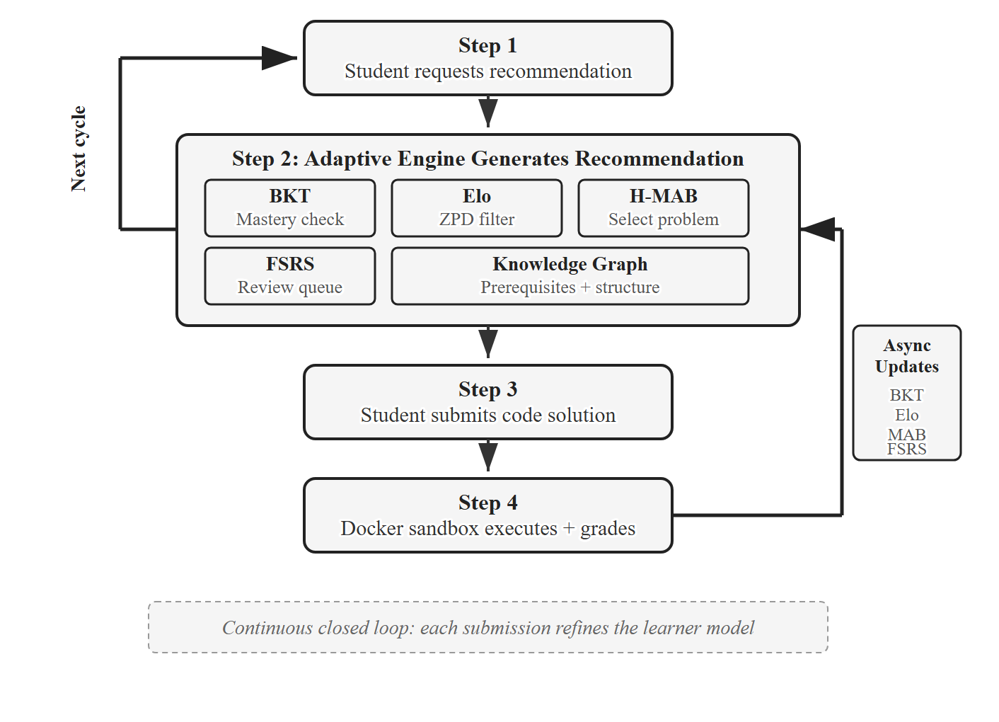
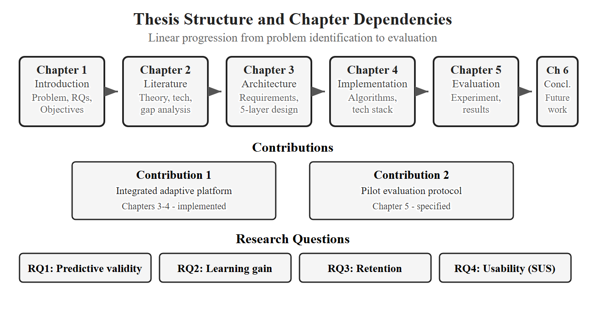

# CHAPTER 1. INTRODUCTION

## 1.1. Problem Statement

Programming is now a core part of higher education, but the field has a long-standing problem: failure rates are high. Luxton-Reilly et al. [1] reviewed decades of intro CS courses and found average failure rates of 30–40%, stable across many pedagogical experiments. Robins et al. [2] highlighted a second issue: students arrive with very different backgrounds. Some have coded for years; others see their first line of code on day one.

This mix is hard to teach in a lecture. The lecturer teaches at one pace and one difficulty. Advanced students are bored; beginners fall behind. Programming is a skill that needs deliberate practice [3] — lectures alone do not replace the cycle of write code, get errors, debug, refine. And the instructor cannot fix this with effort: personalized feedback and progress tracking scale linearly with class size, so at 100 students, individualized support is impossible.

## 1.2. Motivation

### 1.2.1 The Promise of Adaptive Learning

Adaptive learning adjusts content, pace, and method to each student's current knowledge. Studies across many domains show it works [6], [7]. Early Intelligent Tutoring Systems like the Cognitive Tutor showed 50–100% improvement in problem-solving [3], [8]. Modern systems like ALEKS [9] use machine learning to scale adaptation. Duolingo [10] demonstrates the scalability of adaptive techniques in language learning, which suggests potential transfer to programming education. Chapter 2 reviews these systems in detail.

### 1.2.2 Why Programming Fits Adaptive Learning

Programming has four properties that make it well-suited to adaptive systems:

- **Measurable outcomes.** Each submission can be graded automatically against test cases. This gives a clean signal for knowledge modeling.
- **Rich behavioral data.** Each submission carries the number of attempts, time elapsed, error types, and code complexity. These signals are richer than multiple-choice scores.
- **Hierarchical concepts.** Variables come before arrays, before sorting, before dynamic programming. This prerequisite structure can be modeled as a knowledge graph.
- **Multiple solution paths.** Most problems admit brute-force and optimized solutions, which lets us assess approach as well as correctness.

### 1.2.3 The Gap in Existing Platforms

Existing online coding platforms have scale, but their pedagogy is static. LeetCode, HackerRank, and Codeforces classify problems into fixed difficulty tiers. None of them models what each student knows or which prerequisites they have not yet learned. Codeforces and CodeSignal use Elo ratings, but for ranking, not for instruction.

Table 1.1 compares the adaptive components of major platforms. No existing platform — academic or commercial — combines all five components that learning science says matter: knowledge tracing, difficulty calibration, intelligent selection, spaced repetition, and contextual feedback. The bottom row is this thesis. It is implemented and deployed; the classroom pilot has not yet been run.

*Table 1.1. Comparison of adaptive capabilities across existing platforms and this thesis.*

## 1.3. Research Objectives

This thesis designs and implements an integrated adaptive learning platform for undergraduate programming courses, and specifies a pilot evaluation protocol. The five objectives:

1. **Design a multi-layer architecture.** A modular five-layer engine: knowledge tracing (Layer 1), difficulty calibration (Layer 2), problem selection (Layer 3), review scheduling (Layer 4), and an exploratory LLM hint layer (Layer 5).
2. **Implement the learner model.** Bayesian Knowledge Tracing (BKT) for per-(student, concept) mastery, plus a dual Elo system with a dynamic K-factor for continuous difficulty calibration. The Elo / IRT link [11] grounds difficulty matching in psychometric theory.
3. **Implement the recommendation and review pipeline.** A two-level Hierarchical Multi-Armed Bandit (H-MAB) with Thompson Sampling, gated by knowledge-graph prerequisites and Zone of Proximal Development filtering. Integrate the Free Spaced Repetition Scheduler (FSRS) [12]; map code submission outcomes to FSRS review ratings.
4. **Deliver a deployable platform.** React frontend, NestJS API, FastAPI adaptive service, PostgreSQL, Docker sandbox.
5. **Specify the pilot protocol.** A between-subjects, pre-/post-test pilot at Hanoi University with 40–60 students. Execution and result reporting are out of scope.

## 1.4. Research Questions

This thesis addresses four research questions. RQ2 and RQ3 use comparative hypotheses tested at α = 0.05. The pilot enables Layers 1–4 together (see Chapter 5), so RQ2 and RQ3 evaluate the integrated platform as a whole, not individual layers in isolation.

**RQ1: How accurately does the learner model predict student performance?** Primary measure: AUC-ROC of BKT and Elo predictions on held-out submissions. Following standard thresholds in educational data mining [11], the pre-registered target is AUC-ROC ≥ 0.65–0.70. Acceptance rate per difficulty band and Elo convergence speed are reported as **supporting indicators** in Chapter 5, not as primary outcomes.

**RQ2: Does the integrated adaptive pipeline (BKT + Elo + H-MAB + FSRS) produce different learning outcomes than a content-based filtering baseline?** The experimental group gets Layers 1–4. The control group gets only content-based filtering over sentence-transformer embeddings. Primary metric: Normalized Learning Gain. Supporting metric: Problems-to-Mastery ratio.

- *H2 (alternative):* the adaptive group shows higher Normalized Learning Gain.
- *H2_0 (null):* no difference.

**RQ3: Does the platform with FSRS-scheduled reviews yield different short-term retention than the same platform without scheduled reviews?** Measured by a retention test administered two weeks after the intervention.

- *H3 (alternative):* the adaptive group shows higher retention.
- *H3_0 (null):* no difference.

**RQ4: How do students perceive the platform's usability and usefulness?** Measured by the System Usability Scale [13], the TAM constructs Perceived Usefulness and Perceived Ease of Use [14], and semi-structured interviews analysed thematically [15].

## 1.5. Proposed Solution

This thesis presents an Adaptive Learning Platform for University Programming Courses: a five-layer adaptive engine on top of a knowledge graph of programming concepts. It is a closed-loop system — student interactions update the learner model, which drives the next recommendation.

### 1.5.1 Architecture Overview

The platform extends a three-tier web stack (React, NestJS, PostgreSQL) with a Python adaptive engine (FastAPI) that has five layers on top of a knowledge graph:

- **Foundation: Knowledge Graph.** A hand-curated directed graph of ~30 programming concepts. Each problem is tagged with one or more concepts; the graph constrains every adaptive layer.
- **Layer 1: BKT.** For each (student, concept), Bayesian Knowledge Tracing [16] tracks mastery probability and updates it after each submission.
- **Layer 2: Dynamic K-Value Elo.** A dual Elo system rates students and problems, updated after each submission [17]. The K-factor adapts to the student's recent learning trend so ratings converge fast for new students and stay stable for experienced ones [11].
- **Layer 3: Hierarchical MAB.** A two-level H-MAB with Thompson Sampling [18], [19]. Level 1 picks a concept the student is ready for; Level 2 picks a problem whose Elo rating sits in the student's Zone of Proximal Development [20], [21].
- **Layer 4: FSRS.** FSRS [12] tracks memory state per (student, concept) using a power-law forgetting curve. When retrievability drops below a threshold, the MAB prioritizes that concept for review. Submission outcomes map to FSRS review ratings; Chapter 4 explains the mapping.
- **Layer 5: LLM Feedback (exploratory).** A Retrieval-Augmented Generation module that produces Socratic hints when the student is stuck. Built to test feasibility; disabled in the pilot. Not part of the thesis's evaluated contribution.

Layer parameters are in Chapter 4.

*Figure 1.2. Five-layer adaptive engine architecture overview.*

### 1.5.2 Closed-Loop Workflow

The student requests a recommendation. The adaptive engine combines BKT mastery, the FSRS review queue, and Elo ratings, then asks the H-MAB for the next problem. The student submits code; it runs in a Docker sandbox. All models update asynchronously: BKT mastery, Elo ratings, MAB reward distributions, FSRS memory state. The updated learner model feeds the next recommendation. The loop continues, keeping problems at the right level and avoiding stagnation.

*Figure 1.1. Closed-loop adaptive workflow showing continuous knowledge state updates.*

## 1.6. Scope and Limitations

### 1.6.1 Scope

- **Subject matter:** Python, ~30 concepts from basics (variables, I/O) to intermediate (functions, recursion, data structures) to advanced (dynamic programming, graph algorithms).
- **Population:** Hanoi University undergraduates in programming courses.
- **Platform:** Web application, accessible via modern browsers.
- **Adaptive components:** Layers 1–4 from §1.5 are evaluated in the pilot. Layer 5 (LLM) is built but disabled in the pilot to avoid confounding the evaluation.
- **Evaluation.** A pilot protocol is specified for a between-subjects study with 40–60 participants over a four-week intervention plus a two-week retention follow-up. **The power analysis in Chapter 5 shows that this sample size detects only large effects (Cohen's d ≥ 0.8) at α = 0.05 with 80% power.** The pilot is presented as a preliminary design, not a completed evaluation. Full execution and reporting are future work.
- **Ethics:** The design will be submitted for approval to Hanoi University's academic oversight body. Informed consent, voluntary participation, and grade-independence will be enforced.

### 1.6.2 Limitations

Out of scope: multi-language support (Python only), mobile app, real-time collaboration, integration with Learning Management Systems, large-scale deployment (single university, 40–60 students), longitudinal evaluation (four weeks only). The cold-start problem is handled by recommending beginner-average problems until ~10 submissions accumulate.

## 1.7. Contributions

This thesis makes two contributions.

**Contribution 1: An integrated adaptive platform for programming courses (Chapters 3–4).** A closed-loop platform combining BKT, Dynamic K-Value Elo, prerequisite-constrained Hierarchical MAB with Thompson Sampling, and FSRS — unified by a curated knowledge graph of ~30 concepts. The integration is the central engineering contribution: BKT mastery gates MAB exploration, Elo ratings constrain selection to the Zone of Proximal Development, and FSRS reviews can interrupt the MAB. Released as a working full-stack application (React, NestJS, FastAPI, PostgreSQL, Docker sandbox) for the Vietnamese university context.

**Contribution 2: A pilot evaluation protocol (Chapter 5).** A between-subjects, pre-/post-test pilot design for Hanoi University undergraduates: recruitment and consent procedure, instruments (custom pre/post-test, SUS, TAM, interviews), quantitative metrics (Normalized Learning Gain, BKT/Elo prediction AUC, acceptance and completion rates, engagement), and a statistical plan with pre-registered thresholds, power assumptions, and a fallback for small samples. The protocol evaluates the whole Layers-1–4 system, not individual layers.

**Contribution 1 is implemented and demonstrated technically. Contribution 2 is specified but not yet empirically executed.**

A Layer 5 module (LLM-based Socratic hints) was also built as exploratory work to test feasibility of RAG-grounded hint generation. It is described in §1.5.1, Chapter 4, and §6.3 (future work), but is disabled in the pilot to avoid confounding the evaluation of Layers 1–4. It is not a primary contribution of this thesis.

## 1.8. Thesis Structure

Chapter 2 reviews the relevant literature and ends with a gap analysis. Chapter 3 covers requirements and the five-layer architecture. Chapter 4 covers implementation, including per-difficulty BKT initialization, the dynamic K-factor for Elo, the multi-component MAB reward, and the submission-to-FSRS mapping; feature flags allow control-group mode. Chapter 5 describes the pilot design (recruitment, ethics, metrics, statistical plan); since the intervention has not been executed, this chapter is a protocol, not results. Chapter 6 summarizes the work and discusses limitations and future directions.

*Figure 1.3. Thesis structure roadmap. Six chapters proceed linearly. Two contributions map to their primary chapters; four research questions are addressed across Chapters 5-6.*
