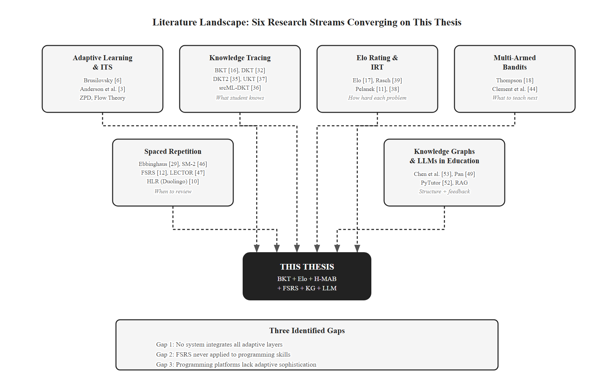
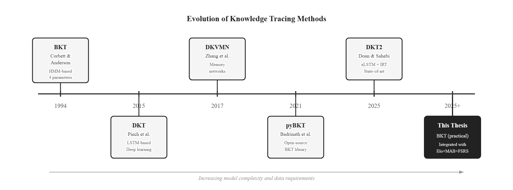
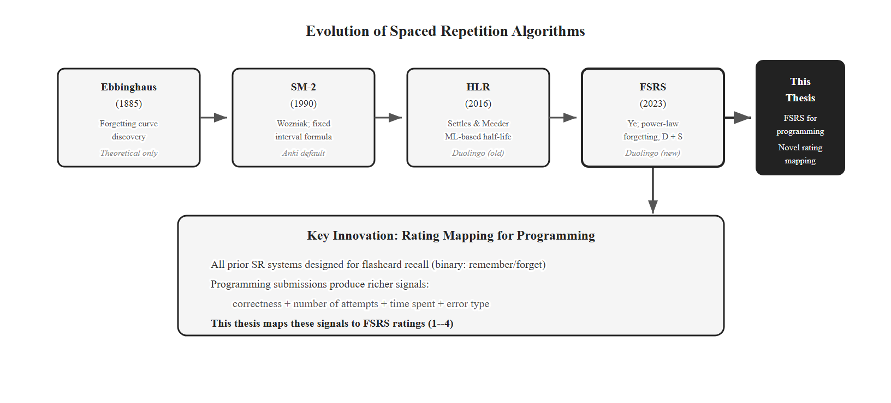
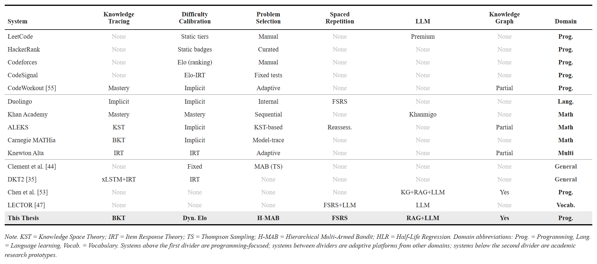
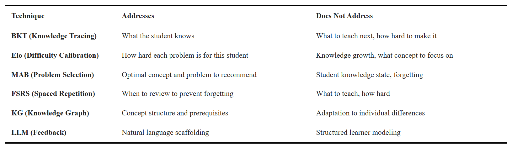

# CHAPTER 2. LITERATURE REVIEW AND THEORETICAL BACKGROUND

This chapter reviews the literature that grounds the platform's design. §2.1 covers learning theories (adaptive learning, ZPD, desirable difficulties, the spacing effect). §2.2 covers the algorithms each layer uses (BKT, DKT, Elo / IRT, MAB, FSRS, knowledge graphs, LLMs). §2.3 surveys existing platforms and prototypes. §2.4 identifies the gap this thesis fills: an integrated multi-layer adaptive platform for programming education.

*Figure 2.1. Literature landscape map showing six research streams converging on the thesis.*

## 2.1. Theoretical Foundations

### 2.1.1 Adaptive Learning and Intelligent Tutoring Systems

Adaptive learning is "the ability of the system to adjust the instruction content, speed, and methodology in relation to the characteristics of the learner and the results of the learning process" [6]. Brusilovsky [6] split adaptation into adaptive presentation and adaptive navigation; Paramythis and Loidl-Reisinger [7] extended this to four dimensions, of which this thesis uses adaptive content selection and adaptive assessment.

The first generation of adaptive systems were Intelligent Tutoring Systems (ITS) such as Anderson et al.'s LISP Tutor and the Cognitive Tutor for math [3], [8], which produced 50–100% gains over traditional teaching. Their main contribution was the explicit student model and the distinction between **model tracing** (compare to expert solution) and **knowledge tracing** (estimate skill mastery). Both require the domain to be decomposed into fine-grained skills — the same idea that motivates the knowledge graph in this thesis. Later web-based AEH systems (AHA! [22], KnowledgeTree [23]) and ML-based systems (ALEKS [9], Khan Academy [24]) extended adaptation to a larger scale. Duolingo demonstrates the scalability of adaptive techniques in language learning [10]; its success suggests potential transfer to programming education.

**Relevance to this thesis.** The proposed platform is an ITS-style system for programming, with explicit knowledge tracing (Layer 1, BKT) and skill-decomposed content (the knowledge graph). The design follows the ITS lineage and adopts Brusilovsky's adaptive content selection.

### 2.1.2 Zone of Proximal Development

The Zone of Proximal Development (ZPD), introduced by Vygotsky [20], is the gap between what a learner can do alone and what they can do with guidance. Tasks below the ZPD are too easy and produce little learning; tasks above it produce frustration. The flow theory of Csikszentmihalyi [25] makes a related point: optimal engagement happens when challenge matches skill.

**Relevance to this thesis.** The Elo layer (§2.2.3) operationalizes the ZPD as a numeric range above the student's rating, calibrated to a 36–64% expected success rate. ZPD acts as a hard filter on the problem selector (Layer 3): no problem outside the ZPD is recommended.

### 2.1.3 Desirable Difficulties

Bjork and Bjork [21] showed that conditions which slow short-term performance often improve long-term retention and transfer. Three desirable difficulties are directly relevant:

- **Spacing effect** [26]: spreading practice over time outperforms massed practice. Underpins Layer 4 (FSRS).
- **Testing effect** [27]: actively retrieving material is more effective for retention than restudying it. The platform's "review" recommends a new problem on the due concept rather than the concept's definition.
- **Interleaving** [28]: mixing concepts beats blocking them. The Hierarchical MAB (Layer 3) is naturally interleaved across many concepts.

**Relevance to this thesis.** All three principles are encoded directly in the architecture. The platform is not just adaptive; it is built on validated cognitive-science effects.

### 2.1.4 Spacing Effect and Forgetting Curves

Ebbinghaus [29] first showed that memory decay is fast initially and slows over time. The exact functional form has been debated; recent work [12], [30] settles on a power law: `R(t, S) = (1 + t / (9 S))^-1`, where `R` is the probability of recall, `t` is time since the last review, and `S` is memory stability (the time at which retrievability falls to 90%). This is the form FSRS uses [12].

Cepeda et al. [26] confirmed the spacing effect across 254 studies: optimal review spacing scales with the desired retention interval. SR algorithms exploit this by scheduling reviews just before forgetting is likely.

**Relevance to this thesis.** FSRS has only been validated on declarative knowledge (vocabulary, facts). Programming is procedural. This thesis bridges the gap with a submission-outcome-to-FSRS-rating mapping (Chapter 4), so "review" still means deliberate retrieval practice — solving a new problem on the due concept.

## 2.2. Related Technologies

### 2.2.1 Bayesian Knowledge Tracing

Bayesian Knowledge Tracing (BKT) [16] models per-skill mastery as a two-state Hidden Markov Model with four parameters: `p(L0)` prior knowledge, `p(T)` learn rate per opportunity, `p(G)` guess rate, `p(S)` slip rate. After each response, BKT applies Bayes' theorem to update the mastery posterior, then applies the learn-rate transition. Parameters are typically fit per skill via Expectation-Maximization (e.g., the pyBKT library [31]).

BKT's strengths: parameters are interpretable (the mastery probability has a direct pedagogical meaning), updates are O(1), the model has 30+ years of validation [8], [16], and it works on sparse data — which matters for a 40–60-student pilot. Its known limitations: the binary skill state is a coarse approximation, skills are assumed independent, and there is no forgetting (Layer 4 fixes this).

**Relevance to this thesis.** I chose BKT for Layer 1 because the Hierarchical MAB (Layer 3) needs an **interpretable mastery probability** to gate prerequisites. DKT (§2.2.2) is more accurate on benchmarks but its hidden-state representation is opaque; using DKT would require a separate extraction step before the value is usable as a gate. BKT's data efficiency is also better-matched to the pilot's small sample. DKT2 is identified as a future upgrade once enough interaction data is collected (Chapter 6).

### 2.2.2 Deep Knowledge Tracing and Recent Advances

Deep Knowledge Tracing (DKT) [32] replaces BKT's HMM with an LSTM, taking a sequence of (skill, correctness) pairs and outputting next-step probabilities. DKT improves predictive accuracy but suffers two problems noted in the literature: the hidden state cannot be directly read as per-skill mastery [33], and the model is reconstruction-inconsistent (different mastery readings for the same skill at the same step) [33]. DKT also needs thousands of student histories to train. Subsequent variants (DKT+ with regularizers [33], DKVMN with memory networks, DKT2 with xLSTM + IRT [35], srcML-DKT [36] for code, UKT [37] with uncertainty) improve accuracy further but inherit DKT's interpretability and data-volume limitations.

*Figure 2.2. Knowledge tracing evolution from BKT (1994) to DKT2 (2025).*

**Relevance to this thesis.** DKT-family models are not chosen as Layer 1 for two reasons. First, the Hierarchical MAB needs an interpretable mastery value to use as a prerequisite gate; DKT does not provide one without extra extraction work. Second, the 40–60-student pilot has nowhere near the sample size DKT needs. BKT delivers what the architecture requires today; DKT2 is a future-work upgrade once data accumulates (Chapter 6).

### 2.2.3 Elo Rating System and Item Response Theory

The Elo rating system [17] rates competitors via outcomes of pairwise matches. In education, each (student, problem) interaction is one match: `P(student solves problem) = 1 / (1 + 10^((R_problem - R_student)/400))`. After observing the outcome, both ratings shift by `K * (actual - expected)`, where `K` is the step size (K-factor).

Pelanek [11] showed Elo ratings converge to stable estimates within ~20 attempts per student and ~30 per problem, and Elo correctly identifies expert-misclassified problems. An empirical study of 76 programming tasks across 299 students (50,055 attempts) reported AUC > 0.7 for Elo prediction [38]. The Elo expected-score formula is mathematically equivalent to the Rasch IRT model with a scaling factor [39]; Elo can therefore be seen as an online, low-overhead form of IRT [11].

A fixed K is a trade-off: large K reacts fast but is noisy; small K is stable but slow. Recent work [40] proposed a **dynamic K-factor** that scales with the student's recent learning trend (a windowed sum of residuals between actual and expected outcomes). When the student is improving, K shrinks; when they are struggling, K grows. Multidimensional Elo [41] keeps a separate rating per concept.

**Relevance to this thesis.** Elo is Layer 2. It (1) operationalizes the ZPD as a per-student rating range and (2) feeds the MAB reward function with expected-success probabilities. The dynamic K is adopted directly so ratings converge fast for new students and stay stable for experienced ones. Concept-level Elo aligns naturally with the knowledge graph in §2.2.6.

### 2.2.4 Multi-Armed Bandits in Education

The Multi-Armed Bandit (MAB) problem [42] is the classic exploration–exploitation trade-off: each arm has an unknown reward distribution; the agent must maximize cumulative reward. In education, an arm is a learning activity and the reward is learning gain. Thompson Sampling [18], [19] is a Bayesian MAB algorithm that maintains a Beta posterior per arm, samples from each posterior, and picks the maximum. It explores high-uncertainty arms naturally — exactly what is wanted when the system is unsure of a student's readiness — and requires no tuning parameter.

Standard MAB treats every problem as an arm, which is impractical at hundreds of items. The Hierarchical MAB [43] uses two levels: Level 1 picks a concept (arms = concepts whose prerequisites are met), Level 2 picks a problem (arms = problems within the concept that fall in the ZPD). Clement et al. [44] showed MAB-based selection outperforms random and expert-designed curricula in ITS settings. MAB with abandonment [45] adds a third outcome (the student gives up) as a strong signal that a recommendation was wrong; it informs a future direction for this work.

**Relevance to this thesis.** The Hierarchical MAB with Thompson Sampling is Layer 3. Combined with BKT prerequisite gating (Layer 1) and Elo ZPD filtering (Layer 2), it produces recommendations that are both pedagogically valid and difficulty-appropriate. The reward function combines BKT learning gain, difficulty match, and time efficiency (Chapter 4).

### 2.2.5 Free Spaced Repetition Scheduler

The first widely used SR algorithm was SM-2 [46], which schedules reviews via a recursive formula and a subjective 0–5 quality rating. SM-2's parameters are fixed for all users and are not data-driven. The Free Spaced Repetition Scheduler (FSRS) [12] replaces SM-2 with a data-grounded model based on three states per item: Difficulty `D` (1–10), Stability `S` (days, the time for retrievability to drop to 90%), and Retrievability `R` (current recall probability). The forgetting curve is the power law from §2.1.4. Stability updates after a successful review use 19 parameters fit by gradient descent on the user's own review history. FSRS uses four ratings (Again / Hard / Good / Easy) and is empirically 20–30% more efficient than SM-2 for the same retention target [12]. It has shipped in Anki since v23.10 (October 2023), giving it large-scale validation.

LECTOR [47] combines spaced repetition with LLM-assisted similarity detection for confusable items, achieving 90.2% retention versus 88.4% baseline across 100 simulated learners.

*Figure 2.3. Spaced repetition evolution from Ebbinghaus to FSRS.*

**Relevance to this thesis.** FSRS is Layer 4. I chose FSRS over SM-2 because FSRS's per-user parameter fit is more accurate and it has the open algorithm + production validation that SM-2 lacks. Within the literature surveyed here, this is among the first applications of FSRS to programming-concept review. The novel piece is the rating mapping that converts code-submission outcomes into FSRS ratings (Chapter 4) — without it, FSRS would not work for procedural skills.

### 2.2.6 Knowledge Graphs

A knowledge graph (KG) represents domain concepts as nodes and prerequisite relations as directed edges. Programming has unusually clear prerequisite structure (variables → arrays → sorting → DP), which the literature has long recognized [2]. KGs can be hand-built, automatically extracted (e.g., the ACE pipeline [48]), or hybrid. Graph Neural Network approaches [49], [50], [51] improve recommendation quality on large educational graphs but require thousands of training examples.

**Relevance to this thesis.** I use a hand-curated KG of ~30 Python concepts and ~40–50 prerequisite edges. Manual curation is justified at this scale: the concept space is small, prerequisite accuracy matters (one wrong edge can permanently block a student), and the graph must align with the specific Hanoi University curriculum. A learned KG via ACE or GNN methods is future work — it is not viable now because we lack the historical interaction volume needed to train it. The hand-built KG serves three purposes: it is the concept space for BKT, the prerequisite gate for the MAB, and the structural context for the Layer 5 RAG hints.

### 2.2.7 Large Language Models in Education

LLMs are increasingly used as tutoring agents. PyTutor [52] is a ChatGPT-based Socratic tutor for Python that maintains dialogue state and reports 4.2/5.0 satisfaction in usability studies. Known LLM limitations in education include hallucination, over-eagerness to give direct answers, response inconsistency, and per-call cost.

Retrieval-Augmented Generation (RAG) addresses several of these by grounding LLM responses in retrieved factual content. Chen et al. [53] combined a KG, a RAG retriever, and an LLM to generate personalized programming feedback; their hybrid mode outperformed both adaptive-only and LLM-only baselines on 4,956 code submissions. Wang et al. [54] extended this to multimodal KGs and reported 15% concept-mastery improvements.

**Relevance to this thesis.** The platform includes Layer 5, an exploratory RAG-grounded LLM hint module that produces Socratic hints when a student fails three or more attempts. It is built but disabled in the pilot to avoid confounding the evaluation of Layers 1–4 (cost, hallucination, and hint quality require their own evaluation). Layer 5 is not a primary contribution of this thesis; it is documented in Chapter 4 and listed as future work in §6.4.

## 2.3. Related Work

### 2.3.1 Commercial Programming Platforms

LeetCode, HackerRank, Codeforces, and CodeSignal serve tens of millions of users but are pedagogically static. LeetCode classifies problems into three fixed difficulty tiers (Easy, Medium, Hard) with no per-user adaptation, no knowledge model, no spaced repetition, and no prerequisite awareness; LLM hints were recently added but operate independently of any learner model. HackerRank's skill tracks use binary skill badges and fixed assessment tests. Codeforces has an Elo rating system, but only for competitive ranking — not for pedagogical recommendation. CodeSignal uses an Elo-IRT hybrid for hiring assessment, not for adaptive practice.

*Table 2.1. Detailed comparison of academic and commercial adaptive systems.*

### 2.3.2 Adaptive Learning Platforms (Other Domains)

Duolingo is the most-cited example of data-driven adaptive learning at scale; it migrated from Half-Life Regression [10] to FSRS [12] for vocabulary review scheduling. Duolingo demonstrates the scalability of adaptive techniques in language learning, which suggests potential transfer to programming. Khan Academy uses deterministic mastery learning and has integrated Khanmigo (LLM tutor); ALEKS [9] uses Knowledge Space Theory with binary mastery and prerequisite-aware sequencing. Carnegie MATHia uses BKT + model tracing for math [8] — closest in spirit to this thesis but without Elo, MAB, or FSRS. Knewton Alta uses batch-mode IRT with adaptive sequencing, no MAB or SR.

### 2.3.3 Academic Research Systems

Research prototypes typically combine subsets, not all five layers. Clement et al. [44] showed MAB beats random / expert curricula but assumed fixed difficulty and skipped knowledge tracing. CodeWorkout [55] uses adaptive selection on concept mastery without Elo or SR. DKT2 [35] is purely predictive — no recommendation or scheduling layer. Chen et al.'s KG + RAG + LLM framework [53] integrates structured knowledge with generative AI but skips KT, Elo, and MAB. LECTOR [47] combines SR + LLM in vocabulary, not programming.

These systems show the value of each individual technique, but the integration challenge remains open.

*Table 2.2. How each adaptive technique addresses the limitations of the others.*

## 2.4. Research Gap

The literature shows three principal gaps:

**Gap 1 — No integration of all five adaptive layers.** Each technique addresses one piece. No reviewed system combines knowledge tracing, difficulty calibration, intelligent selection, spaced repetition, and contextual feedback. Table 2.2 makes the complementarity concrete: each technique's blind spot is another technique's strength.

**Gap 2 — Spaced repetition has not been applied to programming.** FSRS and its predecessors were built and validated for declarative knowledge — vocabulary and facts. Programming is procedural. Applying FSRS to programming-concept retention requires a mapping from code-submission outcomes to FSRS ratings (Chapter 4), which has not been done in the literature surveyed here.

**Gap 3 — Programming platforms lack adaptive sophistication.** The largest programming platforms (LeetCode, HackerRank, Codeforces) skip adaptation. The most adaptive platforms (ALEKS, Carnegie MATHia, Duolingo) skip programming. Programming education sits at the intersection — it needs both the domain infrastructure (sandboxed code execution, test-case grading) and the adaptive engine.

This thesis fills these three gaps via the integrated five-layer architecture in Chapter 3, the FSRS rating mapping in Chapter 4, and the pilot evaluation protocol in Chapter 5.
