# CHAPTER 3. SYSTEM DESIGN

Chapters 3 and 4 are the technical core of this thesis. Chapter 3 explains the design; Chapter 4 explains how I implemented it. The design must close the three gaps from Chapter 2: no integrated multi-layer adaptive engine for programming, no spaced repetition for procedural skills, and no adaptive sophistication in commercial coding platforms.

This chapter is organized as follows. §3.1 lists the functional and non-functional requirements and maps each to its design and evaluation point. §3.2 gives the four-component architecture. §3.3 describes the five-layer adaptive engine, layer by layer. §3.4 covers the data model. §3.5 walks through the recommendation and submission flows. §3.6 covers cold start. §3.7 covers caching. §3.8 closes with the layer interaction summary.

## 3.1. Requirements

The requirements come from three sources: the five research objectives in §1.3, the theory in Chapter 2, and the practical realities of running an adaptive platform in a Vietnamese university course. I split them into functional requirements (what the system must do) and non-functional requirements (how it must perform), then trace each to its design section, implementation section, and evaluation metric.

### 3.1.1. Functional Requirements

Ten functional requirements cover three families: adaptive capabilities (FR1–FR5), platform functions (FR6–FR7), and dashboard / analytics (FR8–FR10). Table 3.1 lists each requirement with priority and source.

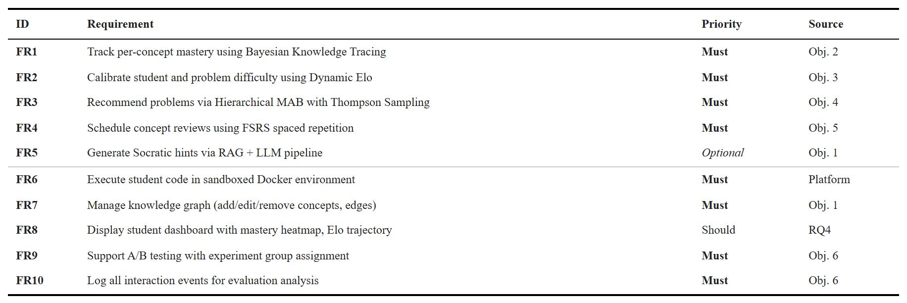

*Table 3.1. Functional requirements derived from research objectives.*

A few requirements deserve a sentence of context. FR1 (Bayesian Knowledge Tracing) maintains the per-(student, concept) posterior `P(L_t)`; the threshold `P(L_t) ≥ 0.85` gates prerequisites for downstream recommendation. FR3 (Hierarchical MAB) is the integration point: it consumes BKT mastery (FR1), Elo ratings (FR2), and FSRS review urgency (FR4) and returns a ranked problem list. FR5 (LLM hints) is **exploratory** and disabled in the pilot, per §1.5.1.

### 3.1.2. Non-Functional Requirements

Six non-functional requirements set performance and security targets. Table 3.2 lists them.

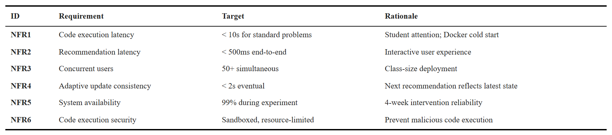

*Table 3.2. Non-functional requirements.*

NFR2 (recommendation latency under 500&nbsp;ms end-to-end) is the binding constraint that motivates the Redis caching strategy in §3.7. NFR3 (50+ concurrent users) is the expected pilot cohort size; the FastAPI service is stateless to allow horizontal scaling. NFR6 (sandboxed execution) keeps each Docker container isolated with no network access, a memory cap, and a CPU-time cap.

### 3.1.3. Requirements Traceability

Table 3.3 maps every requirement to the architectural component that fulfils it, the design section in this chapter, the implementation section in Chapter 4, and the evaluation metric in Chapter 5. The matrix confirms that every requirement has an owner and an evaluation hook.

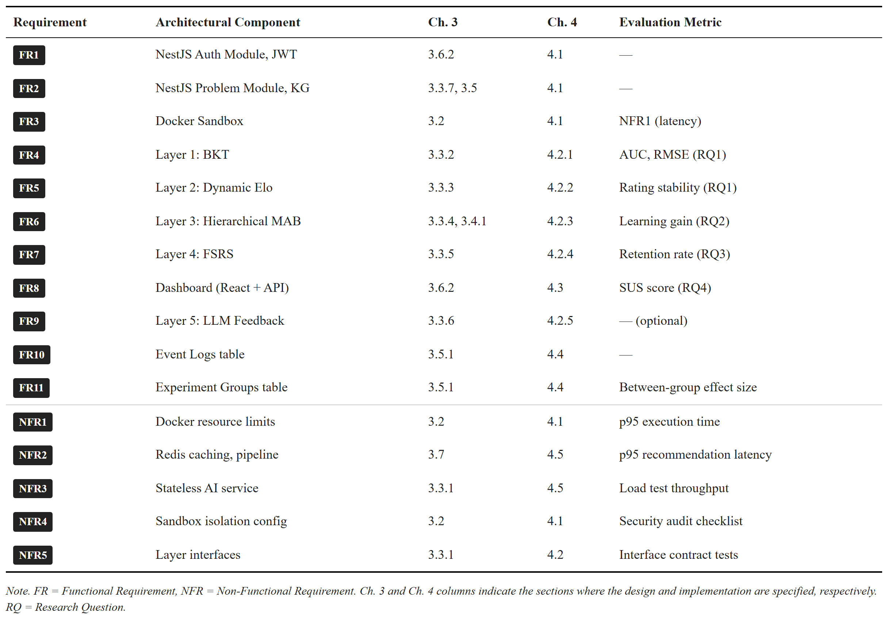

*Table 3.3. Requirements traceability matrix.*

## 3.2. Architecture Overview

The platform is built from the ground up for adaptive learning. I did not bolt adaptive features onto an existing online judge; every layer — from the code editor to the AI service — was designed with adaptive learning as a core concern.

The system has four components:

1. **React + TypeScript frontend** (Vite, Ant Design, Monaco editor). The client provides the code editor, the problem browser, the adaptive dashboard (mastery, Elo trends, review queue), and the recommendation panel.
2. **NestJS API gateway** (TypeScript, Prisma ORM). The gateway handles authentication, course and problem CRUD, and code execution. For adaptive features it acts as a proxy to the FastAPI service.
3. **FastAPI AI service** (Python 3.11, SQLAlchemy). The AI service hosts the five-layer adaptive engine. Python is the natural choice because the relevant libraries — pyBKT [31], NumPy, SciPy, and the FSRS reference implementation — are written in Python.
4. **PostgreSQL + Redis + Docker sandbox.** PostgreSQL is the single persistent store. Redis provides caching for adaptive state and per-student locks for concurrency control. Docker containers run student code with the limits in NFR4.

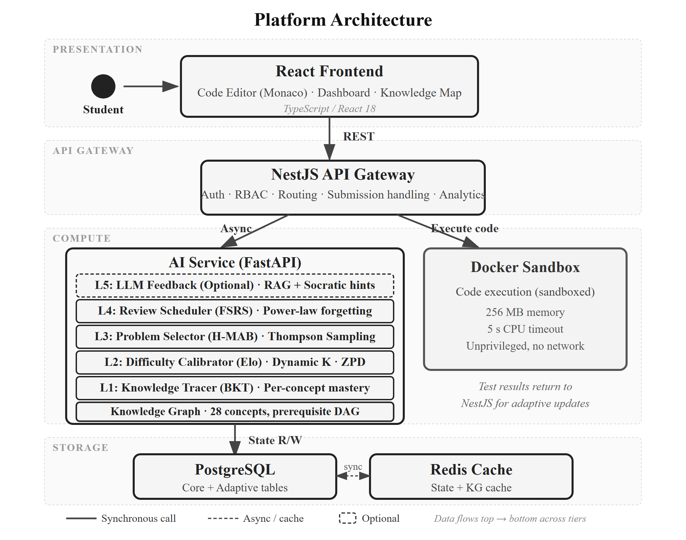

*Figure 3.1. System architecture: the four-component platform with the five-layer adaptive engine inside the FastAPI service.*

Three design choices deserve a note. First, separating the AI service from the NestJS gateway lets the Python ML ecosystem run natively, lets the adaptive engine scale and deploy independently, and enforces a clean interface contract. Second, the two services share a database under a strict **write-ownership rule**: NestJS owns writes to core domain tables (users, problems, submissions); the AI service owns writes to adaptive state tables (knowledge states, Elo ratings, MAB states, FSRS cards). Both services have read access to all tables. This eliminates distributed transactions. Third, **adaptive updates are asynchronous**. The submission verdict is returned to the student synchronously; BKT, Elo, MAB, and FSRS update in the background. This decouples response time from adaptive logic complexity.

The platform also follows **progressive enhancement**: core functions (browse, submit, run, see verdict) work even when the adaptive engine is off. Each adaptive layer is feature-flagged, which simplifies the control-group condition in the pilot.

## 3.3. Five-Layer Adaptive Engine

The adaptive engine has five layers stacked on a knowledge graph foundation. The layers communicate through small, well-defined interfaces (NFR5). Layer 3 is the integration point: it consumes outputs from Layers 1, 2, and 4 to choose the next problem. Figure 3.6 summarizes the data dependencies.

### 3.3.1. Knowledge Graph Foundation

The knowledge graph is a directed acyclic graph: nodes are programming concepts, edges are prerequisite relations. It encodes the pedagogical sequencing every programming curriculum follows (variables before loops, loops before sorting, sorting before dynamic programming).

The graph has 34 Python concepts grouped into seven topic groups: Basics, Control Flow, Functions, Data Structures, OOP, Algorithms, and Advanced. The full 34-concept listing and all 52 prerequisite edges are in Appendix B. Each concept has a difficulty tier (1–5). Edges are weighted (default 1.0) to allow soft prerequisites in future extensions. Instructors and admins manage the graph through the NestJS API; a DAG validation prevents cycles.

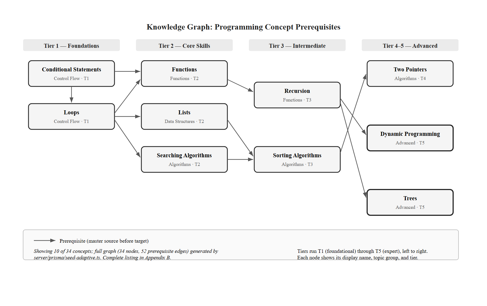

*Figure 3.2. Knowledge graph excerpt: 10 of 34 concepts and their prerequisite edges. The full graph (34 nodes, 52 edges) is in Appendix B.*

The graph is consumed by every layer. Layer 1 (BKT) uses the `problem → concepts` mapping to know which mastery posterior to update. Layer 3 (MAB) uses prerequisite edges to gate concept eligibility. Layer 4 (FSRS) uses the graph to make sure a "review" pulls a problem on the due concept, not a related one. Layer 5 (LLM) uses concept descriptions for retrieval context.

### 3.3.2. Layer 1 — Knowledge Tracing (BKT)

**Purpose.** Layer 1 maintains a probabilistic estimate of each student's mastery of each concept. This estimate gates prerequisites in Layer 3 and supplies the learning-gain reward signal to the MAB.

**Model.** I implemented standard Bayesian Knowledge Tracing [16], described in §2.2.1. Each (student, concept) pair has four parameters — `P(L_0)`, `P(T)`, `P(G)`, `P(S)` — and a current mastery `P(L_t)`. Defaults follow Corbett and Anderson [16] and pyBKT [31]: `P(L_0) = 0.1`, `P(T) = 0.2`, `P(G) = 0.15`, `P(S) = 0.1`. These reflect typical introductory programming exercises: low prior knowledge, moderate per-opportunity learning, low guess rate (multi-test-case grading constrains lucky guesses).

**Mastery threshold.** A concept is treated as mastered for prerequisite gating when `P(L_t) ≥ 0.85`. The threshold of 0.85 is the midpoint of the 0.80–0.90 range recommended by [16]. **It is a design choice from the literature, not empirically optimized on this dataset. The pilot will test sensitivity in the 0.80–0.90 band (§5.4).**

**Inputs / outputs.** After each graded submission, Layer 1 receives the student id, the concept id (the problem's primary tag), and a binary correctness signal (1 = ACCEPTED, 0 = otherwise). It writes the updated `P(L_t)` to the `knowledge_states` table and exposes it to Layers 3 and 4.

**Interaction with other layers.** Layer 1 feeds Layer 3 in two ways. (1) The `≥ 0.85` classification gates which concepts become eligible at MAB Level 1: concept B with prerequisite A is eligible only when A is mastered. (2) The change in `P(L_t)` is the learning-gain term in the MAB reward. Layer 1 also triggers Layer 4: when a concept first reaches mastery, an FSRS card is initialized for it.

**This enables RQ1**, which asks how accurately the learner model predicts student performance. BKT's per-concept posterior is the main quantity validated in §5.

### 3.3.3. Layer 2 — Difficulty Calibrator (Dynamic Elo)

**Purpose.** Layer 2 puts students and problems on a shared rating scale so problem difficulty can be matched to student level. The shared scale operationalizes Vygotsky's Zone of Proximal Development [20] as a numeric range above the student's rating.

**Model.** I implemented a dual Elo system [17] with a dynamic K-factor [11]. Each student and each problem has a rating (initialized at 1200) and a K-factor that controls update sensitivity. The expected probability that student A solves problem B is

$$E_A = \frac{1}{1 + 10^{(R_B - R_A)/400}} \quad (3.1)$$

After a submission with outcome `S_A` (1 = ACCEPTED, 0 = otherwise), both ratings update:

$$R_A' = R_A + K_A (S_A - E_A), \quad R_B' = R_B + K_B (E_A - S_A) \quad (3.2)$$

The student's K-factor is dynamic. It boosts updates when the student is new (few interactions) or on a steep learning curve (high recent residuals):

$$K_A = K_{\text{base}} \cdot f_{\text{novelty}}(n) \cdot f_{\text{trend}}(\Delta R_{\text{recent}}) \quad (3.3)$$

where `f_novelty(n) = max(1.0, 2.0 − n/30)` boosts the first 30 interactions and `f_trend` scales K with a windowed exponential moving average of recent residuals. Problem K-factors follow the analogous formula keyed on the number of submissions the problem has received.

**Hyperparameter disclaimer.** **`K_base = 25` is a heuristic midpoint chosen for moderate volatility in education, not a tuned optimum. Elo [17] originally recommended K = 32 for new and K = 16 for established chess players; 25 sits between. Sensitivity to K is in §5.4.**

**Interaction with other layers.** Layer 2 defines the ZPD filter for Layer 3. Within a selected concept, only problems whose Elo rating satisfies

$$R_A + \delta_{\min} \le R_B \le R_A + \delta_{\max} \quad (3.4)$$

are eligible. With `δ_min = 50` and `δ_max = 250`, Equation 3.1 gives expected success probabilities of about 0.43 and 0.15. After accounting for the asymmetric nature of educational gains (students learn most from moderately challenging tasks), this band approximates the 36–64% success-rate range from flow theory [25] and the desirable-difficulty literature [21]. The bounds are design choices, validated by sensitivity analysis in §5.4.

**This enables RQ1** by producing a continuous, calibrated difficulty rating per problem and per student, which is the primary input the model uses to predict next-step success.

### 3.3.4. Layer 3 — Problem Selector (Hierarchical MAB)

**Purpose.** Layer 3 is the recommendation engine. It frames problem selection as a two-level Hierarchical Multi-Armed Bandit and solves it with Thompson Sampling [18], [19]. The hierarchy mirrors the pedagogical decision: which concept first, then which problem within it.

**Level 1 — Concept selection.** Each eligible concept is an arm. A concept is eligible if all its prerequisites are mastered (`P(L) ≥ 0.85`) and either the concept itself is unmastered or it is flagged for review by Layer 4. Each arm has a Beta(α, β) posterior modelling expected learning gain. Thompson Sampling draws one sample per arm and picks the maximum.

**Level 2 — Problem selection.** Within the selected concept, each unsolved problem whose Elo rating sits in the student's ZPD (Equation 3.4) is an arm. Each arm has its own Beta posterior. Thompson Sampling again selects the maximum.

**Reward signal.** After the student submits, the reward combines three terms:

$$r = w_1 \cdot \Delta P(L_t) + w_2 \cdot \mathbb{1}[\text{correct}] + w_3 \cdot (1 - \text{normalized\_attempts}) \quad (3.5)$$

Here `ΔP(L_t)` is the learning gain from Layer 1, the second term is the binary correctness, and `normalized_attempts = min(attempt, M) / M` with `M = 5`. The reward is clipped to `[0, 1]` and the Beta posterior is updated as `α += r`, `β += 1 − r`. While Thompson Sampling's regret bounds were originally proved for Bernoulli rewards [18], using continuous rewards with Beta priors is an established approximation with good empirical performance [19].

**Hyperparameter disclaimer.** **Weights `w_1 = 0.5` (gain), `w_2 = 0.3` (correctness), `w_3 = 0.2` (efficiency) are heuristic combining values, not learned from data. They prioritize learning gain as the primary optimization signal. Sensitivity will be tested via grid search in §5.4.**

**Interaction with other layers.** Layer 3 is where everything converges. It consumes BKT mastery and prerequisite gating from Layer 1, the ZPD filter from Layer 2, review urgency from Layer 4, and the prerequisite graph from §3.3.1. The integration of FSRS-due concepts into the MAB candidate set is the key novelty: due concepts are added as eligible arms with a priority boost on their Thompson Sampling prior, scaled by how far retrievability has fallen below the threshold. This balances new-material exploration against forgetting prevention without one overriding the other.

The specific combination of (i) prerequisite constraints from a curated knowledge graph, (ii) BKT-based mastery gating, and (iii) FSRS review urgency inside a hierarchical Thompson Sampling framework has not, to my knowledge, been previously reported. Multi-Armed Bandits have been applied to educational recommendation before [44]; the four-component integration is the engineering contribution of Contribution 1 (§1.7).

**This enables RQ2**, which asks whether the integrated adaptive pipeline produces different learning outcomes than a content-based filtering baseline.

### 3.3.5. Layer 4 — Review Scheduler (FSRS)

**Purpose.** Layer 4 fights the forgetting problem. It models memory decay per (student, concept) and surfaces concepts for review before they decay below a useful retrievability.

**Model.** I implemented FSRS v4 [12], whose power-law retrievability has been validated against SM-2 on millions of Anki reviews. Each (student, concept) is a card with two state variables: difficulty `D` (1–10) and stability `S` (the time in days at which retrievability drops to 90%). Retrievability at time `t` after the last review is

$$R(t) = \left( 1 + \frac{t}{9 S} \right)^{-1} \quad (3.6)$$

A concept whose retrievability has fallen below the review threshold `θ_r = 0.7` is flagged as due. When the student reviews a concept by solving a problem tagged with it, FSRS updates `D` and `S` from the review outcome. FSRS expects a 1–4 rating (Again / Hard / Good / Easy); programming submissions don't naturally produce that. The submission-to-rating mapping — the bridge from procedural code outcomes to FSRS's declarative rating scale — is in Chapter 4.

**Interaction with other layers.** Layer 4 feeds Layer 3. Review-due concepts are injected into the MAB Level 1 candidate set even if already mastered, with a priority bonus proportional to the urgency of the review. The result balances three pulls: advance to new concepts (exploitation), explore uncertain concepts (exploration), and review at-risk concepts (retention).

**This enables RQ3**, which asks whether FSRS-scheduled reviews change short-term retention versus the same platform without scheduled reviews.

### 3.3.6. Layer 5 — LLM Feedback (Exploratory)

Layer 5 is **exploratory engineering work, not a thesis contribution**. It is built and disabled in the pilot to avoid confounding the evaluation of Layers 1–4. The design is described here briefly for completeness; the implementation is in §4.6.

**What it does.** When a student requests a hint or fails three or more attempts on a problem, the system constructs a query from the problem description, the student's latest code, the error message, and the relevant concept. A Retrieval-Augmented Generation pipeline retrieves concept descriptions, prerequisite information, and similar solved examples from the knowledge graph and problem bank. The retrieved context plus the student's code goes into a large language model with a prompt template that enforces Socratic questioning — guiding the student rather than giving the answer.

The hint level is calibrated by Layer 1's mastery estimate: low mastery gets fundamentals, moderate mastery gets a targeted nudge.

**This enables future work** on cost, hallucination, and hint quality (§6.4). It is not tied to a research question in the pilot.

### 3.3.7. Hyperparameter Summary

Table 3.4 lists every hyperparameter introduced above with its default value, valid range, and source. The table is referenced throughout Chapter 4 (implementation) and §5.4 (sensitivity analysis).

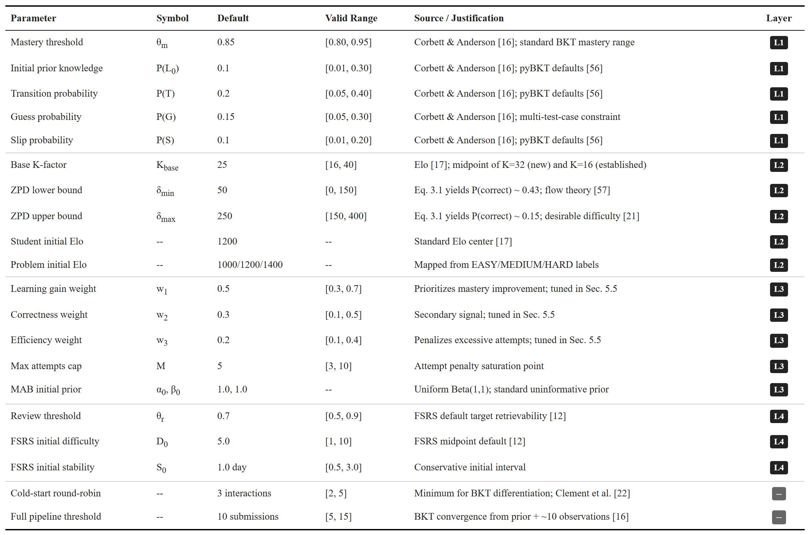

*Table 3.4. Hyperparameter summary for the five-layer adaptive engine.*

## 3.4. Data Model

The data model has two halves matching the write-ownership rule. NestJS owns the **core domain** (users, courses, problems, test cases, submissions, concepts, knowledge graph edges, problem-concept mappings). The AI service owns the **adaptive state** (`knowledge_states`, `elo_ratings`, `mab_states`, `fsrs_cards`) and the analytics tables (`event_logs`, `experiment_groups`).

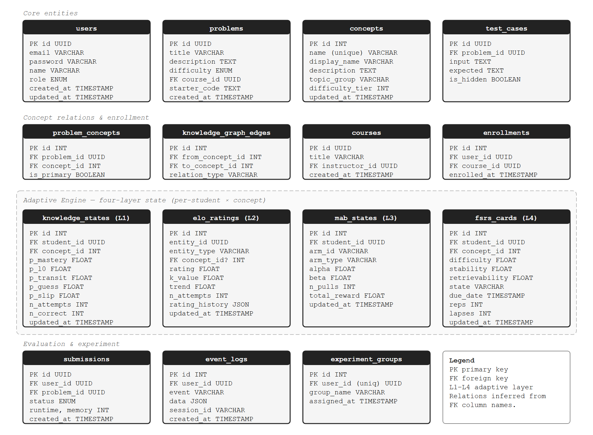

*Figure 3.5. Database schema: core domain tables (left) owned by NestJS, adaptive state tables (right) owned by the AI service. Foreign-key relationships are conveyed via column names (e.g., `student_id` → `users.id`).*

Three design notes. First, every adaptive state row is keyed on `(student_id, concept_id)` or `(student_id, problem_id)`, which keeps reads O(1) by the lookup key after caching. Second, `event_logs` records every recommendation shown, accepted, and skipped, with timestamps and session ids; this powers RQ1's prediction validation and RQ2's learning-gain analysis. Third, `experiment_groups` tags each student with a condition (adaptive vs. content-based filtering control), letting the system serve different recommendation logic per group from a single deployment.

## 3.5. Recommendation and Submission Flows

Two flows exercise the engine: the recommendation flow (synchronous, low-latency), and the submission flow (synchronous code execution + asynchronous adaptive update).

### 3.5.1. Recommendation Flow

A student requests a practice problem. The flow traverses all adaptive layers and returns a ranked list within the 500ms target (NFR2).

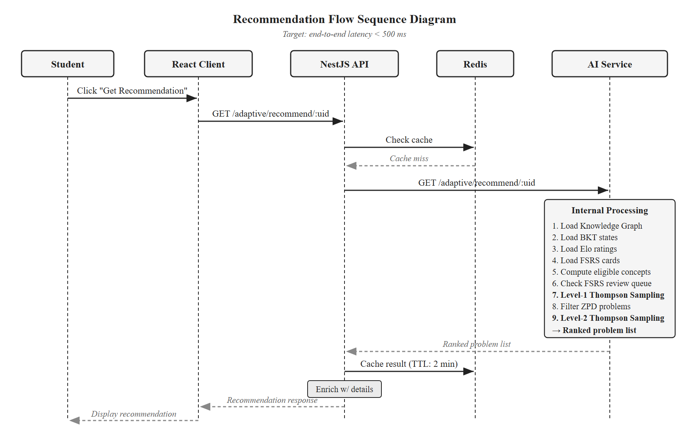

*Figure 3.3. Sequence diagram for the recommendation flow.*

The AI service does seven things. (1) Load the knowledge graph from Redis (60-minute TTL) or the database. (2) Load the student's BKT states, Elo rating, MAB states, and FSRS cards from Redis (5-minute TTL) or the database. (3) Compute eligible concepts: prerequisites mastered AND (concept unmastered OR flagged for FSRS review). FSRS-due concepts get a priority boost on their Thompson Sampling prior. (4) Thompson-sample each eligible concept and pick the maximum. (5) Within that concept, retrieve unsolved problems and apply the ZPD filter (Equation 3.4); if empty, fall back to the next concept. (6) Thompson-sample the surviving problems and pick the maximum. (7) Return a ranked list (3–5 items) so the student keeps some agency. NestJS enriches the list with full problem details before returning it to the client.

### 3.5.2. Submission Processing Flow

A student submits code. The flow has two phases.

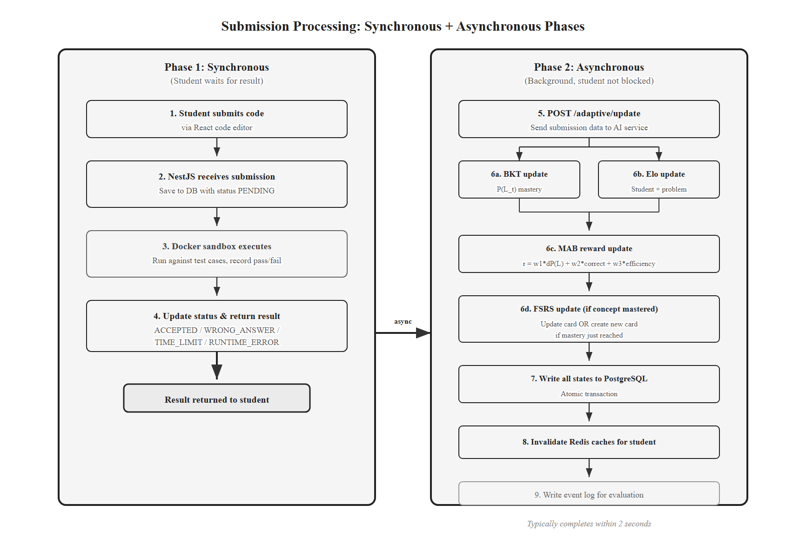

*Figure 3.4. Submission processing flow: synchronous code execution returns the verdict to the student; adaptive updates run asynchronously in the background.*

**Phase 1 — Synchronous execution.** NestJS saves the submission as PENDING, dispatches it to the Docker sandbox, and updates the status to ACCEPTED, WRONG_ANSWER, TIME_LIMIT, RUNTIME_ERROR, or COMPILATION_ERROR. The verdict goes back to the student.

**Phase 2 — Asynchronous adaptive update.** NestJS posts to the AI service `/adaptive/update` endpoint with the student id, problem id, concept id, correctness, attempt number, time spent, and error type. The service runs the layer updates in order: Layer 1 (BKT mastery, learning gain), Layer 2 (Elo for student and problem), Layer 3 (MAB reward and Beta update), Layer 4 (FSRS card update or initialization). All writes happen in a single database transaction; if any layer fails, the whole update rolls back. The service then invalidates Redis caches for the affected student and writes an event-log entry.

The sequential order matters: Layer 3 needs Layer 1's learning gain, and Layer 4 needs Layer 1 to know whether mastery has been reached. Layer 2 can run in parallel with Layer 1 because it only depends on the submission outcome.

The asynchronous pattern introduces an eventual-consistency window — typically under 2 seconds. A student who submits and immediately requests a new recommendation may see one based on slightly stale state; the next request reflects the update. The pedagogical impact is negligible.

**Failure handling.** Failed adaptive updates go onto a Redis-backed retry queue with exponential backoff (1s, 2s, 4s, max 3 retries). After three failures the event lands in a dead-letter table for manual review. The student's submission verdict is unaffected — Phase 1 always completes, with or without Phase 2. If the AI service is unreachable, NestJS returns a fallback recommendation drawn from the student's most recent active topic, ordered by static difficulty.

**Concurrency.** A per-student Redis lock (SETNX with 30-second TTL) serializes adaptive updates, preventing race conditions when two submissions arrive in quick succession.

## 3.6. Cold Start

The cold-start problem appears in two places: a new student with no submission history, and a new problem with no submission data.

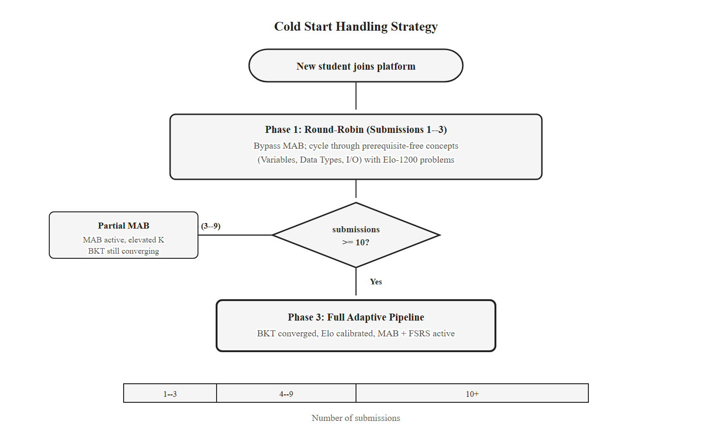

*Figure 3.7. Cold start handling: round-robin onboarding for the first 3 interactions, mixed mode through ~10, full pipeline thereafter.*

**New student.** All adaptive state starts at defaults: `P(L_0) = 0.1`, Elo = 1200, MAB priors Beta(1, 1), no FSRS cards. The system handles this through a three-stage onboarding. For the first 3 interactions, the MAB is bypassed and a round-robin over prerequisite-free concepts (Variables, Data Types, I/O) selects the next concept; within each concept, the problem closest to Elo 1200 is chosen. This guarantees signal across foundational concepts. The threshold of 3 interactions is informed by Clement et al. [44], who showed MAB-based selection needs a minimum exploration period before it outperforms random selection. After approximately 10 submissions, BKT and Elo have enough data to differentiate the student from population means and the full pipeline takes over. This 10-submission threshold reflects BKT's convergence behavior under `P(L_0) = 0.1` and `P(T) = 0.2` [16].

**New problem.** A new problem has no submissions to derive an empirical Elo from. Its rating is initialized from the static difficulty label: EASY → 1000, MEDIUM → 1200, HARD → 1400. The problem K-factor starts at 50 (double the base) so the rating converges fast. After ~30 submissions from diverse students, the rating stabilizes and K decays to base. The MAB prior stays at Beta(1, 1); Thompson Sampling's natural exploration gives the new problem a fair chance regardless.

## 3.7. Caching Strategy

Meeting NFR2's 500ms recommendation latency under concurrent load requires caching. Loading knowledge states, Elo ratings, FSRS cards, MAB states, and the knowledge graph for every recommendation is too slow without a cache. I use Redis with the policies in Table 3.5.

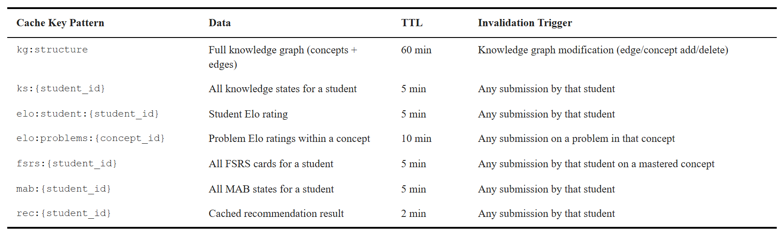

*Table 3.5. Redis caching configuration for adaptive state.*

The TTL values balance freshness against hit rate. The knowledge graph changes only when instructors modify the curriculum, so a 60-minute TTL is fine. Student-specific state has a 5-minute TTL as a safety net; the primary freshness mechanism is **explicit invalidation** after each submission update — the AI service deletes the affected entries when it writes new state. Problem-level Elo cache invalidates only when the rating shifts by more than 10 points, which avoids cache churn for small drift.

If Redis is unavailable, the AI service falls back to direct database reads. Recommendation latency may rise to roughly 800–1200ms, but the platform remains functional. Adaptive features are not gated on Redis availability.

## 3.8. Layer Interaction Summary

Figure 3.6 summarizes the data dependencies between the five layers and the knowledge graph. It is the most concise statement of how the engine fits together.

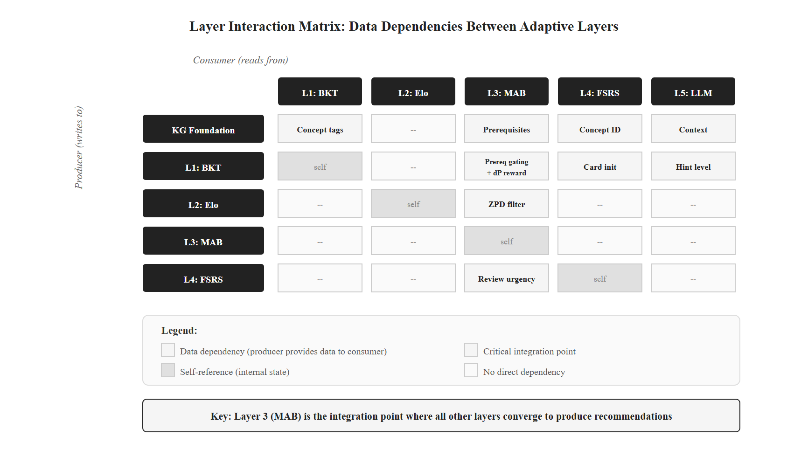

*Figure 3.6. Layer interaction matrix: rows are producers, columns are consumers. Layer 3 is the integration point for Layers 1, 2, and 4.*

Chapter 4 turns this design into code: parameter values, data structures, the per-layer update functions, the submission-to-FSRS mapping that bridges procedural submissions to declarative review ratings, and the deployment of the four-component stack. The implementation respects every contract specified here, so any layer can be replaced without touching the others — exactly what NFR5 requires.
