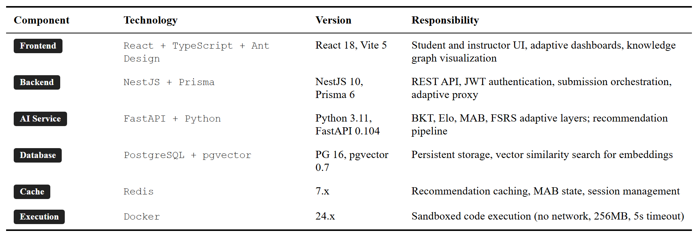
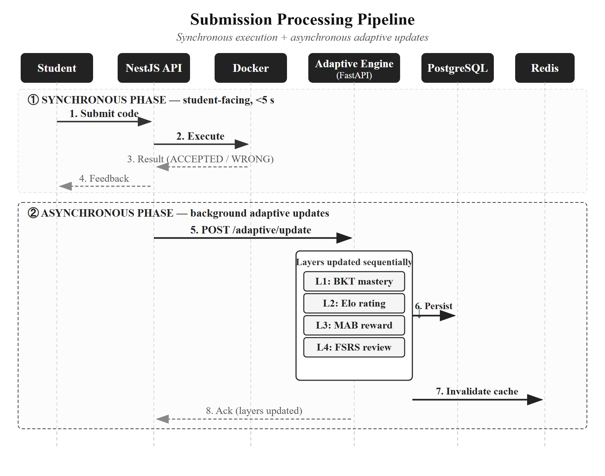
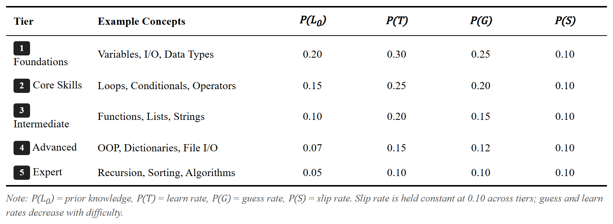
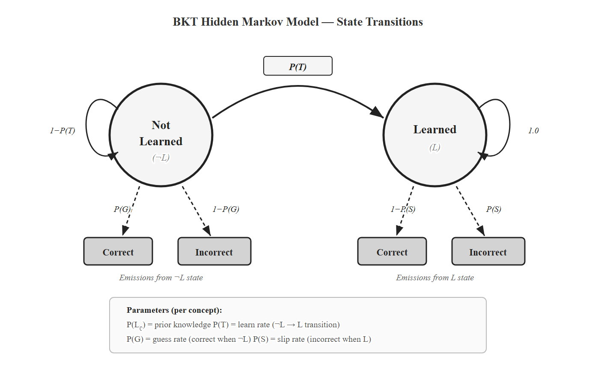
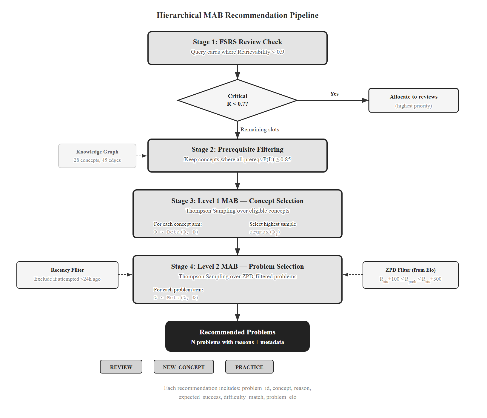
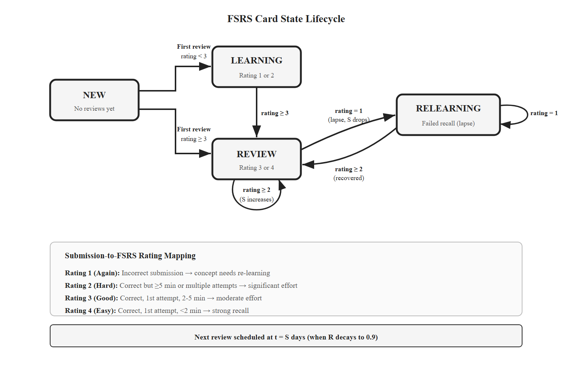
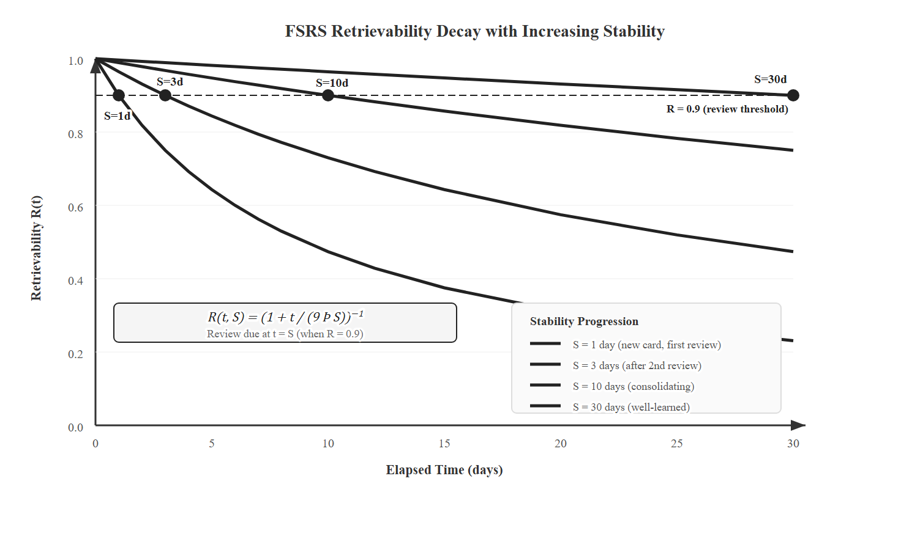
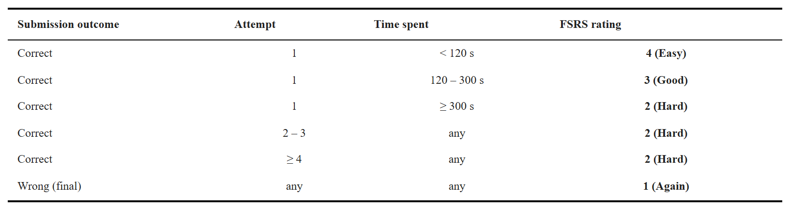

# CHAPTER 4. IMPLEMENTATION

Chapter 3 specified the design. This chapter shows how I turned that design into a working system. The platform is implemented and deployed — every layer in §3.3 has running code, talks to the database, and serves an HTTP endpoint. §4.1 lists the stack. §4.2 covers the backend services and deployment. §4.3 through §4.7 describe each adaptive layer, with the submission-to-FSRS-rating mapping in §4.6 as the bridge from procedural code outcomes to FSRS's declarative ratings. §4.8 covers the frontend. §4.9 closes by framing the chapter as implementation evidence.

## 4.1. Technology Stack

I picked four mature components, each chosen for fit rather than novelty. Table 4.1 summarizes the stack with versions and primary responsibilities.



*Table 4.1. Technology stack summary.*

The choices follow a single principle: use the language each ecosystem is strong in. TypeScript handles the web and API tier, where Prisma and NestJS give type-safe schemas and decorators. Python handles the adaptive engine, where pyBKT [31], NumPy, SciPy, and the FSRS reference implementation [12] are all native. Splitting the two languages into separate services lets each scale independently and keeps a clean boundary.

## 4.2. Backend Services and Deployment

The platform runs as five Docker Compose services: React frontend (Nginx), NestJS gateway, FastAPI AI service, PostgreSQL, and Redis.

**NestJS gateway.** The gateway owns authentication (JWT), course and problem CRUD, submissions, and Docker sandbox orchestration. It exposes REST endpoints to the frontend and proxies adaptive endpoints to the FastAPI service. Prisma generates the TypeScript client from `schema.prisma`, which keeps the database schema and the application types in sync.

**FastAPI AI service.** The AI service hosts the five-layer engine. Each layer is a Python module in `ai-service/app/services/` with a stable interface (NFR5). Endpoints follow `/adaptive/<layer>/...` for layer-specific operations and `/adaptive/recommend`, `/adaptive/update` for orchestration. SQLAlchemy reads the same PostgreSQL database that NestJS writes to, under the write-ownership rule from §3.2.

**PostgreSQL with pgvector.** PostgreSQL stores both the core domain (users, problems, submissions) and the adaptive state (knowledge states, Elo ratings, MAB arms, FSRS cards). The pgvector extension powers the content-based filtering baseline used by the control group in the pilot, with 384-dimensional sentence-transformer embeddings.

**Docker sandbox.** Every code submission runs in a fresh container with no network, 256 MB memory, a 5-second CPU cap, and an unprivileged user. The container is destroyed after capturing stdout and stderr. This satisfies NFR4 and isolates students from each other and from the host.

**Feature flags.** Each adaptive layer is feature-flagged (`ENABLE_BKT`, `ENABLE_ELO`, `ENABLE_MAB`, `ENABLE_FSRS`, `ENABLE_LLM_HINTS`). The control group in the pilot runs with the four core flags off and falls back to content-based filtering. The same binary serves both groups.



*Figure 4.1. Submission processing pipeline. Phase 1 returns the verdict synchronously. Phase 2 runs the four-layer adaptive update asynchronously, in a single database transaction.*

The asynchronous pattern is described in §3.5.2. NestJS posts to `/adaptive/update` with the student id, problem id, primary concept id, correctness, attempt number, and time spent. The AI service runs Layer 1 → Layer 2 → Layer 3 → Layer 4 in order, commits, then invalidates the Redis caches for that student.

## 4.3. Layer 1 — Bayesian Knowledge Tracing

Layer 1 lives in `ai-service/app/services/bkt_service.py`. Each `(student, concept)` pair has the four BKT parameters from §3.3.2 and a current mastery `P(L_t)`. Defaults are the literature values [16], [31] listed in Table 4.2.



*Table 4.2. Default BKT parameters by difficulty tier.*

The values relax with difficulty: prior knowledge `P(L_0)`, learn rate `P(T)`, and guess rate `P(G)` all decrease across tiers, while the slip rate `P(S)` stays constant at 0.10. Higher-tier concepts are harder to begin with and slower to acquire; the constant slip reflects that even confident students occasionally make errors regardless of concept difficulty. These defaults are heuristics, not optimized on this dataset; per-student fitting would need more data than the pilot collects.

The update is a textbook two-step posterior. Given the prior `P(L_t)`, the slip rate `P(S)`, the guess rate `P(G)`, and the observed correctness, Bayes' theorem gives the conditional posterior, which the learning transition then bumps by `(1 − P(L | obs)) · P(T)`. The clamp `[0.001, 0.999]` prevents numerical edge cases.

*Listing 1. BKT posterior update.*

```python
def bkt_update(p_l: float, is_correct: bool, params: BKTParams) -> float:
    p_g, p_s, p_t = params.p_guess, params.p_slip, params.p_transit
    if is_correct:
        p_obs = p_l * (1 - p_s) + (1 - p_l) * p_g
        p_post = (p_l * (1 - p_s)) / p_obs
    else:
        p_obs = p_l * p_s + (1 - p_l) * (1 - p_g)
        p_post = (p_l * p_s) / p_obs
    p_new = p_post + (1 - p_post) * p_t
    return max(0.001, min(0.999, p_new))
```

A submission can touch several concepts. The `BKTService.update` method retrieves all `problem_concepts` rows for the submitted problem and applies a differentiated rule: the **primary** concept gets a full update; **secondary** concepts get a positive update on a correct submission and no penalty on a failure. The reasoning is pedagogical — failing a recursion problem that also uses lists should not erode the list mastery estimate.



*Figure 4.2. BKT as a two-state Hidden Markov Model. The hidden states are Learned (L) and Not Learned (¬L). Four parameters govern the prior, transition, and emission distributions.*

After the BKT update completes, the service writes the new `P(L_t)` and the learning gain `ΔP(L_t)` to `knowledge_states`. The gain feeds the MAB reward in §4.5.

## 4.4. Layer 2 — Dynamic Elo

Layer 2 lives in `elo_service.py`. Both students and problems carry an Elo rating and a K-factor. Students start at 1200; problems start at 1000 (EASY), 1200 (MEDIUM), or 1400 (HARD), matching the seed data in `schema.prisma`. Ratings are clamped to `[400, 2800]` to prevent drift to extreme values.

The expected score and update follow Equations 3.1 and 3.2. The Python is a direct transcription:

*Listing 2. Elo expected score and rating update.*

```python
def expected_score(r_student: float, r_problem: float) -> float:
    return 1.0 / (1.0 + 10 ** ((r_problem - r_student) / 400))

def update_elo(r_s, r_p, k_s, k_p, is_correct):
    e_s = expected_score(r_s, r_p)
    s = 1.0 if is_correct else 0.0
    return r_s + k_s * (s - e_s), r_p + k_p * (e_s - s)
```

Student and problem ratings move in opposite directions, as expected: a correct submission raises the student rating and lowers the problem's.

The interesting piece is the dynamic K-factor. A new student should converge fast; an experienced student should stay stable; a streak of unexpected wins or losses should re-open calibration. I implemented the form from Pelanek [11]:

*Listing 3. Dynamic K-factor for student ratings.*

```python
def compute_dynamic_k(history, k_min=10, k_max=40):
    if len(history) < 3:
        return k_max  # cold start: fast initial calibration
    recent = history[-10:]
    weights = [0.9 ** (len(recent) - 1 - i) for i in range(len(recent))]
    residuals = [(1.0 if h["correct"] else 0.0) - h["expected"] for h in recent]
    trend = sum(w * r for w, r in zip(weights, residuals)) / sum(weights)
    if trend > 0:
        return k_min + (k_max - k_min) * math.exp(-2.0 * trend)
    return k_min + (k_max - k_min) * (1 - math.exp(2.0 * trend))
```

The trend is an exponentially weighted average of recent residuals over the last 10 submissions. A positive trend (better than expected) damps K toward `k_min = 10`; a negative trend boosts K toward `k_max = 40`. The bounds and the decay constant `λ = 2.0` are heuristics from [11], not tuned on this dataset; sensitivity is in §5.4.

Problem K-factors decay differently. As a problem accumulates submissions, its rating becomes more reliable, so K should drop:

*Listing 4. Square-root K-factor decay for problem ratings.*

```python
def compute_problem_k(n_attempts: int) -> float:
    return max(K_MIN, K_MAX / math.sqrt(max(1, n_attempts)))
```

The square-root decay matches the noise-floor argument in [11]: rating uncertainty falls as `1/√n`. The full ratings history is stored as a JSON array on `elo_ratings`, capped at the 100 most recent entries. This is enough for trend computation and dashboard visualization without unbounded growth.

The Elo ratings power the ZPD filter consumed by Layer 3, per Equation 3.4. With `δ_min = 50` and `δ_max = 250`, the candidate problems sit at 36–64% expected success — the desirable-difficulty band [21], [25].

## 4.5. Layer 3 — Hierarchical MAB

Layer 3 lives in `mab_service.py`. It implements the two-level Thompson Sampling described in §3.3.4: Level 1 picks the concept, Level 2 picks the problem.

### 4.5.1. Thompson Sampling

Each arm — a concept at Level 1, a problem at Level 2 — has a Beta(α, β) posterior over its expected reward. Sampling and selection are one line each:

*Listing 5. Thompson Sampling arm selection.*

```python
def thompson_select(arms):
    if not arms: return None
    samples = [(np.random.beta(a["alpha"], a["beta"]), a) for a in arms]
    return max(samples, key=lambda x: x[0])[1]
```

Every arm starts at Beta(1, 1) — the uniform prior. Beta(1, 1) gives every arm the same chance of being sampled high, which guarantees early exploration before any arm dominates.



*Figure 4.3. Hierarchical MAB decision flow. FSRS-due concepts enter the candidate pool with a priority bonus; remaining slots run two-level Thompson Sampling under prerequisite and ZPD filters.*

### 4.5.2. Reward Function

The reward signal blends three terms, as in Equation 3.5:

*Listing 6. MAB reward function (gain + difficulty match + efficiency).*

```python
def compute_reward(p_before, p_after, is_correct, attempts, time_spent):
    learning_gain = max(0, (p_after - p_before) * 10)  # scale up small deltas
    if is_correct and attempts <= 3:    diff = 1.0
    elif is_correct:                     diff = 0.5
    elif attempts >= 3:                  diff = 0.0
    else:                                diff = 0.3
    efficiency = min(1.0, 300.0 / max(time_spent, 30.0))
    r = 0.5 * learning_gain + 0.3 * diff + 0.2 * efficiency
    return min(1.0, max(0.0, r))
```

Learning gain is scaled by 10 because raw BKT deltas are typically 0.01–0.05, which would barely move a Beta posterior. Difficulty-match credits a clean first-attempt success and penalizes the opposite. Efficiency adds a small time-based bonus. The auxiliary terms reduce noise from the BKT signal alone.

**Hyperparameter disclaimer.** Weights `w_1 = 0.5` (gain), `w_2 = 0.3` (difficulty match), `w_3 = 0.2` (efficiency) are heuristic combining values, not learned from data. They will be tuned by grid search in §5.4. This disclaimer mirrors the one in §3.3.4 and is intentional repetition: every reader of Chapter 4 must see it without backtracking to Chapter 3.

### 4.5.3. Selection Pipeline

The full pipeline runs four stages on each `/adaptive/recommend` call:

1. **FSRS conflict resolution.** Concepts with retrievability below `θ_r = 0.7` enter as priority arms. Critical reviews (`R < 0.7`) get the first slot; standard reviews (0.7 ≤ R < 0.9) take up to half the remaining slots. The MAB always keeps at least one exploration slot unless critical reviews are very urgent.
2. **Eligible concept filtering.** A query against the knowledge graph keeps concepts whose every prerequisite has `P(L_t) ≥ 0.85` and that are not already mastered (`P(L_t) < 0.95`). FSRS-due concepts are kept regardless.
3. **Level 1.** Thompson Sampling over the eligible concepts.
4. **Level 2.** Within each selected concept, Thompson Sampling over unsolved problems whose Elo sits in the ZPD. Problems attempted in the last 24 hours are excluded.

After the student submits, the `update` method posts the reward to both arms involved in the pull:

*Listing 7. Beta posterior update for MAB arms.*

```python
async def update(session, student_id, concept_id, problem_id, reward):
    for arm in [(student_id, concept_id, "CONCEPT"),
                (student_id, problem_id, "PROBLEM")]:
        a = await get_or_create_arm(session, *arm)
        a.alpha += reward
        a.beta  += (1.0 - reward)
        a.n_pulls += 1
    await session.commit()
```

The reward is continuous in `[0, 1]`, so the Beta update splits it across α and β. Continuous-reward Thompson Sampling sacrifices the strict regret bounds of the Bernoulli case [18] but keeps the empirical performance [19], and it is the standard treatment in educational MAB applications.

## 4.6. Layer 4 — FSRS

Layer 4 lives in `fsrs_service.py` and implements FSRS-5 from [12]. Each `(student, concept)` is a card with three states: difficulty `D ∈ [1, 10]`, stability `S > 0` (days until retrievability drops to 90%), and retrievability `R ∈ [0, 1]` (current recall probability).

Retrievability decays by the power law in Equation 3.6:

*Listing 8. FSRS retrievability decay.*

```python
def retrievability(t_days: float, stability: float) -> float:
    return (1.0 + t_days / (9.0 * stability)) ** -1
```

Three properties make this elegant. `R(0, S) = 1`: a just-reviewed card is fully recalled. `R(S, S) = 0.9`: stability is defined as the time at which retrievability is 90%. `R → 0` as `t → ∞`: without review, recall vanishes. Solving `R(t, S) = θ_r` for the next due date gives `t = 9S(1/θ_r − 1)`, so the scheduler simply persists the due timestamp.



*Figure 4.4. FSRS card state machine: NEW → LEARNING → REVIEW, with RELEARNING on a failed review.*



*Figure 4.5. Retrievability decay curves at three stability values. Higher stability flattens the curve and stretches the interval before the next review.*

I use the FSRS-5 default weights [12] without retraining. The 19 weights `w_0`–`w_18` govern initial stability per rating, difficulty initialization, difficulty/stability updates after success or failure, and the hard/easy modifiers. Retraining the weights would require thousands of card reviews per concept, far beyond what the pilot collects; the published defaults are a reasonable starting point and consistent with the practice in the Anki/FSRS community.

### 4.6.1. Submission-to-Rating Mapping

FSRS expects a 1–4 review rating: 1 = Again, 2 = Hard, 3 = Good, 4 = Easy. Flashcard users self-report this. A programming submission cannot. The bridge from procedural code outcomes to FSRS's declarative scale is one of the thesis's small contributions, and Chapter 3 left it for here.

I infer the rating from two observable signals: correctness and effort (attempts and time). Table 4.3 lists the mapping.



*Table 4.3. Submission-to-FSRS-rating mapping. Two observable signals — correctness and effort — replace flashcard self-report.*

*Listing 9. Submission-to-FSRS-rating mapping.*

```python
def submission_to_fsrs_rating(is_correct, attempts, time_spent_s):
    if not is_correct:           return 1  # Again — needs re-learning
    if attempts == 1:
        if time_spent_s < 120:   return 4  # Easy — strong recall
        if time_spent_s < 300:   return 3  # Good — moderate effort
        return 2                          # Hard — slow but correct
    return 2                              # Hard — multiple attempts
```

The mapping respects the spirit of FSRS: higher ratings should reflect stronger memory traces. A first-try, sub-two-minute solve is the closest a programming submission gets to "I knew it cold." Multiple attempts collapse to Hard; a final wrong answer maps to Again, which resets stability per FSRS-5's failure rule. The thresholds (120 s, 300 s, 3 attempts) are design choices informed by typical introductory-Python solve times in the seed problem bank, not optimized on student data; sensitivity is part of §5.4.

The full FSRS-5 update — the one that consumes this rating to update `D` and `S` — is the reference implementation from [12], which I use unmodified. The mapping is the only programming-specific addition.

### 4.6.2. Review Queue

`get_review_queue` computes current retrievability for every active card and splits the result into **due** (R < 0.9) and **upcoming** (due in the next three days), sorted by urgency. The frontend (§4.8) renders this as the review queue page; the MAB pipeline (§4.5.3) consumes the same list to inject due concepts into the selection candidate pool.

## 4.7. Layer 5 — LLM Feedback (Exploratory)

Layer 5 was built to test feasibility. **It is exploratory engineering work, not a thesis contribution, and is disabled in the pilot to avoid confounding the evaluation of Layers 1–4.** I describe it briefly so the reader knows the architecture is end-to-end working code, but no claim about hint quality is made in this thesis.

The layer triggers when a student fails three or more attempts on a single problem. A short Retrieval-Augmented Generation pipeline runs in three steps. The system fetches the problem's primary concept, its description, and the prerequisite chain from the knowledge graph. A prompt template combines that context with the student's latest code and error message and asks the language model for a Socratic question — a hint that nudges without revealing. The assembled prompt goes to the language-model API at temperature 0.7. A per-user rate limit caps hint requests per hour.

The feature is gated by `ENABLE_LLM_HINTS`. Turning it off is a one-line config change and has no effect on Layers 1–4. Quality, cost, and hallucination evaluation are future work (§6.4).

## 4.8. Frontend

The React frontend exposes three adaptive views: the student dashboard, the recommendation page, and the review queue. All three pull data from the NestJS gateway, which proxies adaptive endpoints to the AI service. TanStack Query handles caching, background refetch, and optimistic updates so the dashboard stays responsive on slow connections.

The dashboard shows a mastery radar chart by topic group (seven topics: basics, control flow, functions, data structures, OOP, algorithms, advanced), an Elo card with a 20-submission sparkline, a review-queue badge, and a concept tree colored by mastery state. The recommendation page lists the MAB's chosen problems, each annotated with concept, ZPD-based difficulty match, and a recommendation reason (NEW / REVIEW / PRACTICE). The review queue page sorts FSRS-due cards by retrievability and links each to a Level-2-MAB-selected problem on that concept.

Recharts powers the radar and Elo charts; a custom SVG renderer lays out the knowledge graph by tier (vertical) and topic (horizontal) with curved-path edges. Ant Design covers the rest of the UI primitives.

## 4.9. Chapter Summary

Chapter 4 is implementation evidence. The five layers from Chapter 3 are not vapourware: each has running Python code in `ai-service/app/services/`, tied into a shared PostgreSQL schema, exposed through a FastAPI service, proxied by a NestJS gateway, and rendered in a React frontend. The platform is deployable as a single `docker-compose up` and has been used end-to-end during development.

The implementation translates Chapter 3 into roughly 2,500 lines of Python for the adaptive engine, 4,000 lines of TypeScript for the NestJS layer, and 3,000 lines of TypeScript/React for the frontend. The knowledge graph holds 34 concepts and 52 prerequisite edges, matching the seed in `server/prisma/seed-adaptive.ts`. The submission-to-FSRS-rating mapping in §4.6.1 is the small but load-bearing bridge that lets a spaced-repetition algorithm built for declarative flashcards drive review scheduling for procedural programming skills.

Chapter 5 takes the deployed system and specifies the pilot study that will evaluate it.
