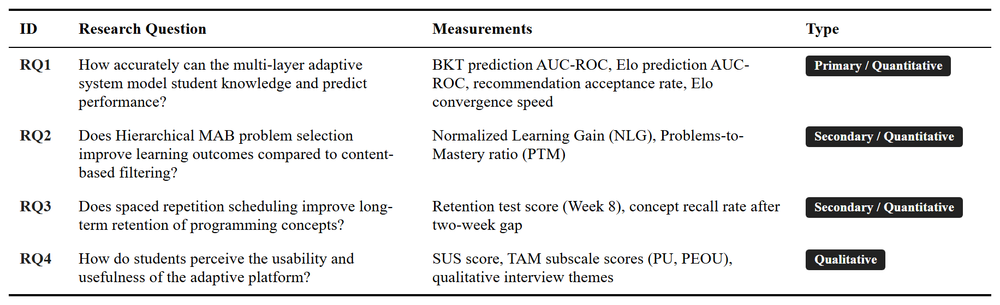
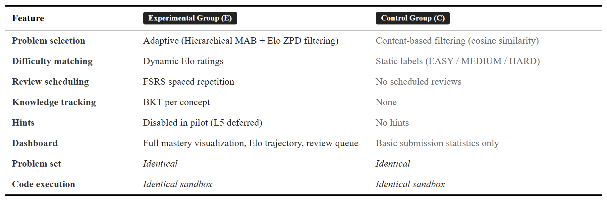
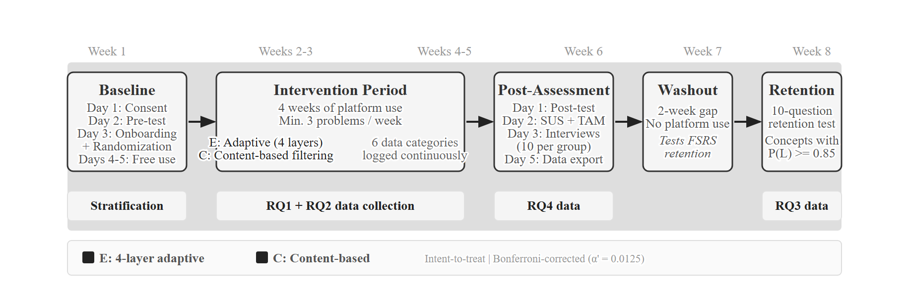
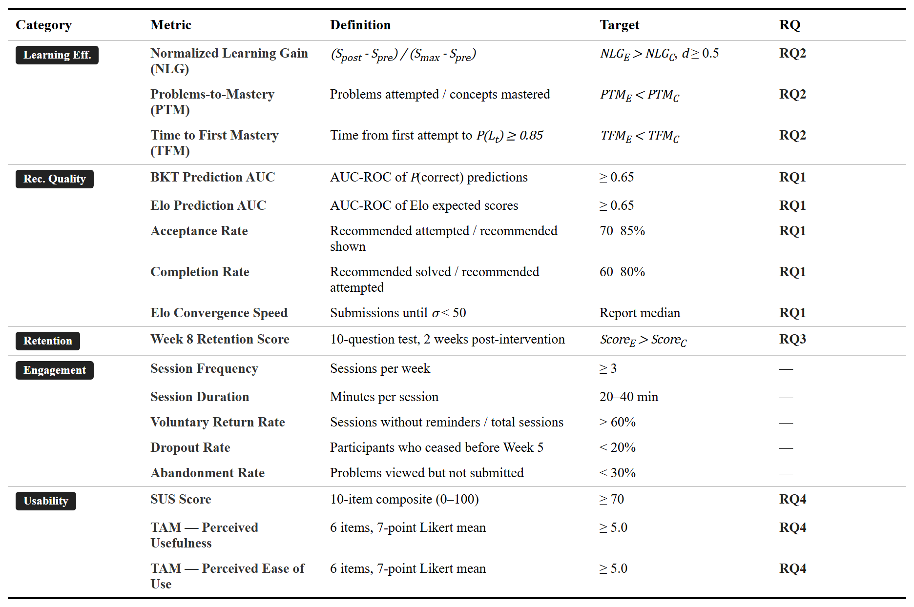

# CHAPTER 5. PILOT EVALUATION DESIGN

The platform in Chapters 3 and 4 is built and deployed. The classroom study described here is **specified, not yet executed**. This chapter presents the pilot protocol — research questions, design, instruments, metrics, and statistical plan — for evaluating the platform once recruitment opens. Pilot procedures use future tense; what was already done uses past tense. No results are reported.

The pilot enables Layers 1–4 together for the experimental group. Layer 5 (LLM Socratic hints) is disabled to avoid confounding hint quality with the core adaptive logic. The design evaluates the integrated platform as a whole; per-layer ablations are future work, revisited in §5.4.

## 5.1. Research Questions and Hypotheses

Four research questions guide the pilot, mirroring §1.4. Predictive validity of the learner model is RQ1's primary outcome; operational metrics are supporting indicators in §5.3.2. RQ2 and RQ3 are tested with comparative hypotheses at α = 0.05.

**RQ1.** How accurately does the learner model predict student performance? Primary measure: AUC-ROC of BKT and Elo predictions on held-out submissions. Pre-registered target: AUC-ROC ≥ 0.65, in line with [13] for BKT and [38] for Elo in educational settings.

**RQ2.** Does the integrated adaptive pipeline (Layers 1–4) produce different learning outcomes than a content-based filtering baseline? Primary metric: Normalized Learning Gain.

- *H2 (alternative):* the adaptive group shows higher Normalized Learning Gain than the control group.
- *H2_0 (null):* no difference between groups.

**RQ3.** Does FSRS-scheduled review yield different short-term retention than the same platform without scheduled review? Measured by a retention test two weeks after the intervention.

- *H3 (alternative):* the adaptive group shows higher retention.
- *H3_0 (null):* no difference between groups.

**RQ4.** How do students perceive the platform's usability and usefulness? Measured by SUS [51], TAM constructs (Perceived Usefulness, Perceived Ease of Use) [52], and semi-structured interviews analysed thematically [54].

Table 5.1 summarises the four questions and the instruments tied to each.

*Table 5.1. Research questions and corresponding measurements.*

## 5.2. Experimental Design

The pilot is a between-subjects, pre-/post-test study with a control group. Participants are randomly assigned, after stratification on pre-test score, to one of two conditions:

- **Experimental group (E).** Receives the full Layers 1–4 pipeline: BKT, Dynamic K-Value Elo, Hierarchical MAB with Thompson Sampling, and FSRS-scheduled review.
- **Control group (C).** Receives content-based filtering over sentence-transformer embeddings. No BKT, no Elo, no MAB, no FSRS.

This design holds constant the platform interface and problem environment, while varying only the recommendation logic between groups. Both groups use the same UI; the only difference is the algorithm behind it. Layer 5 is disabled in both groups via `ENABLE_LLM_HINTS=false`. The other adaptive flags (`ENABLE_BKT`, `ENABLE_ELO`, `ENABLE_MAB`, `ENABLE_FSRS`) toggle between conditions. Table 5.2 shows the feature contrast.

*Table 5.2. Experimental versus control group feature comparison.*

### 5.2.1. Participants

The target sample is 40–60 undergraduates from Hanoi University programming courses (Introduction to Programming, Data Structures, Algorithms). All courses use Python and align with the ~30-concept knowledge graph from §3.3.1.

**Inclusion.** Enrollment in one of the target courses, regular access to the platform, and signed informed consent.

**Exclusion.** Self-reported competitive programming experience above an estimated Elo of 1600 (the introductory-to-intermediate problem set would not benefit them). Students unable to commit to four weeks of platform use.

**Sample size.** An a-priori G*Power analysis for an independent-samples *t*-test (medium effect, Cohen's *d* = 0.5; α = 0.05; power 0.80) returned 26 per group [55]. Allowing 20% dropout, the recruitment target is 30 per group (60 total).

**Contingency.** If recruitment yields 20–30 participants (10–15 per group), the study detects only large effects (*d* ≥ 0.8). The plan switches to Mann-Whitney U and shifts the contribution to a system-behavior description, with all participants interviewed.

**Randomization.** Stratified by pre-test tercile (low/medium/high); within each tercile, students are randomly assigned to E or C. This prevents one group from drawing disproportionately from a single ability band.

**Ethics.** Written informed consent is obtained before any data collection. Identifiers are replaced with random codes at export. Raw data is destroyed after two years. The control group receives full adaptive features after the study ends. The protocol will be submitted to the Hanoi University academic oversight body.

### 5.2.2. Protocol

The pilot spans eight weeks: a one-week baseline, a four-week intervention, a post-assessment week, a one-week washout (no platform access), and a retention test in Week 8. Figure 5.1 sketches the timeline.

*Figure 5.1. Eight-week pilot study timeline: Week 1 baseline, Weeks 2–5 intervention, Week 6 post-assessment, Week 7 washout (no platform use), Week 8 retention test.*

**Week 1: Baseline.** Information session and consent (Day 1), pre-test (Day 2, 60 min, 20 items mixing multiple-choice and short-answer across five difficulty tiers), platform tutorial and stratified randomization (Day 3), free exploration (Days 4–5). This week supports the stratified randomization that opens the intervention period.

**Weeks 2–5: Intervention.** Both groups use the platform regularly, with a soft minimum of three problems per week. The experimental group receives Layers 1–4 (BKT + Elo + H-MAB + FSRS); the control group receives content-based filtering. Students below the weekly floor are flagged but kept in the intent-to-treat analysis. The platform logs six data streams continuously: every submission (timestamp, code, verdict, attempts, time), every recommendation (problems shown, ranking, reason), clicks, page views and session times, daily BKT snapshots (E), and Elo and FSRS histories (E). These logs are the source for RQ1 (predictive AUC-ROC) and RQ2 (Normalized Learning Gain).

**Week 6: Post-assessment.** Post-test on Day 1 (parallel-form, different items). SUS and TAM on Day 2 (10 min each). Semi-structured interviews on Day 3 with 10 students per group, sampled across the learning-gain distribution. Data export on Day 5. RQ4 data comes from this week.

**Week 7: Washout.** No platform access for either group. The week creates a clean two-week gap (counting from the end of Week 5 intervention to the start of Week 8 retention) over which short-term retention differences can develop. No logging occurs.

**Week 8: Retention test.** A 30-minute, 10-question test on concepts the participant reached mastery on (`P(L_t) ≥ 0.85`) during the intervention. Two weeks of washout is short relative to FSRS's full forgetting curves, but it is the minimum window in which FSRS stability differences become observable [25]. Reminders go out one and three days before. RQ3 data comes from this test.

### 5.2.3. Variables

**Independent variable.** Treatment condition (E vs C), implemented through the feature flags from §4.2.

**Dependent variables.** Grouped by research question. RQ1: BKT prediction AUC-ROC, Elo prediction AUC-ROC. RQ2: Normalized Learning Gain, Problems-to-Mastery ratio. RQ3: retention test score, FSRS stability convergence. RQ4: SUS composite, TAM subscale means, interview themes.

**Covariates.** Pre-test score (used for stratification and as a regression covariate), self-reported prior programming experience (none / <6 months / 6–12 months / >12 months), and course level (introductory vs data structures/algorithms). The covariates allow ANCOVA refinement of the treatment effect estimate and exploration of which subgroups benefit most.

## 5.3. Evaluation Metrics

This section separates **primary metrics** (one per research question, used for hypothesis testing) from **supporting indicators** (used for interpretation and platform diagnostics, not for hypothesis testing). The split follows the advisor's reframe of RQ1 in §1.4.

### 5.3.1. Primary Metrics

**RQ1 — BKT and Elo prediction AUC-ROC.** Each submission in the experimental group's log is a (prediction, outcome) pair. Before grading, BKT records `P(correct)` and Elo records the expected score *E(A)* from the student's current rating and the problem's rating. After grading, the binary outcome (1 = correct, 0 = incorrect) is paired with each prediction, and AUC-ROC is computed across all pairs. Pre-registered target: AUC ≥ 0.65 for both models, with bootstrapped 95% confidence intervals (1,000 resamples).

**RQ2 — Normalized Learning Gain (NLG).** Defined as

`NLG = (S_post − S_pre) / (S_max − S_pre)`

NLG corrects for ceiling effects: a student starting at 90% has less room to grow than one at 30%. Following Hake [53], values are read as low (< 0.3), medium (0.3–0.7), or high (≥ 0.7). H2 is tested with an independent-samples *t*-test if Shapiro-Wilk normality holds; otherwise Mann-Whitney U. Effect size is reported as Cohen's *d* (or Hedges' *g* for small samples) [55].

**RQ3 — Retention test score.** The 10-item retention test in Week 8 yields a score in [0, 10]. H3 is tested between groups with an independent-samples *t*-test under normality, Mann-Whitney U otherwise.

**RQ4 — SUS composite + TAM construct means.** SUS [51] returns a single score on a 0–100 scale. Standard interpretation [Bangor et al., 2008] is: < 50 not acceptable, 50–70 marginal, 70–85 good, > 85 excellent. Pre-registered target for E: SUS ≥ 70. TAM [52] returns Perceived Usefulness and Perceived Ease of Use as means of six 7-point Likert items each. Internal consistency is checked with Cronbach's α (target ≥ 0.70). Group means are compared with independent-samples *t*-tests.

Family-wise error across the four primary tests is controlled with Bonferroni (α' = 0.05 / 4 = 0.0125). Interview transcripts are coded with Braun and Clarke's six-phase thematic analysis [54]; themes from E and C are compared qualitatively.

Table 5.3 consolidates the primary and supporting metrics with definitions and pre-registered targets.

*Table 5.3. Complete evaluation metrics summary, with primary metrics for each research question and supporting indicators.*

### 5.3.2. Supporting Indicators

These metrics are reported for interpretation, **not for hypothesis testing**. They inform whether the recommendation pipeline is behaving as designed.

- **Acceptance rate** per difficulty band (proportion of recommended problems attempted). Pre-registered range: 70–85% for E, 40–60% for C.
- **Completion rate** (proportion of attempted recommendations solved). Target range: 60–80% — too high suggests problems are too easy; too low suggests they are too hard. The range maps to the Zone of Proximal Development from §3.3.3.
- **Elo convergence speed** (number of submissions until rolling Elo standard deviation drops below 50 over 10 attempts). Reported as a median for E only.
- **Problems-to-Mastery ratio** (PTM = N_attempted / N_mastered). Lower is more efficient.
- **Engagement signals.** Session frequency, session duration, problems per session, voluntary return rate, dropout rate, and abandonment rate. Reported to disentangle learning-effect differences from engagement differences.

## 5.4. Threats to Validity and Sensitivity Analysis

### 5.4.1. Threats to Validity

The pilot's design has known limits. Stating them up front lets readers calibrate the weight to give any future result.

**Small, single-site sample.** Recruitment is one cohort at Hanoi University, with a target of 40–60 and a 20–30 fallback. At the nominal sample size, the study detects only large effects (Cohen's *d* ≥ 0.8). Generalisation to other universities, curricula, or student populations is not supported by what this pilot can produce.

**Short intervention window.** Four weeks of intervention plus two weeks before the retention test is short relative to FSRS's full forgetting curves. RQ3 results should be read as suggestive of short-term retention differences, not as validation of long-term spaced repetition for programming.

**Confounded treatment.** The experimental group receives Layers 1–4 simultaneously. A positive effect on RQ2 cannot be cleanly separated from FSRS effects, and vice versa. Per-layer ablations are future work.

**Metric–model coupling.** BKT prediction AUC and Elo convergence speed use the same model that drives recommendations. A favourable value shows internal consistency, not independent evidence of learning effectiveness.

**Self-selection, novelty, and attention.** Participation is voluntary and the experimental UI is more feature-rich. Differences may partly reflect novelty or self-selection of more motivated students into E.

**Unvalidated assessments.** The pre-/post-test and retention test were constructed for this study and have not been independently validated. Reliability and concurrent validity will be reported post hoc.

Taken together, **any findings reported from this pilot should be interpreted as preliminary, given the small sample size, four-week duration, and single-institution setting.**

### 5.4.2. Sensitivity Analysis Plan

Several hyperparameters were set as design choices from the literature, not optimised on this dataset. The pilot reserves a grid-search pass over the interaction logs after the intervention. Each group is replayed offline against the same submission stream, since the engine is deterministic given fixed parameters and a fixed log.

- **BKT mastery threshold.** Default 0.85. Grid: {0.80, 0.825, 0.85, 0.875, 0.90}. Outcome: PTM ratio and AUC-ROC.
- **Elo K-factor.** Default `K_base = 25`. Grid: {15, 20, 25, 30, 35}. Outcome: AUC-ROC and rolling-SD convergence.
- **MAB reward weights.** Default `w_1 = 0.5, w_2 = 0.3, w_3 = 0.2`. Grid: a 5×5×5 simplex (sum to 1, step 0.1). Outcome: NLG and acceptance rate under counterfactual policies.
- **FSRS thresholds.** Default `θ_r = 0.7`. Grid: {0.6, 0.7, 0.8, 0.9}. Outcome: review density and a retention proxy on logged correctness.

The sensitivity analysis is descriptive, not a tuning exercise; operating values are fixed for the pilot itself.

## 5.5. Chapter Summary

The adaptive learning platform has been designed, implemented, and deployed in a functional form. The classroom evaluation has not. This thesis should be read as an implementation thesis with a pilot evaluation protocol, not as a completed classroom evaluation.

This chapter specified the protocol that will turn the platform into evidence: four research questions (with RQ1 reframed around predictive validity); a between-subjects design with stratified randomization at Hanoi University; primary metrics for hypothesis testing (AUC-ROC, NLG, retention score, SUS/TAM) and supporting indicators for interpretation; explicit threats to validity; and a sensitivity-analysis plan for the BKT, Elo, MAB, and FSRS hyperparameters that Chapters 3 and 4 deferred to this section.

Chapter 6 closes the thesis with a summary of contributions, limitations, and directions for future work — including the empirical execution of this pilot.
